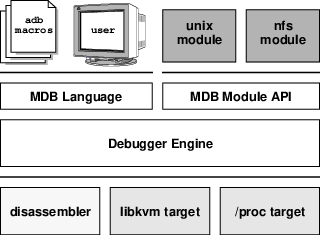
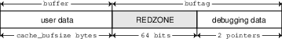
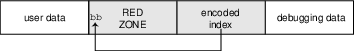
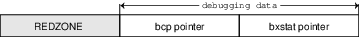
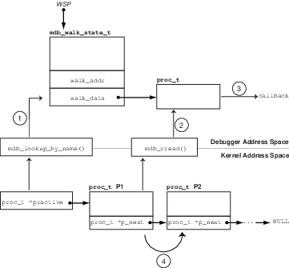

= Modular Debugger Guide
:toc: left
:toclevels: 3
:sectnums:
:source-highlighter: highlight.js
:highlightjs-theme: github
:icons: font
:linkattrs:
:sectanchors:
:stylesdir: .
:stylesheet: illumos-docs.css

== Preface

The Modular Debugger (MDB) is a highly extensible, general purpose
debugging tool for the illumos Operating System. The Modular Debugger
Guide describes how to use MDB to debug complex software systems, with a
particular emphasis on the facilities available for debugging the
illumos kernel and associated device drivers and modules. It also
includes a complete reference for and discussion of the MDB language
syntax, debugger features, and MDB Module Programming API.

[NOTE]
This illumos release supports systems that use the SPARC and x86
families of processor architectures: UltraSPARC, SPARC64, AMD64,
Pentium, and Xeon EM64T. In this document the term “x86” refers to
64-bit and 32-bit systems manufactured using processors compatible with
the AMD64 or Intel Xeon/Pentium product families. For supported systems,
see the http://illumos.org/hcl/[illumos Hardware Compatibility Lists].
This document cites any implementation differences between the platform
types.

[[whats-new-in-mdb]]
=== What's New in MDB

*Aug 2012* kmdb supports ttyc and ttyd

*May 2012* Added tab completion support

*Mar 2012* `::printf` dcmd added

*Aug 2011* Added 16-bit disassembler support

[[who-should-use-this-book]]
=== Who Should Use This Book

If you were a detective and were investigating at the scene of a crime,
you might interview the witnesses and ask them to describe what happened
and who they saw. However, if there were no witnesses or these
descriptions proved insufficient, you might consider collecting
fingerprints and forensic evidence that could be examined for DNA to
help solve the case. Often, software program failures divide into
analogous categories: problems that can be solved with source-level
debugging tools, and problems that require low-level debugging
facilities, examination of core files, and knowledge of assembly
language to diagnose and correct. MDB facilitates analysis of this
second class of problems.

MDB is most useful when you are programming a complex low-level software
system such as an operating system. The MDB debugging framework allows
you to construct your own custom analysis tools to aid in the diagnosis
of these low-level problems. MDB also provides a powerful set of
built-in commands that enable you to analyze the state of your program
at the assembly language level.

[[before-you-read-this-book]]
=== Before You Read This Book

If you are not familiar with assembly language programming and
debugging, link:#related-books-and-papers[Related Books and Papers] provides references
to materials that you might find useful.

You should disassemble various functions of interest in the programs you
will be debugging in order to familiarize yourself with the relationship
between your program's source code and the corresponding assembly
language code. If you are planning to use MDB for debugging illumos
kernel software, read carefully link:#kernel-debugging-modules[Kernel Debugging
Modules] and link:#debugging-with-the-kernel-memory-allocator[Debugging With the Kernel Memory Allocator].
These chapters provide more detailed information on the MDB commands and
facilities provided for debugging illumos kernel software.

[[how-this-book-is-organized]]
=== How This Book Is Organized

link:#modular-debugger-overview[Modular Debugger Overview] provides an overview of the
debugger.

link:#debugger-concepts[Debugger Concepts] describes the MDB architecture and
explains the terminology for the debugger concepts used throughout this
book.

link:#mdb-language-syntax[MDB Language Syntax] describes the syntax, operators and
evaluation rules for the MDB language.

link:#using-mdb-commands-interactively[Using MDB Commands Interactively] describes the MDB
interactive command-line editing facilities and output pager.

link:#built-in-commands[Built-In Commands] describes the set of built-in
debugger commands that are always available.

link:#execution-control[Execution Control] describes the MDB facilities for
controlling the execution of live running programs. This chapter is
intended for application developers and device driver developers.
Execution control features might also be useful for system
administrators.

link:#kernel-execution-control[Kernel Execution Control] describes the MDB facilities
for controlling the execution of the live operating system kernel that
are specific to `kmdb`. This chapter is intended for operating system
kernel developers and device driver developers.

link:#kernel-debugging-modules[Kernel Debugging Modules] describes the set of loadable
debugger commands that are provided for debugging the illumos kernel.
This chapter is intended for users who intend to examine illumos kernel
crash dumps and for kernel software developers.

link:#debugging-with-the-kernel-memory-allocator[Debugging With the Kernel Memory Allocator] describes the
debugging features of the illumos kernel memory allocator and the MDB
commands provided to take advantage of these features. This chapter is
intended for advanced programmers and kernel software developers.

link:#module-programming-api[Module Programming API] describes the facilities for writing
loadable debugger modules. This chapter is intended for advanced
programmers and software developers who intend to develop custom
debugging support for MDB.

link:#options[appendix_title] provides a reference for MDB
command-line options.

link:#notes[appendix_title] provides warnings and notes about
using the debugger.

link:#transition-from-adb-and-kadb[appendix_title] provides a reference for `adb`
commands and their MDB equivalents. The `adb` command is implemented by
`mdb`.

link:#transition-from-crash[appendix_title] provides a reference for `crash`
commands and their MDB equivalents. The `crash` command is no longer
present in illumos.

[[related-books-and-papers]]
=== Related Books and Papers

The following books and papers are recommended and related to the tasks
that you need to perform:

* Vahalia, Uresh. UNIX Internals: The New Frontiers. Prentice Hall,
2007. ISBN 0-13-021034-0
* Mauro, Jim and McDougall, Richard. Solaris Performance and Tools:
DTrace and MDB Techniques for Solaris 10 and OpenSolaris. Prentice Hall
PTR, 2006. ISBN 0-13-156819-8
* Mauro, Jim and McDougall, Richard. Solaris Internals: Core Kernel
Architecture. Prentice Hall PTR, 2000. ISBN 0-13-022496-5
* The SPARC Architecture Manual, Version 9. Prentice Hall, 2000. ISBN
0–13–825001–4
* AMD64 Architecture Programmer's Manual. Advanced Micro Devices, 2006.
Available at http://developer.amd.com/[AMD Developer Central].
* Pentium Pro Family Developer's Manual, Volumes 1-3. Intel Corporation,
1996. ISBN 1-55512-259-0 (Volume 1), ISBN 1-55512-260-4 (Volume 2) ,
ISBN 1-55512-261-2 (Volume 3)
* Bonwick, Jeff, and Jonathan Adams.
http://www.usenix.org/publications/library/proceedings/usenix01/full_papers/bonwick/bonwick.pdf[Magazines
and Vmem: Extending the Slab Allocator to Many CPUs and Arbitrary
Resourceso]. Proceedings of the 2001 USENIX Annual Technical Conference,
2001. Available at .
* Bonwick, Jeff.
http://www.usenix.org/publications/library/proceedings/bos94/bonwick.html[The
Slab Allocator: An Object-Caching Kernel Memory Allocator]. Proceedings
of the Summer 1994 Usenix Conference, 1994. ISBN 9–99–452010–5.
Available at .
* SPARC Assembly Language Reference Manual. Sun Microsystems, 2002.
* x86 Assembly Language Reference Manual. Sun Microsystems, 2005.
* Writing Device Drivers. Sun Microsystems, 2008.
* STREAMS Programming Guide. Sun Microsystems, 2000.
* Solaris 64-bit Developer’s Guide. Sun Microsystems, 2000.
* Linker and Libraries Guide. Sun Microsystems, 2007.

Third-party URLs are referenced in this document and provide additional,
related information.

[NOTE]
Sun is not responsible for the availability of third-party web sites
mentioned in this document. Sun does not endorse and is not responsible
or liable for any content, advertising, products, or other materials
that are available on or through such sites or resources. Sun will not
be responsible or liable for any actual or alleged damage or loss caused
or alleged to be caused by or in connection with use of or reliance on
any such content, goods, or services that are available on or through
such sites or resources.

=== Typographic Conventions

The following table describes the typographic conventions that are used
in this book.

.Typographic Conventions
[width="100%",cols="21%,45%,34%",options="header",]
|===
|Typeface |Meaning |Example
|`AaBbCc123` |The names of commands, files, and directories, and
onscreen computer output a|
Edit your `.login` file.

Use `ls` `a` to list all files.

`machine++_++name% you have mail.`

|`AaBbCc123` |What you type, contrasted with onscreen computer output a|
`machine++_++name%` `su`

`Password:`

|++<++aabbcc123> |Placeholder: replace with a real name or value
|The command to remove a file is `rm` _filename_.

|_AaBbCc123_ |Book titles, new terms, and terms to be emphasized a|
Read Chapter 6 in the User's Guide.

A _cache_ is a copy that is stored locally.

Do _not_ save the file.

*Note:* Some emphasized items appear bold online.

|===

[[shell-prompts-in-command-examples]]
=== Shell Prompts in Command Examples

The following table shows the default UNIX system prompt and superuser
prompt for the C shell, Bourne shell, and Korn shell.

.Shell Prompts
[width="100%",cols="50%,50%",options="header",]
|===
|Shell |Prompt
|C shell |`machine++_++name%`
|C shell for superuser |`machine++_++name#`
|Bourne shell and Korn shell |`$`
|Bourne shell and Korn shell for superuser |`#`
|===

[[modular-debugger-overview]]
== Modular Debugger Overview

The Modular Debugger (MDB) is a general purpose debugging tool for the
illumos operating system whose primary feature is its extensibility.
This book describes how to use MDB to debug complex software systems,
with a particular emphasis on the facilities available for debugging the
illumos kernel and associated device drivers and modules. The book also
includes a complete reference for and discussion of the MDB language
syntax, debugger features, and MDB Module Programming API.

[[introduction]]
=== Introduction

Debugging is the process of analyzing the execution and state of a
software program in order to remove defects. Traditional debugging tools
provide facilities for execution control so that programmers can execute
programs in a controlled environment and display the current state of
program data or evaluate expressions in the source language used to
develop the program. Unfortunately, these techniques are often
inappropriate for debugging complex software systems such as:

* An operating system, where bugs might not be reproducible and program
state is massive and distributed
* Programs that are highly optimized or have had their debug information
removed
* Programs that are themselves low-level debugging tools
* Customer situations where the developer can only access post-mortem

MDB provides a completely customizable environment for debugging these
programs and scenarios, including a dynamic module facility that you can
use to implement your own debugging commands to perform program-specific
analysis. Each MDB module can be used to examine the program in several
different contexts, including live and post-mortem. The illumos OS
includes a set of MDB modules that help you debug the illumos kernel and
related device drivers and kernel modules. Third-party developers might
want to develop and deliver their own debugging modules for supervisor
or user software.

[[mdb-features]]
=== MDB Features

MDB provides an extensive collection of features for analyzing the
illumos kernel and other target programs. You can do the following tasks
in MDB:

* Perform post-mortem analysis of illumos kernel crash dumps and user
process core dumps. MDB includes a collection of debugger modules that
facilitate sophisticated analysis of kernel and process state, in
addition to standard data display and formatting capabilities. These
debugger modules enable you to formulate complex queries to investigate
kernel and process state in the following ways:
** Locate all the memory allocated by a particular thread
** Print a visual picture of a kernel STREAM
** Determine what type of structure a particular address refers to
** Locate leaked memory blocks in the kernel
** Analyze memory to locate stack traces
* Use a first-class programming API to implement your own debugger
commands and analysis tools without having to recompile or modify MDB.
In MDB, debugging support is implemented as a set of loadable modules
(shared libraries that the debugger can open with the `dlopen(3C)`
function), each of which provides a set of commands that extends the
capabilities of MDB. MDB provides an API of core services, such as the
ability to read and write memory and access symbol table information.
MDB provides a framework for you to implement debugging support for your
own drivers and modules. Your command and tools can then be made
available for everyone to use.
* Learn to use MDB if you are already familiar with the legacy debugging
tools `adb` and `crash`. MDB provides backward compatibility with these
existing debugging solutions. The MDB language is a superset of the
`adb` language. All existing `adb` macros and commands work within MDB.
Thus, developers who use `adb` can immediately use MDB without knowing
any MDB-specific commands. MDB also provides commands that surpass the
functionality available from the `crash` utility.
* Benefit from enhanced usability features. MDB provides many usability
features, including the following:
** Command-line editing
** Command history
** Built-in output pager
** Syntax error checking and handling
** Online help
** Interactive session logging

[[using-mdb]]
=== Using MDB

MDB is available on illumos systems as two commands that share common
features: `mdb` and `kmdb`. You can use the `mdb` command interactively
or in scripts to debug live user processes, user process core files,
kernel crash dumps, the live operating system, object files, and other
files. You can use the `kmdb` command to debug the live operating system
kernel and device drivers when you also need to control and halt the
execution of the kernel. To start `mdb`, use the `mdb` command as
described in the `mdb(1)` manual page. To start `kmdb`, boot the system
as described in the `kmdb(1)` manual page, or execute the `mdb` command
with the `K` option.

[[future-enhancements]]
=== Future Enhancements

MDB provides a stable foundation for developing advanced post-mortem
analysis tools. Each illumos release includes additional MDB modules
that provide even more sophisticated functionality for debugging the
kernel and other software programs. You can use MDB to debug existing
software programs, and you can develop your own modules to improve your
ability to debug your own illumos drivers and applications.

[[debugger-concepts]]
== Debugger Concepts

This chapter discusses the significant features of MDB and the benefits
derived from this architecture.

[[building-blocks]]
=== Building Blocks

The *target* is the program being inspected by the debugger. MDB
currently provides support for the following types of targets:

* User processes
* User process core files
* Live operating system without kernel execution control (through
`/dev/kmem` and `/dev/ksyms`)
* Live operating system with kernel execution control (through the
`kmdb(1)` command)
* Operating system crash dumps
* User process images recorded inside an operating system crash dump
* ELF object files
* Raw data files

Each target exports a standard set of properties, including one or more
address spaces, one or more symbol tables, a set of load objects, and a
set of threads. link:#chapter-fig-10[MDB architecture] shows an overview
of the MDB architecture, including two of the built-in targets and a
pair of sample modules.

A debugger command, or *dcmd* (pronounced _dee-command_)
in MDB terminology, is a routine in the debugger that can access any of
the properties of the current target. MDB parses commands from standard
input, then executes the corresponding dcmds. Each dcmd can also accept
a list of string or numerical arguments, as shown in
link:#syntax[Syntax]. MDB contains a set of built-in dcmds that are
always available. These built-in dcmds are described in
link:#built-in-commands[Built-In Commands]. You can also extend the
capabilities of MDB by writing dcmds using a programming API provided
with MDB.

A *walker* is a set of routines that describe how to
walk, or iterate, through the elements of a particular program data
structure. A walker encapsulates the data structure's implementation
from dcmds and from MDB. You can use walkers interactively, or you can
use walkers as primitives to build other dcmds or walkers. As with
dcmds, you can extend MDB by implementing additional walkers as part of
a debugger module.

A debugger module, or *dmod* (pronounced _dee-mod_), is a
dynamically loaded library that contains a set of dcmds and walkers.
During initialization, MDB attempts to load dmods corresponding to the
load objects present in the target. You can subsequently load or unload
dmods at any time while running MDB. MDB provides a set of standard
dmods for debugging the illumos kernel.

A *macro file* is a text file that contains a set of
commands to execute. Macro files are typically used to automate the
process of displaying a simple data structure. MDB provides complete
backward compatibility for the execution of macro files written for
`adb`. The set of macro files provided with the illumos installation can
therefore be used with either tool.

.MDB architecture
[#chapter-fig-10]

[[modularity]]
=== Modularity

The benefit of MDB's modular architecture extends beyond the ability to
load a module containing additional debugger commands. The MDB
architecture defines clear interface boundaries between each of the
layers shown in link:#chapter-fig-10[MDB architecture]. Macro files
execute commands written in the MDB or `adb` language. Dcmds and walkers
in debugger modules are written using the MDB Module API. The MDB Module
API is the basis of an application binary interface that allows the
debugger and its modules to evolve independently.

The MDB name space of walkers and dcmds also defines a second set of
layers between debugging code. These layers maximize code sharing and
limit the amount of code that must be modified as the target program
evolves. For example, one of the primary data structures in the illumos
kernel is the list of `proc++_++t` structures that represent active
processes in the system. The `::ps` dcmd must iterate over this list in
order to produce its output. However, the code to iterate over the list
is not in the `::ps` dcmd. The code to iterate over the list of
`proc++_++t` structures is encapsulated in the `genunix` module's `proc`
walker.

MDB provides both `::ps` and `::ptree` dcmds, but neither of these dcmds
has any knowledge of how `proc++_++t` structures are accessed in the
kernel. Instead, these dcmds invoke the `proc` walker programmatically
and format the set of returned structures appropriately. If the data
structure used for `proc++_++t` structures ever changed, MDB could
provide a new `proc` walker, and none of the dependent dcmds would need
to change. The `proc` walker can also be accessed interactively using
the `::walk` dcmd in order to create novel commands as you work during a
debugging session.

In addition to facilitating layering and code sharing, the MDB Module
API provides dcmds and walkers with a single stable interface for
accessing various properties of the underlying target. The same API
functions are used to access information from user process or kernel
targets, simplifying the task of developing new debugging facilities.

In addition, you can use a custom MDB module to perform debugging tasks
in a variety of contexts. For example, you might want to develop an MDB
module for a user program you are developing. Once you have done so, you
can use this module when MDB examines a live process executing your
program, a core dump of your program, or even a kernel crash dump taken
on a system where your program was executing.

The Module API provides facilities for accessing the following target
properties:

Address Spaces::
  The module API provides facilities for reading and writing data from
  the target's virtual address space. Functions for reading and writing
  using physical addresses are also provided for kernel debugging
  modules.
Symbol Tables::
  The module API provides access to the static and dynamic symbol tables
  of the target's primary executable file, its runtime link-editor, and
  a set of load objects. Load objects are shared libraries in a user
  process or loadable modules in the illumos kernel.
External Data::
  The module API provides a facility for retrieving a collection of
  named external data buffers associated with the target. For example,
  MDB provides programmatic access to the `proc(5)` structures
  associated with a user process or user core file target.

In addition, you can use built-in MDB dcmds to access information about
target memory mappings, load objects, register values, and control the
execution of user process targets.

[[mdb-language-syntax]]
== MDB Language Syntax

This chapter describes the MDB language syntax, operators, and rules for
command and symbol name resolution.

[[syntax]]
=== Syntax

MDB processes commands from standard input. If standard input is a
terminal, MDB provides terminal editing capabilities. MDB can also
process commands from macro files and from dcmd pipelines, as described
below.

* Compute the value of an expression. This value
typically is a memory address in the target. The current address
location is referred to as *dot*. Use the dot or period character (`.`)
to reference the value of the current address.
* Apply a dcmd to the computed address.

A *metacharacter* is a newline, space, or tab character,
or one of the following characters:

....
[   ]   |   !   /   \   ?   =   >   $   :   ;
....

A *blank* is a `TAB` or a
`SPACE`. A *word* is a sequence of characters separated by one or more
non-quoted metacharacters. . An *identifier* is a sequence of letters,
digits, underbars, periods, or back quotes beginning with a letter,
underbar, or period. Identifiers are used as the names of symbols,
variables, dcmds, and walkers. Commands are delimited by a `NEWLINE` or
semicolon ( `;` ).

A dcmd is denoted by one of the following
words or metacharacters:

`/ \ ? = > $character :character ::identifier`

Dcmds named by metacharacters or prefixed by a single dollar sign (`$`)
or colon character (`:`) are provided as built-in operators. These dcmds
implement complete compatibility with the command set of the legacy
`adb(1)` utility. After a dcmd has been parsed, the `/`, `\`, `?`,
`=`, `>`, `$`, and `:` characters are no longer recognized as
metacharacters until the termination of the argument list.

A *simple-command* is a dcmd followed by a sequence of
zero or more blank-separated words. The words are passed as arguments to
the invoked dcmd, except as specified under link:#arithmetic-expansion[Arithmetic
Expansion] and link:#quoting[Quoting].

* The dcmd succeeded.
* The dcmd failed.
* The dcmd was invoked with invalid arguments.

A *pipeline* is a sequence of one or more
simple-commands, each separated by the vertical bar or pipe character
(`|`). After the pipeline has been parsed, each dcmd is invoked in
order from left to right. Each dcmd's output is processed and stored as
described in link:#dcmd-pipelines[Dcmd Pipelines]. After the first dcmd in
the pipeline is complete, its processed output is used as input for the
second dcmd in the pipeline. When the second dcmd is complete, its
output is used as input for the third dcmd in the pipeline, and so on.
If any dcmd does not return a successful exit status, the pipeline is
aborted.

An *expression* is a sequence of words that is evaluated
to compute a 64-bit unsigned integer value. The words are evaluated
using the rules described in link:#arithmetic-expansion[Arithmetic Expansion].

[[commands]]
=== Commands

A *command* is one of the following:

++<++pipeline> ++[++ ! ++<++word> ... ++]++ [;]::
  A simple-command or pipeline can be optionally followed by the
  exclamation point or bang character (`!`), indicating that the
  debugger should open a `pipe(2)`. The standard output of the last dcmd
  in the MDB pipeline is sent to an external process created by
  executing `$SHELL` `c` followed by the string formed by concatenating
  the words after the `!` character. For more details, refer to
  link:#shell-escapes[Shell Escapes].
++<++expression> ++<++pipeline> ++[++ ! ++<++word> ... ++]++
[;]::
  A simple-command or pipeline can be prefixed with an expression.
  Before execution of the pipeline, any occurrence of the dot or period
  character (`.`) in the pipeline is set to the value of the expression.
++<++expression1> , ++<++expression2> ++<++pipeline> ++[++ !
++<++word> ... ++]++ [;]::
  A simple-command or pipeline can be prefixed with two expressions. The
  value of the first expression is the new value of dot. The value of
  the second expression is a repeat count for the first dcmd in the
  pipeline. The first dcmd in the pipeline is executed
  ++<++expression2> times before the next dcmd in the pipeline is
  executed. The repeat count applies only to the first dcmd in the
  pipeline.
, ++<++expression> ++<++pipeline> ++[++ ! ++<++word> ...
++]++ [;]::
  If the first expression is omitted, dot is not modified. The value of
  the second expression (the expression after the comma character) is
  used exactly the same way as ++<++expression2> above.
++<++expression> ++[++ ! ++<++word> ... ++]++ [;]::
  A command can consist of only an arithmetic expression. The value of
  the expression is the new value of dot. The previous dcmd pipeline is
  re-executed using the new value of dot.
++<++expression1> , ++<++expression2> ++[++ ! ++<++word> ...
++]++ [;]::
  A command can consist of only a dot expression and repeat count
  expression. The value of ++<++expression1> is the new value of
  dot. The previous dcmd pipeline is re-executed ++<++expression2>
  times using the new value of dot.
, ++<++expression> ++[++ ! ++<++word> ... ++]++ [;]::
  If the first expression is omitted, dot is not modified. The value of
  the second expression (the expression after the comma character) is
  used exactly the same way as ++<++expression2> above.
! ++<++word> ... [;]::
  If the command begins with the `!` character, no dcmds are executed.
  The debugger executes `$SHELL` `c` followed by the string formed by
  concatenating the words after the `!` character.

[[comments]]
=== Comments

A word that begins with two forward slash characters
(`//`) causes that word and all the subsequent characters up to a
`NEWLINE` to be ignored.

[[arithmetic-expansion]]
=== Arithmetic Expansion

arithmetic expansion

Arithmetic expansion is performed to determine the value of an
expression. MDB commands can be preceded by expressions that represent a
start address or a repeat count. Arithmetic expansion can also be
performed to compute a numeric argument for a dcmd. An expression can
appear in an argument list enclosed in square brackets preceded by a
dollar sign (`$++[++ expression ++]++`). In this case, the expression is
replaced by its arithmetic value.

Expressions can contain any of the following special
words:

++<++integer>::
  The specified integer value. Integer values can be prefixed with `0i`
  or `0I` to indicate binary values, `0o` or `0O` to indicate octal
  values, `0t` or `0T` to indicate decimal values, and `0x` or `0X` to
  indicate hexadecimal values (the default).
0++[++tT++][++0-9++]++{plus}.++[++0-9++]++{plus}::
  The specified decimal floating point value, converted to its IEEE
  double-precision floating point representation.
'++<++cccccccc>'::
  The integer value computed by converting each character to a byte
  equal to its ASCII value. Up to eight characters can be specified in a
  character constant. Characters are packed into the integer in reverse
  order (right-to-left), beginning at the least significant byte.
++<<++identifier>::
  The value of the variable named by ++<++identifier>.
++<++identifier>::
  The value of the symbol named by ++<++identifier>.
(++<++expression>)::
  The value of ++<++expression>.
.::
  The value of dot.
&::
  The most recent value of dot used to execute a dcmd.
{plus}::
  The value of dot incremented by the current increment.
^::
  The value of dot decremented by the current increment.

The increment is a global variable that stores the total bytes read by
the last formatting dcmd. For more information on the increment, refer
to the discussion of link:#formatting-dcmds[Formatting Dcmds].

[[unary-operators]]
==== Unary Operators

Unary operators are right associative and have higher
precedence than binary operators. The unary operators are:

#++<++expression>::
  Logical negation
~++<++expression>::
  Bitwise complement
-++<++expression>::
  Integer negation
%++<++expression>::
  Value of a pointer-sized quantity at the object file location
  corresponding to virtual address ++<++expression> in the target's
  virtual address space
%/++[++csil++]++/++<++expression>::
  Value of a char-sized, short-sized, int-sized, or long-sized quantity
  at the object file location corresponding to virtual address
  ++<++expression> in the target's virtual address space
%/++[++1248++]++/++<++expression>::
  Value of a one-byte, two-byte, four-byte, or eight-byte quantity at
  the object file location corresponding to virtual address
  ++<++expression> in the target's virtual address space
++*<++expression>::
  Value of a pointer-sized quantity at virtual address
  ++<++expression> in the target's virtual address space
++*++/++[++csil++]++/++<++expression>::
  Value of a char-sized, short-sized, int-sized, or long-sized quantity
  at virtual address ++<++expression> in the target's virtual
  address space
++*++/++[++1248++]++/++<++expression>::
  Value of a one-byte, two-byte, four-byte, or eight-byte quantity at
  virtual address ++<++expression> in the target's virtual address

[[binary-operators]]
==== Binary Operators

Binary operators are left associative and have lower
precedence than unary operators. The binary operators, in order of
precedence from highest to lowest, are:

`++*++`::
  Integer multiplication
`%`::
  Integer division
`#`::
  Left-hand side rounded up to next multiple of right-hand side
`{plus}`::
  Integer addition
`-`::
  Integer subtraction
`++<<++`::
  Bitwise shift left
`++>>++`::
  Bitwise shift right
`==`::
  Logical equality
`!=`::
  Logical inequality
`&`::
  Bitwise AND
``^::
  Bitwise exclusive OR
`|`::
  Bitwise inclusive OR

[[quoting]]
=== Quoting

quoting characters

Each metacharacter described in link:#syntax[Syntax] terminates a
word unless the metacharacter is quoted. Characters can be quoted by
enclosing them in a pair of single quotation marks (`'`) or double
quotation marks (`"`).. Quoting characters forces MDB to interpret each
character as itself without any special significance. A single quotation
mark cannot appear inside single quotation marks. Inside double
quotation marks, MDB recognizes the C programming language character
escape sequences.

[[shell-escapes]]
=== Shell Escapes

shell escapes

shell escapes

The `!` character can be used to create a pipeline between an MDB
command and the user's shell. Shell escapes are available only when
using `mdb` and not when using `kmdb`. If the `$SHELL` environment
variable is set, MDB will `fork` and `exec` this `$SHELL` program for
shell escapes. If `$SHELL` is not set, `/bin/sh` is used. The shell is
invoked with the `c` option followed by a string formed by concatenating
the words after the `!` character.

The `!` character takes precedence over all other metacharacters, except
semicolon (`;`) and `NEWLINE`. After a shell escape is detected, the
remaining characters up to the next semicolon or `NEWLINE` are passed
“as is” to the shell. The output of shell commands cannot be piped to
MDB dcmds. The output of commands executed by a shell escape is sent
directly to the terminal, not to MDB.

[[variables]]
=== Variables

A *variable* is a variable name, a corresponding integer value, and a
set of attributes. A variable name is a sequence of letters, digits,
underbars, or periods. Use the `>` dcmd or `::typeset` dcmd to
assign a value to a variable.. Use the `::typeset` dcmd to manipulate
the attributes of a variable. Each variable's value is represented as a
64-bit unsigned integer. A variable can have one or more of the
following attributes: read-only (cannot be modified by the user),
persistent (cannot be unset by the user), and tagged (user-defined
indicator).

The following variables are defined as persistent:

0::
  Most recent value printed using the `/`, `\`, `?`, or `=` dcmd.
9::
  Most recent count used with the `$++<++` dcmd.
b::
  Virtual address of the base of the data section.
cpuid::
  The CPU identifier corresponding to the CPU on which `kmdb` is
  currently executing.
d::
  Size of the data section in bytes.
e::
  Virtual address of the entry point.
hits::
  The count of the number of times the matched software event specifier
  has been matched. See link:#event-callbacks[Event Callbacks].
m::
  Initial bytes (magic number) of the target's primary object file, or
  zero if no object file has been read yet.
t::
  Size of the text section in bytes.
thread::
  The thread identifier of the current representative thread. The value
  of the identifier depends on the threading model used by the current
  target. See link:#thread-support[Thread Support].

In addition, the MDB kernel and process targets export the current
values of the representative thread's register set as named variables.
The names of these variables depend on the target's platform and
instruction set architecture.

[[symbol-name-resolution]]
=== Symbol Name Resolution

name resolution

As explained in link:#syntax[Syntax], a symbol identifier present in
an expression context evaluates to the value of this symbol. The value
typically denotes the virtual address of the storage associated with the
symbol in the target's virtual address space. A target can support
multiple symbol tables including, but not limited to, the following
symbol tables:

* Primary executable symbol table
* Primary dynamic symbol table
* Runtime link-editor symbol table
* Standard and dynamic symbol tables for each of a number of load
objects (such as shared libraries in a user process, or kernel modules
in the illumos kernel)

The target typically searches the symbol tables of the primary
executable first, then one or more of the other symbol tables. Note that
ELF symbol tables contain only entries for external, global, and static
symbols. Automatic symbols do not appear in the symbol tables processed
by MDB.

Additionally, MDB provides a private user-defined symbol table that is
searched prior to any of the target symbol tables. The private symbol
table is initially empty. Use the `::nmadd` and `::nmdel` dcmds to
manipulate the private symbol table.

Use the `::nm` `P` dcmd to display the contents of the private symbol
table. The private symbol table enables you to create symbol definitions
for program functions or data that were either missing from the original
program or stripped out. These definitions are then used whenever MDB
converts a symbolic name to an address, or converts an address to the
nearest symbol.

Because targets contain multiple symbol tables, and each symbol table
can include symbols from multiple object files, different symbols with
the same name can exist. MDB uses the backquote character (``) as a
symbol-name scoping operator to enable you to obtain the value of the
desired symbol in this situation.

You can specify the scope used to resolve a symbol name as either:
_object_``_name_, or
++<++file>``_name_, or
_object_``++<++file>``_name_. The object
identifier refers to the name of a load object. The file identifier
refers to the basename of a source file that has a symbol of type
`STT_FILE` in the symbol table of the specified object. The object
identifier's interpretation depends on the target type.

The MDB kernel target expects _object_ to specify the basename
of a loaded kernel module. For example, the symbol name
`specfs++`_++init` evaluates to the value of the `++_++init` symbol in
the `specfs` kernel module.

The `mdb` process target expects _object_ to specify the name of
the executable or of a loaded shared library. The value of
_object_ can take any of the following forms:

* Exact match (that is, a full path name): `/usr/lib/libc.so.1`
* Exact basename match: `libc.so.1`
* Initial basename match up to a period or dot character (`.`) suffix:
`libc.so` or `libc`
* Literal string `a.out`, which is accepted as an alias for the

The process target will also accept any of these four forms preceded by
an optional link-map ID (`lmid`). The `lmid` prefix is specified by an
initial `LM` followed by the link-map id in hexadecimal followed by an
additional backquote character (``). For example, the symbol name
`LM0++`++libc.so.1++`_++init` evaluates to the value of the `++_++init`
symbol in the `libc.so.1` library that is loaded on link-map 0
(`LM++_++ID++_++BASE`). The link-map specifier might be necessary to
resolve symbol naming conflicts if the same library is loaded on more
than one link map. For more information on link maps, refer to the
Linker and Libraries Guide and the `dlopen(3C)` manual page. Link-map
identifiers are displayed when symbols are printed according to the
setting of the `showlmid` option, as described in
link:#summary-of-command-line-options[Summary of Command-line Options].

In the case of a naming conflict between symbols and hexadecimal integer
values, MDB attempts to evaluate an ambiguous token as a symbol first,
before evaluating it as an integer value. For example, the token `f` can
refer either to the decimal integer value `15` specified in hexadecimal
(the default base), or to a global variable named `f` in the target's
symbol table. If a symbol can have an ambiguous name, use an explicit
`0x` or `0X` prefix to specify the integer value.

[[dcmd-and-walker-name-resolution]]
=== Dcmd and Walker Name Resolution

name resolution

name resolution

As described earlier, each MDB dmod provides a set of dcmds and walkers.
Dcmds and walkers are tracked in two distinct, global namespaces. MDB
also keeps track of a dcmd and walker namespace associated with each
dmod. Identically named dcmds or walkers within a given dmod are not
allowed. A dmod with this type of naming conflict will fail to load.

Name conflicts between dcmds or walkers from different dmods are allowed
in the global namespace. In the case of a conflict, the first dcmd or
walker with that particular name to be loaded is given precedence in the
global namespace. Alternate definitions are kept in a list in load
order.

Use the backquote character (``) in a dcmd or
walker name as a scoping operator to select an alternate definition. For
example, if dmods `m1` and `m2` each provide a dcmd `d`, and `m1` is
loaded prior to `m2`, then you can use the scoping operator as shown
below to specify the dcmd you want:

`::d`::
  Executes `m1`'s definition of `d`
`::m1++`++d`::
  Executes `m1`'s definition of `d`
`::m2++`++d`::
  Executes `m2'`s definition of `d`

If module `m1` is unloaded, the next dcmd
on the global definition list (`m2++`++d`) is promoted to global
visibility. Use the `::which` dcmd to determine the current definition
of a dcmd or walker. Use the `::which` `v` dcmd to display the global
definition list.

[[dcmd-pipelines]]
=== Dcmd Pipelines

Use the vertical bar (`|`) operator to pipeline dcmds. The purpose
of a pipeline is to pass values from one dcmd or walker to another. The
values passed usually are virtual addresses. Pipeline stages might be
used to map a pointer from one type of data structure to a pointer to a
corresponding data structure, to sort a list of addresses, or to select
the addresses of structures with certain properties.

MDB executes each dcmd in the pipeline in order from left to right. The
left-most dcmd is executed using the current value of dot, or using the
value specified by an explicit expression at the start of the command. A
pipe operator (`|`) causes MDB to create a shared buffer between the
output of the dcmd to its left and the MDB parser, and an empty list of
values.

As the dcmd executes, its standard output is placed in the pipe and then
consumed and evaluated by the parser, as if MDB were reading this data
from standard input. Each line must consist of an arithmetic expression
terminated by a `NEWLINE` or semicolon (`;`). The value of the
expression is appended to the list of values associated with the pipe.
If a syntax error is detected, the pipeline is aborted.

When the dcmd to the left of a `|` operator completes, the list of
values associated with the pipe is then used to invoke the dcmd to the
right of the `|` operator. For each value in the list, dot is set to
this value, and the right-hand dcmd is executed. Only the output of the
right-most dcmd in the pipeline is written to standard output. If any
dcmd in the pipeline produces output to standard error, these messages
are written directly to standard error and are not processed as part of
the pipeline.

[[formatting-dcmds]]
=== Formatting Dcmds

The `/`, `\`, `?`, and `=` metacharacters are used to denote the
special output formatting dcmds. Each of these dcmds accepts an argument
list consisting of one or more format characters, repeat counts, or
quoted strings. A format character is one of the ASCII characters
described below.

Format characters are used to read and format data from the target. A
repeat count is a positive integer preceding the format character that
is always interpreted in base 10 (decimal). A repeat count can also be
specified as an expression enclosed in square brackets preceded by a
dollar sign (`$[ ]`). A string argument must be enclosed in
double quotation marks (`" "`). No blanks are necessary between format
arguments.

The formatting dcmds are:

`/`::
  Display data from the target's virtual address space starting at the
  virtual address specified by dot.
`\`::
  Display data from the target's physical address space starting at the
  physical address specified by dot.
`?`::
  Display data from the target's primary object file starting at the
  object file location corresponding to the virtual address specified by
  dot.
`=`::
  Display the value of dot in each of the specified data formats. The
  `=` dcmd is useful for converting between bases and performing
  arithmetic.

In addition to dot, MDB keeps track of another global
value called the *increment*. The increment represents the distance
between dot and the address following all the data read by the last
formatting dcmd.

For example, let dot equal address ++<++addr>, where ++<++addr>
displays as a 4-byte integer. After a formatting dcmd is executed with
dot equal to ++<++addr>, the increment is set to `4`. The plus
(`{plus}`) operator, described in link:#arithmetic-expansion[Arithmetic Expansion],
would now evaluate to the value `A{plus}4`, and could be used to reset
dot to the address of the next data object for a subsequent dcmd.

Most format characters
increase the value of the increment by the number of bytes corresponding
to the size of the data format. The number of bytes in various data
formats are shown below. Use the `::formats` dcmd to display the list of
format characters from within MDB.

The format characters are:

{plus}::
  Increment dot by the count (variable size)
-::
  Decrement dot by the count (variable size)
B::
  Hexadecimal int (1 byte)
C::
  Character using C character notation (1 byte)
D::
  Decimal signed int (4 bytes)
E::
  Decimal unsigned long long (8 bytes)
F::
  Double (8 bytes)
G::
  Octal unsigned long long (8 bytes)
H::
  Swap bytes and shorts (4 bytes)
I::
  Address and disassembled instruction (variable size)
J::
  Hexadecimal long long (8 bytes)
K::
  Hexadecimal uintptr++_++t (4 or 8 bytes)
N::
O::
  Octal unsigned int (4 bytes)
P::
  Symbol (4 or 8 bytes)
Q::
  Octal signed int (4 bytes)
R::
  Binary int (8 bytes)
S::
  String using C string notation (variable size)
T::
  Horizontal tab
U::
  Decimal unsigned int (4 bytes)
V::
  Decimal unsigned int (1 byte)
W::
  Default radix unsigned int (4 bytes)
X::
  Hexadecimal int (4 bytes)
Y::
  Decoded time32++_++t (4 bytes)
Z::
  Hexadecimal long long (8 bytes)
^::
  Decrement dot by increment ++*++ count (variable size)
a::
  Dot as symbol{plus}offset
b::
  Octal unsigned int (1 byte)
c::
  Character (1 byte)
d::
  Decimal signed short (2 bytes)
e::
  Decimal signed long long (8 bytes)
f::
  Float (4 bytes)
g::
  Octal signed long long (8 bytes)
h::
  Swap bytes (2 bytes)
i::
  Disassembled instruction (variable size)
n::
o::
  Octal unsigned short (2 bytes)
p::
  Symbol (4 or 8 bytes)
q::
  Octal signed short (2 bytes)
r::
s::
  Raw string (variable size)
t::
  Horizontal tab
u::
  Decimal unsigned short (2 bytes)
v::
  Decimal signed int (1 byte)
w::
  Default radix unsigned short (2 bytes)
x::
  Hexadecimal short (2 bytes)
y::
  Decoded time64++_++t (8 bytes)

You can also use the `/`, `\`, and `?` formatting
dcmds to write to the target's virtual address space, physical address
space, or object file. First specify one of the following modifiers as
the first format character, and then specify a list of words. The words
in the list are either immediate values or expressions enclosed in
square brackets preceded by a dollar sign (`$[ ]`).

The write modifiers are:

v::
  Write the lowest byte of the value of each expression to the target
  beginning at the location specified by dot
w::
  Write the lowest 2 bytes of the value of each expression to the target
  beginning at the location specified by dot
W::
  Write the lowest 4 bytes of the value of each expression to the target
  beginning at the location specified by dot
Z::
  Write the complete 8 bytes of the value of each expression to the
  target beginning at the location specified by dot

You can also use the `/`, `\`, and `?` formatting
dcmds to search for a particular integer value in the target's virtual
address space, physical address space, and object file, respectively.
First specify one of the following modifiers as the first format
character, and then specify a value and optional mask. The value and
mask are each either immediate values or expressions enclosed in square
brackets preceded by a dollar sign.

If only a value is specified, MDB reads integers of the appropriate size
and stops at the address that contains the matching value. If a value
`V` and mask `M` are specified, MDB reads integers of the appropriate
size and stops at the address that contains a value `X` where
`(X & M) == V`. At the completion of the dcmd, dot is updated to the
address of the match. If no match is found, dot is left at the last
address that was read.

The search modifiers are:

l::
  Search for the specified 2-byte value
L::
  Search for the specified 4-byte value
M::
  Search for the specified 8-byte value

For both user and kernel targets, an address space is typically composed
of a set of discontiguous segments. It is not legal to read from an
address that does not have a corresponding segment. If a search reaches
a segment boundary without finding a match, the search aborts when the
read past the end of the segment boundary fails.

[[using-mdb-commands-interactively]]
== Using MDB Commands Interactively

This chapter describes the MDB interactive command line editing and
history functions, the output pager, and debugger signal handling.

[[command-reentry]]
=== Command Reentry

The text of the last `HISTSIZE` (default 128) commands
entered from a terminal device is saved in memory. The inline editing
facility provides key mappings for searching and fetching elements from
the history list.

[[inline-editing]]
=== Inline Editing

If standard input is a terminal device,
MDB provides some simple emacs-style facilities for editing the command
line. The `search`, `previous`, and `next` commands in edit mode provide
access to the history list. Only strings, not patterns, are matched when
searching. In the list below, the notation for control characters is the
caret character (`^`) followed by a character shown in uppercase. The
notation for escape sequences is M- followed by a character. For
example, M-f (pronounced _meta- eff_) is entered by pressing the ESC
keyboard key followed by the f key, or by pressing the Meta key followed
by the f key on keyboards that support a Meta key. A command line is
committed and executed using `RETURN` or `NEWLINE`. The edit commands
are:

^F::
  Move cursor forward (right) one character.
M-f::
  Move cursor forward one word.
^B::
  Move cursor backward (left) one character.
M-b::
  Move cursor backward one word.
^A::
  Move cursor to start of line.
^E::
  Move cursor to end of line.
^D::
  Delete current character, if the current line is not empty. If the
  current line is empty, ^D denotes EOF and the debugger will exit.
M-^H::
  (Meta-backspace) Delete previous word.
^K::
  Delete from the cursor to the end of the line.
^L::
  Reprint the current line.
^T::
  Transpose the current character with the next character.
^N::
  Fetch the next command from the history. Each time ^N is entered, the
  next command forward in time is retrieved.
^P::
  Fetch the previous command from the history. Each time ^P is entered,
  the next command backward in time is retrieved.
^R++[<++string++>]++::
  Search backward in the history for a previous command line containing
  _string_. The string should be terminated by a `RETURN` or
  `NEWLINE`. If _string_ is omitted, the previous history
  element containing the most recent string is retrieved.

The editing mode also interprets the following user-defined sequences as
editing commands. User-defined sequences can be read or modified using
the `stty(1)` command.

erase::
  User-defined erase character (usually ^H or ^?). Delete previous
  character.
intr::
  User-defined interrupt character (usually ^C). Abort the current
  command and print a new prompt.
kill::
  User-defined kill character (usually ^U). Kill the entire current
  command line.
quit::
  User-defined quit character (usually ^\). Quit the debugger.
suspend::
  User-defined suspend character (usually ^Z). Suspend the debugger.
werase::
  User-defined word erase character (usually ^W). Erase the preceding
  word.

On keyboards that support an extended keypad with arrow
keys, `mdb` interprets these keystrokes as editing commands:

Up arrow::
  Fetch the previous command from the history (same as ^P)
Down arrow::
  Fetch the next command from the history (same as ^N)
Left arrow::
  Move cursor backward one character (same as ^B)
Right arrow::
  Move cursor forward one character (same as ^F)

[[keyboard-shortcuts]]
=== Keyboard Shortcuts

keyboard shortcuts

step over

MDB provides a set of keyboard shortcuts that bind individual keystrokes
to common MDB commands when the keystroke listed in the table below is
typed as the first character following the MDB prompt. The keyboard
shortcuts are:

`++[++`::
  Execute the command `::step over`
`++]++`::
  Execute the command `::step`

[[output-pager]]
=== Output Pager

MDB provides a built-in output pager. The output pager
is enabled if the debugger's standard output is a terminal device. Each
time a command is executed, `mdb` pauses after each screenful of output
is written and displays a pager prompt:

....
>> More [<space>, <cr>, q, n, c, a] ?
....

The following key sequences are recognized by the pager:

`SPACE`::
  Display the next screenful of output
a, A::
  Abort the current top-level command and return to the prompt
c, C::
  Continue displaying output without pausing at each screenful, until
  the current top-level command is complete
n, N, `NEWLINE`, `RETURN`::
  Display the next line of output
q, Q, ^C, ^\::
  Quit (abort) the current dcmd only

[[signal-handling]]
=== Signal Handling

MDB ignores the PIPE and QUIT signals. The INT signal
aborts the command that is currently executing. The debugger intercepts
and provides special handling for the ILL, TRAP, EMT, FPE, BUS, and SEGV
signals. If any of these signals is generated asynchronously (delivered
from another process using the `kill(2)` call), mdb restores the signal
to its default disposition and dumps core. However, if any of these
signals is generated synchronously by the debugger process itself and a
dcmd from an externally loaded `dmod` is currently executing, and
standard input is a terminal, `mdb` will provide a menu of choices
allowing the user to force a core dump, quit without producing a core
dump, stop for attach by a debugger, or attempt to resume. The resume
option will abort all active commands and unload the `dmod` whose dcmd
was active at the time the fault occurred. It can then be subsequently
re-loaded by the user. The resume option provides limited protection
against buggy dcmds. Refer to link:#warnings[Warnings], Use of the Error
Recovery Mechanism, for information about the risks associated with the
resume option.

[[built-in-commands]]
== Built-In Commands

MDB provides a set of built-in dcmds that are always defined. Some of
these dcmds are applicable only to certain targets: if a dcmd is not
applicable to the current target, it fails and prints a message
indicating “command is not supported by current target”.

In many cases, MDB provides a mnemonic equivalent (`::identifier`) for
the legacy `adb(1)` dcmd names. For example, `::quit` is provided as the
equivalent of `$q`. Programmers who are experienced with `adb(1)` or who
appreciate brevity or arcana might prefer the `$` or `:` forms of the
built-ins. Programmers who are new to MDB might prefer the more verbose
`::` form. The built-ins are shown in alphabetical order. If a `$` or
`:` form has a `::identifier` equivalent, it is shown under the
`::identifier` form.

[[built-in-dcmds]]
=== Built-In dcmds

`>` _variable-name_::
`>` `/_modifier_/` _variable-name_::
Assign the value of dot to the specified named variable. Some variables are read-only and cannot be modified. If the `>` is followed by a modifier character surrounded by `//`, then the value is modified as part of the assignment. The modifier characters are:
+
`c`;;
Unsigned char quantity (1-byte)
`s`;;
Unsigned short quantity (2-byte)
`i`;;
Unsigned int quantity (4-byte)
`l`;;
Unsigned long quantity (4-byte in 32-bit, 8-byte in 64-bit)
+
Notice that these operators do not perform a cast; they instead fetch the specified number of low-order bytes (on little-endian architectures) or high-order bytes (big-endian architectures). These modifiers are provided for backward compatibility; the MDB `*/_modifier_/` and `%/_modifier_/` syntax should be used instead.
`$<` _macro-name_::
   Read and execute commands from the specified macro
  file. The file name can be given as an absolute or relative path. If
  the file name is a simple name (that is, if it does not contain a
  “`/`”), MDB searches for it in the macro file include path. If another
  macro file is currently being processed, this file is closed and
  replaced with the new file.
`$<<` _macro-name_::
   Read and execute commands from the specified macro file
(as with `$<`), but do not close the current open macro file.
`$?`::
   Print the process-ID and current signal of the target
  if it is a user process or core file, and then print the general
  register set of the representative thread.
[_address_] `$C` [_count_]::
   Print a C stack backtrace, including stack frame
  pointer information. If the dcmd is preceded by an explicit
_address_, a backtrace beginning at this virtual memory
  address is displayed. Otherwise, the stack of the representative
  thread is displayed. If an optional count value is given as an
  argument, no more than _count_ arguments are displayed for
  each stack frame in the output.
  +
  The biased frame pointer value (that is, the virtual address minus
  `0x7ff`) should be used as the address when requesting a stack trace.
[_base_] `$d`::
   Get or set the default output radix. If the dcmd is
  preceded by an explicit expression, the default output radix is set to
  the given _base_; otherwise, the current radix is printed in
  base 10 (decimal). The default radix is base 16 (hexadecimal).
`$e`::
   Print a list of all known external (global) symbols of
  type object or function, the value of the symbol, and the first 4
  (32-bit `mdb`) or 8 (64-bit `mdb`) bytes stored at this location in
  the target's virtual address space. The `::nm` dcmd provides more
  flexible options for displaying symbol tables.
`$P` _prompt-string_::
   Set the prompt to the specified
  _prompt-string_. The default prompt is ' `>` '. The prompt
  can also be set using `::set` `P` or the `P` command-line option.
`$M`::
  In `kmdb` only, list the macro files that are cached by `kmdb` for use
  with the `$++<++` dcmd.
_distance_ `$s`::
   Get or set the symbol matching _distance_ for
  address-to-symbol-name conversions. The symbol matching distance modes
  are discussed along with the `s` command-line option in
  link:#options[appendix_title]. The symbol matching distance can
  also be modified using the `::set` `s` option. If no distance is
  specified, the current setting is displayed.
`$v`::
   Print a list of the named variables that have non-zero
  values. The `::vars` dcmd provides other options for listing
  variables.
_width_ `$w`::
   Set the output page _width_ to the specified
  value. Typically, this command is not necessary, as MDB queries the
  terminal for its width and handles resize events.
`$W`::
   Reopen the target for writing, as if MDB had been
  executed with the `w` option on the command line. Write mode can also
  be enabled with the `::set` `w` option.
`::array` _type_ _count_::
  Print the address of each element of an array. The type of the array
  elements should be specified as the first argument, _type_,
  and the number of elements to be computed should be specified as the
  second argument, _count_. The output of `::array` can be
  pipelined to the `::print` dcmd to print the elements of an array data
  structure.
  +
  This dcmd may only be used with objects that contain compressed
  symbolic debugging information designed for use with `mdb`. This
  information is currently only available for certain illumos kernel
  modules. The zlib decompression software must be installed in order to
  process the symbolic debugging information.
[_pid_] `::attach` [_core_ |
_pid_]; [_pid_] `:A` [_core_
| _pid_]::
  +
  ::attach
  +
  +
  :A
  +
  If the user process target is active, attach to and debug the
  specified process-ID or _core_ file. The core file path name
  should be specified as a string argument. The process-ID can be
  specified as the string argument, or as the value of the expression
  preceding the dcmd. Recall that the default base is hexadecimal, so
  decimal PIDs obtained using `pgrep(1)` or `ps(1)` should be preceded
  with “`0t`” when specified as expressions.
`::branches` [`v`]::
  Display the most recent branches taken by the current CPU. This dcmd
  is currently only available when using `kmdb` on x86 systems where the
  appropriate processor-specific feature is enabled. The number and type
  of branches that can be displayed is determined by the processor
  architecture. If the `v` option is present, the instructions prior to
  each branch are displayed.
`::cat` _filename_ ...::
   Concatenate and display files. Each file name can be
  specified as a relative or absolute path name. The file contents will
  print to standard output, but will not pass through the output pager.
  This dcmd is intended to be used with the `|` operator; the
  programmer can initiate a pipeline using a list of addresses stored in
  an external file.
_address_ `::context`; _address_ `$p`::
  +
  ::context
  +
  +
  $p
  +
  Context switch to the specified process. A context switch operation is
  valid only when using the kernel target. The process context is
  specified using the _address_ of its `proc` structure in the
  kernel's virtual address space. The special context address `0` is
  used to denote the context of the kernel itself. MDB can only perform
  a context switch when examining a crash dump if the dump contains the
  physical memory pages of the specified user process (as opposed to
  just kernel pages). The kernel crash dump facility can be configured
  to dump all pages or the pages of the current user process using
  `dumpadm(8)`. The `::status` dcmd can be used to display the contents
  of the current crash dump.
  +
  When the user requests a context switch from the kernel target, MDB
  constructs a new target representing the specified user process. After
  the switch occurs, the new target interposes its dcmds at the global
  level: thus the `/` dcmd can now format and display data from the
  virtual address space of the user process, the `::mappings` dcmd can
  display the mappings in the address space of the user process, and so
  on. The kernel target can be restored by executing `0::context`.
`::cpuregs` [`c` _cpuid_]::
  Display the current general-purpose register set for the current CPU
  or the specified _cpuid_. This command is only available when
  using `kmdb`.
`::cpustack` [`c` _cpuid_]::
  Display a C stack backtrace for the thread executing on the current
  CPU or the specified _cpuid_. This command is only available
  when using `kmdb`.
`::dcmds`::
  +
  ::dcmds
  +
  List the available dcmds and print a brief description for each one.
[_address_] `::dis` [`abfw`] [`n`
_count_ ++]++ [_address_]::
  +
  ::dis
  +
  Disassemble starting at or around the _address_ specified by
  the final argument, or the current value of dot. If the address
  matches the start of a known function, the entire function is
  disassembled. Otherwise, a “window” of instructions before and after
  the specified address is printed in order to provide context. By
  default, instructions are read from the target's virtual address
  space; if the `f` option is present, instructions are read from the
  target's object file instead. The `f` option is enabled by default if
  the debugger is not currently attached to a live process, core file,
  or crash dump. The `w` option can be used to force window-mode, even
  if the address is the start of a known function. The size of the
  window defaults to ten instructions. The number of instructions can be
  specified explicitly using the `n` option. If the `a` option is
  present, addresses are printed as numeric values rather than
  symbolically. The `b` option displays both address and symbol names of
  the disassembled code.
`::disasms`::
  +
  ::disasms
  +
  List the available disassembler modes. When a target is initialized,
  MDB attempts to select the appropriate disassembler mode. The user can
  change the mode to any of the modes listed using the `::dismode` dcmd.
`::dismode` [_mode_]; `$V` ++[++ _mode_
++]++::
  +
  ::dismode
  +
  +
  $V
  +
  Get or set the disassembler mode. If no argument is specified, print
  the current disassembler mode. If a _mode_ argument is
  specified, switch the disassembler to the specified mode. The list of
  available disassemblers can be displayed using the `::disasms` dcmd.
`::dmods` [`l`] [_module-name_]::
  +
  ::dmods
  +
  List the loaded debugger modules. If the `l` option is specified, the
  list of the dcmds and walkers associated with each dmod is printed
  below its name. The output can be restricted to a particular dmod by
  specifying its name as an additional argument.
[address] `::dump` [`eqrstu`] [`f`|`p`]
[`g` _bytes_] [`w` _paragraphs_]::
  +
  ::dump
  +
  Print a hexadecimal and ASCII memory dump of the 16-byte aligned
  region of virtual memory containing the address specified by dot. If a
  repeat count is specified for `::dump`, this is interpreted as a
  number of bytes to dump rather than a number of iterations. The
  `::dump` dcmd also recognizes the following options:
  +
  `e`;;
    Adjust for endianness. The `e` option assumes 4-byte words; the `g`
    option can be used to change the default word size.
  `f`;;
    Read data from the object file location corresponding to the given
    virtual address instead of from the target's virtual address space.
    The `f` option is enabled by default if the debugger is not
    currently attached to a live process, core file, or crash dump.
  `g` _group_;;
    Display bytes in groups of bytes. The default _group_ size
    is 4 bytes. The _group_ size must be a power of two that
    divides the line width
  `p`;;
    Interpret _address_ as a physical address location in the
    target's address space instead of a virtual address.
  `q`;;
    Do not print an ASCII decoding of the data.
  `r`;;
    Number lines relative to the start address instead of with the
    explicit address of each line. This option implies the `u` option.
  `s`;;
    Elide repeated lines.
  `t`;;
    Only read from and display the contents of the specified addresses,
    instead of reading and printing entire lines.
  `u`;;
    Unalign output instead of aligning the output at a paragraph
    boundary.
  `w` _paragraphs_;;
    Display paragraphs 16-byte paragraphs per line. The default number
    of paragraphs is one. The maximum value accepted for `w` is 16.
`::echo` [_string_ | _value_ ...]::
  +
  ::echo
  +
  Print the arguments separated by blanks and terminated by a `NEWLINE`
  to standard output. Expressions enclosed in `$[ ]` will be
  evaluated to a value and printed in the default base.
`::eval` _command_::
  +
  ::eval
  +
  Evaluate and execute the specified string as a command. If the command
  contains metacharacters or white space, it should be enclosed in
  double or single quotes.
`::files` ++[<++object++>]++; `$f`::
  +
  ::files
  +
  +
  $f
  +
  Print a list of the known source files (symbols of type `STT_FILE`
  present in the various target symbol tables). If an _object_
  name is specified, the output is restricted to file symbols present in
  the corresponding object file.
[address] `::findsym` [`g`] [_address_
| _symbol_ ...++]++::
  Search instruction text for instructions that refer to the specified
  symbols or addresses. The search list should consist of one or more
  addresses or symbol names specified as an address preceding the dcmd
  or one or more symbol names or expressions following the dcmd. If the
  `g` option is specified, the search is restricted to instruction text
  that is part of a globally visible function in the target's symbol
  table.
  +
  _SPARC only_. The `::findsym` dcmd is only available when debugging a
  target that uses the SPARC instruction set architecture.
`::formats`::
  +
  ::formats
  +
  List the available output format characters for use with the `/`,
  `\`, `?`, and `=` formatting dcmds. The formats and their use is
  described in link:#formatting-dcmds[Formatting Dcmds].
[_thread_] `::fpregs`
[`dqs`]; `++[++ thread ++]++ $x, $X, $y, $Y`::
  +
  ::fpregs
  +
  +
  $x
  +
  +
  $X
  +
  +
  $y
  +
  +
  $Y
  +
  Print the floating-point register set of the representative thread. If
  a thread is specified, the floating point registers of that thread are
  displayed. The thread expression should be one of the thread
  identifiers described under link:#thread-support[Thread Support].
  +
  SPARC only. The `d`, `q`, and `s` options can be used to display the
  floating point registers as a collection of double-precision (`d`),
  quad-precision (`q`), or single-precision (`s`) floating point values.
`::grep` _command_::
  +
  ::grep
  +
  Evaluate the specified command string, then print the old value of dot
  if the new value of dot is non-zero. If the _command_ contains
  white space or metacharacters, it must be quoted. The `::grep` dcmd
  can be used in pipelines to filter a list of addresses.
`::help` [_dcmd-name_]::
  +
  ::help
  +
  With no arguments, the `::help` dcmd prints a brief overview of the
  help facilities available in MDB. If a _dcmd-name_ is
  specified, MDB prints a usage summary for that dcmd.
[_address_ ++[++ , _len_ ++]]++ `::in` ++[++ `L`
_len_ ++]++::
  Read and display _len_ bytes from the I/O port specified by
  _address_. The value of the `L` option, if present, takes
  precedence over the repeat count specified on the left-hand side. The
  _len_ must be 1, 2, or 4 bytes and the port address must be
  aligned according to the length. This command is only available when
  using `kmdb` on x86 systems.
[_address_] `::list` ++<++type member> ++[++
_variable-name_ ++]++::
  +
  ::list
  +
  Walk through the elements of a linked list data structure and print
  the address of each element in the list. The address of the first
  element in the list can be specified using an optional
  _address_; otherwise the list is assumed to start at the
  current value of dot. The _type_ parameter must name a C
  struct or union type and is used to describe the type of the list
  elements so that MDB can read in objects of the appropriate size. The
  _member_ parameter is used to name the member of
  _type_ that contains a pointer to the next list element. The
  `::list` dcmd will continue iterating until a NULL pointer is
  encountered, the first element is reached again (a circular list), or
  an error occurs while reading an element. If the optional
  _variable-name_ is specified, the specified variable will be
  assigned the value returned at each step of the walk when MDB invokes
  the next stage of a pipeline.
  +
  This dcmd may only be used with objects that contain compressed
  symbolic debugging information designed for use with `mdb`. This
  information is currently only available for certain illumos kernel
  modules. The zlib decompression software must be installed in order to
  process the symbolic debugging information.
`::load` [`s`] _module-name_::
  +
  ::load
  +
  Load the specified dmod. The module name can be given as an absolute
  or relative path. If _module-name_ is a simple name (that is,
  does not contain a “`/`”), MDB searches for it in the module library
  path. Modules with conflicting names cannot be loaded; the existing
  module must be unloaded first. If the `-s` option is present, MDB will
  remain silent and not issue any error messages if the module is not
  found or could not be loaded.
`::log` ++[++ `d` | ++[++ `e` ++]++ _filename_
++]++; `$>` [_filename_]::
  +
  ::log
  +
  +
  $>
  +
  Enable or disable the output log. MDB provides an interactive logging
  facility where both the input commands and standard output can be
  logged to a file while still interacting with the user. The `e` option
  enables logging to the specified file, or re-enables logging to the
  previous log file if no file name is given. The `d` option disables
  logging. If the `$>` dcmd is used, logging is enabled if a file
  name argument is specified; otherwise, logging is disabled. If the
  specified log file already exists, MDB appends any new log output to
  the file.
`::map` _command_::
  +
  ::map
  +
  Map the value of dot to a corresponding value using the
  _command_ specified as a string argument, then print the new
  value of dot. If the command contains white space or metacharacters,
  it must be quoted. The `::map` dcmd can be used in pipelines to
  transform the list of addresses into a new list of addresses.
[_address_] `::mappings` ++[++ _name_
++]++; [_address_] `$m` [_name_]::
  +
  ::mappings
  +
  +
  $m
  +
  Print a list of each mapping in the target's virtual address space,
  including the address, size, and description of each mapping. If the
  dcmd is preceded by an _address_, MDB shows only the mapping
  that contains the given address. If a string _name_ argument
  is given, MDB shows only the mapping that matched the description.
`++[++address++]++ ::nm` ++[++ `DPdghnopuvx` ++]++ ++[++ `t`
_types_ ++]++ ++[++ `f` _format_ ++]++ ++[++
_object_ ++]++::
  +
  ::nm
  +
  Print the symbol tables associated with the current target. If an
  optional _address_ preceding the dcmd is specified, only the
  symbol table entry for the symbol corresponding to address is
  displayed. If an _object_ name is specified, only the symbol
  table for this load object is displayed. The `::nm` dcmd also
  recognizes the following options:
  +
  `D`;;
    Prints `.dynsym` (dynamic symbol table) instead of `.symtab`.
  `P`;;
    Prints the private symbol table instead of `.symtab`.
  `d`;;
    Prints value and size fields in decimal.
  `f` format ++[++,format...++]++;;
    Print only the specified symbol information. The valid format
    argument strings are:
    +
    ndx::
      symbol table index
    val::
      symbol table
    size::
      size in bytes
    type::
      symbol type
    bind::
    oth::
    shndx::
      section index
    name::
      symbol name
    ctype::
      C type for symbol (if known)
    obj::
      object which defines symbol
  `g`;;
    Prints only global symbols.
  `h`;;
    Suppresses the header line.
  `n`;;
    Sorts symbols by name.
  `o`;;
    Prints value and size fields in octal.
  `p`;;
    Prints symbols as a series of `::nmadd` commands. This option can be
    used with `P` to produce a macro file that can be subsequently read
    into the debugger with `$++<++`.
  `t` type ++[++,type...++]++;;
    Prints only symbols of the specified types. The valid type argument
    strings are:
    +
    noty::
      STT_NOTYPE
    objt::
      STT_OBJECT
    func::
      STT_FUNC
    sect::
      STT_SECTION
    file::
      STT_FILE
    comm::
      STT_COMMON
    tls::
      STT_TLS
    regi::
      STT_SPARC++_++REGISTER
  `u`;;
    Prints only undefined symbols.
  `v`;;
    Sorts symbols by value.
  `x`;;
    Prints value and size fields in hexadecimal.
_value_ `::nmadd` ++[++ `fo` ++]++ ++[++ `e` _end_ ++]++
++[++ `s` _size_ ++]++ _name_::
  +
  ::nmadd
  +
  Add the specified symbol _name_ to the private symbol table.
  MDB provides a private, configurable symbol table that can be used to
  interpose on the target's symbol table, as described in
  link:#symbol-name-resolution[Symbol Name Resolution]. The `::nmadd` dcmd also
  recognizes the following options:
  +
  `e`;;
    Set the size of the symbol to _end_ - _value_.
  `f`;;
    Set the type of the symbol to `STT_FUNC`.
  `o`;;
    Set the type of the symbol to `STT_OBJECT`.
  `s`;;
    Set the size of the symbol to _size_.
`::nmdel` _name_::
  +
  ::nmdel
  +
  Delete the specified symbol _name_ from the private symbol
  table.
`::objects` ++[++ `v` ++]++::
  +
  ::objects
  +
  Print a map of the target's virtual address space, showing only those
  mappings that correspond to the primary mapping (usually the text
  section) of each of the known load objects. If the `v` option is
  present, the command displays the version of each object if version
  information is know. If no version information is known, a version of
  `Unknown` will be displayed in the output.
`::offsetof` ++<++type member>::
  +
  ::offsetof
  +
  Print the offset of the specified member of the specified type. The
  type should be the name of a C structure. The offset is printed in
  bytes, unless the member is a bit-field in which case the offset may
  be printed in bits. The output is always suffixed with the appropriate
  units for clarity. The type name may use the backquote (``)
  scoping operator described in link:#symbol-name-resolution[Symbol Name Resolution].
  +
  This dcmd may only be used with objects that contain compressed
  symbolic debugging information designed for use with `mdb`. This
  information is currently only available for certain illumos kernel
  modules. The zlib decompression software must be installed in order to
  process the symbolic debugging information.
[_address_ ++[++ , _len_ ++]]++ `::out` ++[++ `L`
_len_ ++]++::
  Write the specified _value_ to the I/O port specified by
  _address_. The value of the `L` option, if present, takes
  precedence over the repeat count specified on the left-hand side. The
  _len_ must be 1, 2, or 4 bytes and the port address must be
  aligned according to the length. This command is only available when
  using `kmdb` on x86 systems.
`++[++address++]++ ::print` ++[++`aCdiLptx`++]++ ++[++`c` ++<++lim++>]++
++[++`l` ++<++lim++>]++ ++[<++type> ++[<++member++>|<++offset>
... ++]]++::
  +
  ::print
  +
  Print the data structure at the specified virtual _address_
  using the given _type_ information. The _type_
  parameter may name a C struct, union, enum, fundamental integer type,
  or a pointer to any of these types. If the type name contains
  whitespace (for example, `struct foo`), it must be enclosed in single
  quotation marks or double quotation marks. The type name may use the
  backquote (++`++) scoping operator described under
  link:#symbol-name-resolution[Symbol Name Resolution]. If the type is a structured
  type, the `::print` dcmd will recursively print each member of the
  struct or union. If the _type_ argument is not present and a
  static or global STT_OBJECT symbol matches the address, `::print`
  will infer the appropriate type automatically.
  +
  The type argument can be followed by an optional list of
  _member_ or _offset_ expressions, in which case only
  those members and submembers of the specified _type_ are
  displayed. Members can be specified using C syntax that includes the
  array index operator (`++[]++`), the structure member operator
  (`->`), and the structure pointer operator (`.`). Offsets can be
  specified using the MDB arithmetic expansion syntax (`$++[]++`). After
  displaying the data structure, `::print` increments dot by the size of
  _type_ in bytes.
  +
  The `::print` dcmd may only be used with objects that contain
  compressed symbolic debugging information designed for use with MDB.
  This information is only available at present in certain illumos
  kernel modules and user libraries. The `zlib` decompression software
  must be installed in order to process the symbolic debugging
  information.
  +
  If the `a` option is present, the address of each member is displayed.
  If the `i` option is present, the expression on the left-hand side is
  interpreted as an immediate value to be displayed using the specified
  type. If the `p` option is present, `::print` interprets address as a
  physical memory address instead of a virtual memory address. If the
  `t` option is present, the type of each member is displayed. If the
  `d` or `x` options are present, all integers are displayed in decimal
  (`d`) or hexadecimal (`x`); by default a heuristic is used to
  determine if the value should be displayed in decimal or hexadecimal.
  The number of characters in a character array that will be read and
  displayed as a string can be limited with the `c` option. If the `C`
  option is present, no limit is enforced. The number of elements in a
  standard array that will be read and displayed can be limited with the
  `l` option. If the `L` option is present, no limit is enforced and all
  array elements are shown. The default values for `c` and `l` can be
  modified using `::set` or the `o` command-line option as described in
  link:#options[appendix_title].
`::quit` [`u`]; `$q` [`u`]::
  +
  ::quit
  +
  +
  $q
  +
  Quit the debugger. When using `kmdb` only, the `u` option causes the
  debugger to resume execution of the operating system and unload the
  debugger. The `u` option cannot be used if `kmdb` was loaded at boot.
  If the `u` option is not present, `::quit` causes `kmdb` to exit to
  the firmware (on SPARC systems) or causes the system to reboot (on x86
  systems).
[_thread_] `::regs`; [_thread_]
`$r`::
  +
  ::regs
  +
  +
  $r
  +
  Print the general-purpose register set of the representative thread.
  If a thread is specified, the general purpose register set of that
  thread is displayed. The thread expression should be one of the thread
  identifiers described under link:#thread-support[Thread Support].
`::release` [`a`]; `:R` [`a`]::
  +
  ::release
  +
  +
  :R
  +
  Release the previously attached process or core file. If the `-a`
  option is present, the process is released and left stopped and
  abandoned. It can subsequently be continued by `prun(1)` or it can be
  resumed by applying MDB or another debugger. By default, a released
  process is forcibly terminated if it was created by MDB using `::run`,
  or it is released and set running if it was attached to by MDB using
  the `-p` option or using the `::attach` or `:A dcmds`.
`::set` ++[++ `wF` ++]++ ++[++ {plus}/-`o` _option_ ++]++ ++[++
`s` _distance_ ++]++ ++[++ `I` _path_ ++]++ ++[++ `L`
_path_ ++]++ ++[++ `P` _prompt_ ++]++::
  +
  ::set
  +
  Get or set miscellaneous debugger properties. If no options are
  specified, the current set of debugger properties is displayed. The
  `::set` dcmd recognizes the following options:
  +
  `F`;;
    Forcibly take over the next user process that `::attach` is applied
    to, as if `mdb` had been executed with the `F` option on the command
    line.
  `I`;;
    Set the default path for locating macro files. The path argument can
    contain any of the special tokens described for the `I` command-line
    option in link:#options[appendix_title].
  `L`;;
    Set the default path for locating debugger modules. The path
    argument can contain any of the special tokens described for the `I`
    command-line option in link:#options[appendix_title].
  `o`;;
    Enable the specified debugger option. If the `{plus}o` form is used,
    the option is disabled. The option strings are described along with
    the `o` command-line option in link:#options[appendix_title].
  `P`;;
    Set the command prompt to the specified prompt string.
  `s`;;
    Set the symbol matching distance to the specified distance. Refer to
    the description of the `s` command-line option in
    link:#options[appendix_title] for more information.
  `w`;;
    Re-open the target for writing, as if `mdb` had been executed with
    the `w` option on the command line.
`::showrev` [`pv`]::
  Display revision information for the hardware and software
  corresponding the current target. If no options are specified, general
  system information is displayed. If the `p` option is present,
  information for each load object that is part of a patch is displayed.
  If the `v` option is present, information for each load object is
  displayed. Load objects without version information will be omitted
  from the output for the `p` option. Load objects without version
  information will report `Unknown` in the output of the `v` option.
`::sizeof type`::
  Print the size of the specified type in bytes. The _type_
  parameter may name a C struct, union, enum, fundamental integer type,
  or a pointer to any of these types. The type name may use the
  backquote (``) scoping operator described in
  link:#symbol-name-resolution[Symbol Name Resolution].
  +
  This dcmd may only be used with objects that contain compressed
  symbolic debugging information designed for use with `mdb`. This
  information is currently only available for certain illumos kernel
  modules. The zlib decompression software must be installed in order to
  process the symbolic debugging information.
++[<++address++>]++ `::stack` ++[<++count++>]++; ++[<++address++>]++
`$c` ++[<++count++>]++::
  +
  ::stack
  +
  +
  $c
  +
  Print a C stack back trace. If the dcmd is preceded by an explicit
  _address_, a back trace beginning at this virtual memory
  address is displayed. Otherwise, the stack of the representative
  thread is displayed. If an optional count value is given as an
  argument, no more than _count_ arguments are displayed for
  each stack frame in the output.
  +
  The biased frame pointer value (that is, the virtual
  address minus `0x7ff`) should be used as the address when requesting a
  stack trace.
  +
++[<++address++>]++ `::stackinfo` ++[++`h`|`a`++]++::
  +
  ::stackinfo
  +
  Display `kthread_t` stack usage.
  +
  Shows the real utilization of the kernel stack if the `/etc/system`
  `kmem_stackinfo` tunable (an unsigned integer) is non-zero at
  kthread creation time. For example:
  +
....
          THREAD            STACK   SIZE  CUR  MAX CMD/LWPID
ffffff014f5f2c20 ffffff0004153000   4f00   4%  43% init/1
....
  +
  The current stack size utilization for this kthread is 4% of its
  maximum size. The stack size utilization for this kthread has been up
  to 43% of its maximum size. Stack size is 4f00 bytes.
  +
  * For the very first kthread (sched/1)
  * If `kmem_stackinfo` was zero at kthread creation time
  * If the kthread has not yet run
  +
  The `a` option shows TS_FREE kthreads (interrupt kthreads). The
  `h` option shows history (dead kthreads that used their kernel stack
  the most).
  +
  If the `/etc/system` `kmem_stackinfo` tunable is non-zero, then
  the DTrace probe `sdt:genunix:stkinfo_end:stack-usage` is
  activated for dead kthreads as follows:
  +
  [width="100%",cols="13%,25%,62%",]
  |===
  |arg0 |`kthread_t ++*++` |A dead kthread

  |arg1 |`size++_++t` |The kernel stack size of the dead kthread

  |arg2 |`size++_++t` |A percentage that is the maximum use of the
  kernel stack for this dead kthread
  |===
  +
  If the `/etc/system` `kmem_stackinfo` tunable is non-zero, then
  the performance of creating and deleting kthreads is decreased.
`::status`::
  +
  ::status
  +
  Print a summary of information related to the current target.
_cpuid_ `::switch`; _cpuid_ `:x`::
  When using `kmdb` only, switch to the CPU indicated by the specified
  _cpuid_ and use this CPU's current register state as the
  representative for debugging.
`::term`::
  Print the name of the terminal type that MDB is using to perform any
  terminal-dependent input and output operations, such as command-line
  editing.
_thread_ `::tls` _symbol_::
  Print the address of the storage for the specified thread-local
  storage (TLS) symbol in the context of the specified thread. The
  thread expression should be one of the thread identifiers described
  under link:#thread-support[Thread Support]. The symbol name may use any
  of the scoping operators described under link:#symbol-name-resolution[Symbol Name
  Resolution].
`::typeset` ++[++{plus}/-`t`++]++ _variable-name_ ...::
  +
  ::typeset
  +
  Set attributes for named variables. If one or more variable names are
  specified, they are defined and set to the value of dot. If the `t`
  option is present, the user-defined tag associated with each variable
  is set. If the `t` option is present, the tag is cleared. If no
  variable names are specified, the list of variables and their values
  is printed.
`::unload` _module-name_::
  +
  ::unload
  +
  Unload the specified dmod. The list of active dmods can be printed
  using the `::dmods` dcmd. Built-in modules cannot be unloaded. Modules
  that are busy (that is, provide dcmds that are currently executing)
  cannot be unloaded.
`::unset` _variable-name_ ...::
  +
  ::unset
  +
  Unset (remove) the specified variables from the list of defined
  variables. Some variables are exported by MDB are marked as
  persistent, and cannot be unset by the user.
`::vars` ++[++`npt`++]++::
  +
  ::vars
  +
  Print a listing of named variables. If the `n` option is present, the
  output is restricted to variables that currently have non-zero values.
  If the `p` option is present, the variables are printed in a form
  suitable for re-processing by the debugger using the `$++<++` dcmd.
  This option can be used to record the variables to a macro file, then
  restore these values later. If the `t` option is present, only the
  tagged variables are printed. Variables can be tagged using the `t`
  option of the `::typeset` dcmd.
`::version`::
  +
  ::version
  +
  Print the debugger version number.
`address ::vtop` ++[++`a` ++<++as++>]++::
  +
  ::vtop
  +
  Print the physical address mapping for the specified virtual address,
  if possible. The `::vtop` dcmd is only available when examining a
  kernel target, or when examining a user process inside a kernel crash
  dump (after a `::context` dcmd has been issued).
  +
  When examining a kernel target from the kernel context, the `a` option
  can be used to specify the address (_as_) of an alternate
  address space structure that should be used for the virtual to
  physical translation. By default, the kernel's address space is used
  for translation. This option is available for active address spaces
  even when the dump content only contains kernel pages.
[_address_] `::walk` _walker-name_ ++[++
_variable-name_ ++]++::
  +
  ::walk
  +
  Walk through the elements of a data structure using the specified
  walker. The available walkers can be listed using the `::walkers`
  dcmd. Some walkers operate on a global data structure and do not
  require a starting address. For example, walk the list of `proc`
  structures in the kernel. Other walkers operate on a specific data
  structure whose address must be specified explicitly. For example,
  given a pointer to an address space, walk the list of segments.
  +
  When used interactively, the `::walk` dcmd will print the address of
  each element of the data structure in the default base. The dcmd can
  also be used to provide a list of addresses for a pipeline. The walker
  name can use the backquote “ `` ” scoping operator described in
  link:#dcmd-and-walker-name-resolution[Dcmd and Walker Name Resolution]. If the optional
  _variable-name_ is specified, the specified variable will be
  assigned the value returned at each step of the walk when MDB invokes
  the next stage of the pipeline.
`::walkers`::
  +
  ::walkers
  +
  List the available walkers and print a brief description for each one.
`::whence` [`v`] _name_ ...; `::which` [`v`]
_name_ ...::
  +
  ::whence
  +
  +
  ::which
  +
  Print the dmod that exports the specified dcmds and walkers. These
  dcmds can be used to determine which dmod is currently providing the
  global definition of the given dcmd or walker. Refer to
  link:#dcmd-and-walker-name-resolution[Dcmd and Walker Name Resolution] for more information
  on global name resolution. The `v` option causes the dcmd to print the
  alternate definitions of each dcmd and walker in order of precedence.
`::xdata`::
  +
  ::xdata
  +
  List the external data buffers exported by the current target.
  External data buffers represent information associated with the target
  that cannot be accessed through standard target facilities (that is,
  an address space, symbol table, or register set). These buffers can be
  consumed by dcmds; for more information, refer to link:#mdbgetxdata[].

[[execution-control]]
== Execution Control

MDB provides facilities for controlling and tracing the execution of
live running programs, including both user applications and the live
operating system kernel and device drivers. You can use the `mdb`
command to control user processes that are already running, or create
new processes under the control of the debugger. You can boot or load
`kmdb` to control the execution of the operating system kernel itself,
or debug a device driver. This chapter describes the built-in dcmds that
can be used to control target execution. These commands can be used in
either `mdb` or `kmdb`, except as noted in the descriptions. Additional
topics relating only to execution control in `kmdb` are discussed in
link:#kernel-execution-control[Kernel Execution Control].

[[execution-control]]
[[execution-control-1]]
=== Execution Control

MDB provides a simple model of execution control: a target process can
be started from within the debugger using `::run`, or MDB can attach to
an existing process using `:A`, `::attach`, or the `-p` command-line
option (see link:#built-in-commands[Built-In Commands]). Alternately, the
kernel can be booted using `kmdb` or `kmdb` can be loaded afterward. In
either case, a list of traced _software events_ can be specified by the
user. Each time a traced event occurs in the target program, all threads
in the target stop, the thread that triggered the event is chosen as the
representative thread, and control returns to the debugger. Once the
target program is set running, control can be asynchronously returned to
the debugger by typing the user-defined interrupt character (typically
Control-C).

A _software event_ is a state transition in the target program that is
observed by the debugger. For example, the debugger may observe the
transition of a program counter register to a value of interest (a
breakpoint) or the delivery of a particular signal.

A _software event specifier_ is a description of a class of software
events that is used by the debugger to instrument the target program in
order to observe these events. The `::events` dcmd is used to list the
software event specifiers. A set of standard properties is associated
with each event specifier, as described under `::events` in
link:#built-in-dcmds[Built-in dcmds].

The debugger can observe a variety of different software events,
including breakpoints, watchpoints, signals, machine faults, and system
calls. New specifiers can be created using `::bp`, `::fltbp`,
`:: sigbp`, `::sysbp`, or `::wp`. Each specifier has an associated
callback (an MDB command string to execute as if it had been typed at
the command prompt) and a set of properties, as described under
`::events` in link:#built-in-dcmds[Built-in dcmds]. Any number of specifiers
for the same event may be created, each with different callbacks and
properties. The current list of traced events and the properties of the
corresponding event specifiers can be displayed using the `::events`
dcmd. The event specifier properties are defined as part of the
description of the `::events` and `::evset` dcmds, in
link:#built-in-dcmds[Built-in dcmds].

The execution control built-in dcmds, described in
link:#built-in-dcmds[Built-in dcmds], are always available, but will issue
an error message indicating they are not supported if applied to a
target that does not support execution control.

[[event-callbacks]]
=== Event Callbacks

The `::evset` dcmd and event tracing dcmds allow you to associate an
event callback (using the `-c` option) with each event specifier. The
event callbacks are strings that represent MDB commands to execute when
the corresponding event occurs in the target. These commands are
executed as if they had been typed at the command prompt. Prior to
executing each callback, the _dot_ variable is set to the value of the
representative thread's program counter and the _hits_ variable is set
to the number of times this specifier has been matched, including the
current match.

If the event callbacks themselves contain one or more commands to
continue the target (for example, `::cont` or `::step`), these commands
do _not_ immediately continue the target and wait for it to stop again.
Instead, inside of an event callback, the continue dcmds note that a
continue operation is now pending, and then return immediately.
Therefore, if multiple dcmds are included in an event callback, the step
or continue dcmd should be the last command specified. Following the
execution of _all_ event callbacks, the target will immediately resume
execution if _all_ matching event callbacks requested a continue. If
conflicting continue operations are requested, the operation with the
highest precedence determines what type of continue will occur. The
order of precedence from highest to lowest is: step, step-over (next),
step-out, continue.

[[thread-support]]
=== Thread Support

MDB provides facilities to examine the stacks and registers of each
thread associated with the target. The persistent `thread` variable
contains the current representative thread identifier. The format of the
thread identifier depends on the target. The `::regs` and `::fpregs`
dcmds can be used to examine the register set of the representative
thread, or of another thread if its register set is currently available.
In addition, the register set of the representative thread is exported
as a set of named variables. The user can modify the value of one or
more registers by applying the `>` dcmd to the corresponding named
variable.

The MDB kernel target exports the virtual address of the corresponding
internal thread structure as the identifier for a given thread. This
address corresponds to the `kthread_t` data structure in the
operating system source code. When using `kmdb`, the CPU identifier for
the CPU running `kmdb` is stored in the `cpuid` variable.

The MDB process target provides proper support for examination of
multi-threaded user processes that use the native `lwp++_*++`
interfaces, `/usr/lib/libthread.so`, or `/usr/lib/libpthread.so`. When
debugging a live user process, MDB will detect if a single threaded
process dlopens or closes `libthread` and will automatically adjust its
view of the threading model on-the-fly. The process target thread
identifiers will correspond to either the `lwpid++_++t`, `thread++_++t`,
or `pthread++_++t` of the representative, depending on the threading
model used by the application.

If MDB is debugging a user process target and the target makes use of
compiler-supported thread-local storage, MDB will automatically evaluate
symbol names referring to thread-local storage to the address of the
storage corresponding to the current representative thread. The `::tls`
built-in dcmd can be used to display the value of the symbol for threads
other than the representative thread.

[[built-in-dcmds]]
[[built-in-dcmds-1]]
=== Built-in dcmds

++[++ ++<++addr> ++]++ `::bp` ++[++{plus}/-dDestT++]++ ++[++`c`
++<++cmd++>]++ ++[++`n` ++<++count++>]++ ++<++sym>
...; ++<++addr> `:b` ++[<++cmd> ... ++]++::
  Set a breakpoint at the specified locations. The `::bp` dcmd sets a
  breakpoint at each address or symbol specified, including an optional
  address specified by an explicit expression preceding the dcmd, and
  each string or immediate value following the dcmd. The arguments may
  either be symbol names or immediate values denoting a particular
  virtual address of interest. If a symbol name is specified, it may
  refer to a symbol that cannot yet be evaluated in the target process:
  that is, it may consist of an object name and function name in a load
  object that has not yet been opened. In this case, the breakpoint is
  deferred and it will not be active in the target until an object
  matching the given name is loaded. The breakpoint will be
  automatically enabled when the load object is opened. Breakpoints on
  symbols defined in a shared library should always be set using a
  symbol name and not using an address expression, as the address may
  refer to the corresponding Procedure Linkage Table (PLT) entry instead
  of the actual symbol definition. Breakpoints set on PLT entries may be
  overwritten by the run-time link-editor when the PLT entry is
  subsequently resolved to the actual symbol definition. The `d`, `D`,
  `e`, `s`, `t`, `T`, `c`, and `n` options have the same meaning as they
  do for the `::evset` dcmd, as described later in this section. If the
  `:b` form of the dcmd is used, a breakpoint is only set at the virtual
  address specified by the expression preceding the dcmd. The arguments
  following the `:b` dcmd are concatenated together to form the callback
  string. If this string contains meta-characters, it must be quoted.
`function ::call ++[++ arg ... ++]++`::
  When using `kmdb` only, call the specified ++<++function> defined
  in the operating system kernel. The ++<++function> expression must
  match the address of a defined function in a symbol table of one of
  the known kernel modules. If expression arguments are specified, these
  arguments as passed by value. If string arguments are specified, these
  arguments are passed by reference.
  +
  The `::call` command should be used only with extreme caution and
  should never be applied to a production system. The operating system
  kernel will not resume execution in order to execute the specified
  function. Therefore, the function being called must not utilize
  arbitrary kernel services and must not block for any reason. You must
  be fully aware of the side-effects of any function you call using this
  command.
`::cont` ++[<++SIG++>]++; `:c` ++[<++SIG++>]++::
  Suspend the debugger, continue the target program, and wait for it to
  terminate or stop following a software event of interest. If the
  target is already running because the debugger was attached to a
  running program with the `-o nostop` option enabled, this dcmd simply
  waits for the target to terminate or stop after an event of interest.
  If an optional signal name or number (see `signal(3HEAD)`) is
  specified as an argument, the signal is immediately delivered to the
  target as part of resuming its execution. If the SIGINT signal is
  traced, control may be asynchronously returned to the debugger by
  typing the user-defined interrupt character (usually ^C). This SIGINT
  signal will be automatically cleared and will not be observed by the
  target the next time it is continued. If no target program is
  currently running, `::cont` will start a new program running as if by
  `::run`.
++<++addr> `::delete` ++[<++id> | `all`++]++; ++<++addr>
`:d` ++[<++id> | `all`++]++::
  Delete the event specifiers with the given id number. The ++<++id>
  number argument is interpreted in decimal by default. If an optional
  address is specified preceding the dcmd, all event specifiers that are
  associated with the given virtual address are deleted (e.g. all
  breakpoints or watchpoints affecting that address). If the special
  argument `all` is given, all event specifiers are deleted, except
  those that are marked sticky (T flag). The `::events` dcmd displays
  the current list of event specifiers.
`::events` ++[++`av`++]++; `$b` ++[++`av`++]++::
  Display the list of software event specifiers. Each event specifier is
  assigned a unique ID number that can be used to delete or modify it at
  a later time. The debugger may also have its own internal events
  enabled for tracing; these will only be displayed if the `a` option is
  present. If the `v` option is present, a more verbose display
  including the reason for any specifier inactivity will be shown. The
  following `::events` dcmd shows example output:
  +
....
> ::events
   ID S TA HT LM Description                              Action
----- - -- -- -- ---------------------------------------- -------------
[ 1 ] - T   1  0 stop on SIGINT                           -      
[ 2 ] - T   0  0 stop on SIGQUIT                          -
[ 3 ] - T   0  0 stop on SIGILL                           -
 ...
[ 11] - T   0  0 stop on SIGXCPU                          -
[ 12] - T   0  0 stop on SIGXFSZ                          -
[ 13] -     2  0 stop at libc`printf                      ::echo printf
>
....
  +
  The following discussion explains the meaning of each column. A
  summary of this information is available using `::help events`.
  +
  ID;;
    The event specifier identifier. The identifier will be shown in
    square brackets [ ] if the specifier is enabled, in
    parentheses ( ) if the specifier is disabled, or in angle brackets
    ++<++ > if the target program is currently stopped on an event
    that matches the given specifier.
  S;;
    The event specifier state. The state will be one of the following
    symbols:
    +
    -::
      The event specifier is idle. When no target program is running,
      all specifiers are idle. When the target program is running, a
      specifier may be idle if it cannot be evaluated (such as a
      deferred breakpoint in a shared object that is not yet loaded).
    {plus}::
      The event specifier is active. When the target is continued,
      events of this type will be detected by the debugger.
    ++*++::
      The event specifier is armed. This state means that the target is
      currently running with instrumentation for this type of event.
      This state is only visible if the debugger is attached to a
      running program with the `o nostop` option.
    !::
      The event specifier was not armed due to an operating system
      error. The `::events` `-v` option can be used to display more
      information about the reason the instrumentation failed.
  TA;;
    The Temporary, Sticky, and Automatic event specifier properties. One
    or more of the following symbols may be shown:
    +
    t::
      The event specifier is temporary, and will be deleted the next
      time the target stops, regardless of whether it is matched.
    T::
      The event specifier is sticky, and will be not be deleted by
      `::delete` `all` or `:z`. The specifier can be deleted by
      explicitly specifying its id number to`::delete`.
    d::
      The event specifier will be automatically disabled when the hit
      count is equal to the hit limit.
    D::
      The event specifier will be automatically deleted when the hit
      count is equal to the hit limit.
    s::
      The target will automatically stop when the hit count is equal to
      the hit limit.
  HT;;
    The current hit count. This column displays the number of times the
    corresponding software event has occurred in the target since the
    creation of this event specifier.
  LM;;
    The current hit limit. This column displays the limit on the hit
    count at which the auto-disable, auto-delete, or auto-stop behavior
    will take effect. These behaviors can be configured using the
    `::evset` dcmd.
  Description;;
    A description of the type of software event that is matched by the
    given specifier.
  Action;;
    The callback string to execute when the corresponding software event
    occurs. This callback is executed as if it had been typed at the
    command prompt.
++<++id> `::evset` ++[++{plus}/-dDestT++]++ ++[++`c` ++<++cmd++>]++
++[++`n` ++<++count++>]++ ++<++id> ...::
  Modify the properties of one or more software event specifiers. The
  properties are set for each specifier identified by the optional
  expression preceding the dcmd and an optional list of arguments
  following the dcmd. The argument list is interpreted as a list of
  decimal integers, unless an explicit radix is specified. The `::evset`
  dcmd recognizes the following options:
  +
  `d`;;
    Disable the event specifier when the hit count reaches the hit
    limit. If the `{plus}d` form of the option is given, this behavior
    is disabled. Once an event specifier is disabled, the debugger will
    remove any corresponding instrumentation and will ignore the
    corresponding software events until the specifier is subsequently
    re-enabled. If the `n` option is not present, the specifier is
    disabled immediately.
  `D`;;
    Delete the event specifier when the hit count reaches the hit limit.
    If the `{plus}D` form of the option is given, this behavior is
    disabled. The `D` option takes precedence over the `d` option. The
    hit limit can be configured using the `n` option.
  `e`;;
    Enable the event specifier. If the `{plus}e` form of the option is
    given, the specifier is disabled.
  `s`;;
    Stop the target program when the hit count reaches the hit limit. If
    the `{plus}s` form of the option is given, this behavior is
    disabled. The `s` behavior tells the debugger to act as if `::cont`
    were issued following each execution of the specifier's callback,
    except for the Nth execution, where N is the current value of the
    specifier's hit limit. The `s` option takes precedence over both the
    `D` option and the `d` option.
  `-t`;;
    Mark the event specifier as temporary. Temporary specifiers are
    automatically deleted the next time the target stops, regardless of
    whether it stopped as the result of a software event corresponding
    to the given specifier. If the `{plus}t` form of the option is
    given, the temporary marker is removed. The `-t` option takes
    precedence over the `-T` option.
  `T`;;
    Mark the event specifier as sticky. Sticky specifiers will not be
    deleted by `::delete all` or `:z`. They can be deleted by specifying
    the corresponding specifier ID as an explicit argument to
    `::delete`. If the `{plus}T` form of the option is given, the sticky
    property is removed. The default set of event specifiers are all
    initially marked sticky.
  `c`;;
    Execute the specified ++<++cmd> string each time the
    corresponding software event occurs in the target program. The
    current callback string can be displayed using `::events`.
  `n`;;
    Set the current value of the hit limit to _count_. If no hit
    limit is currently set and the `n` option does not accompany `s` or
    `D`, the hit limit will be set to one.
  +
  A summary of this information is available using `::help evset`.
++<++flt> `::fltbp` ++[++{plus}/-dDestT++]++ ++[++`c` ++<++cmd++>]++
++[++`n` ++<++count++>]++ ++<++flt> ...::
  Trace the specified machine faults. The faults are identified using an
  optional fault number preceding the dcmd, or a list of fault names or
  numbers (see `++<++sys/fault.h>`) following the dcmd. The `d`,
  `D`, `e`, `s`, `t`, `T`, `c`, and `n` options have the same meaning as
  they do for the `::evset` dcmd. The `::fltbp` command applies to user
  process debugging only.
++<++signal> `:i`::
  If the target is a live user process, ignore the specified signal and
  allow it to be delivered transparently to the target. All event
  specifiers that are tracing delivery of the specified signal will be
  deleted from the list of traced events. By default, the set of ignored
  signals is initialized to the complement of the set of signals that
  cause a process to dump core by default (see `signal(3HEAD)`), except
  for SIGINT, which is traced by default. The `:i` command applies to
  user process debugging only.
`$i`::
  Display the list of signals that are ignored by the debugger and will
  be handled directly by the target. More information on traced signals
  can be obtained using the `::events` dcmd. The `$i` command applies to
  user process debugging only.
`::kill`; `:k`::
  Forcibly terminate the target if it is a live user process. The target
  will also be forcibly terminated when the debugger exits if it was
  created by the debugger using `::run`. The `::kill` command applies to
  user process debugging only.
`$l`::
  Print the LWPID of the representative thread, if the target is a user
  process.
`$L`::
  Print the LWPIDs of each LWP in the target, if the target is a user
  process.
`::next` ++[<++SIG++>]++; `:e` ++[<++SIG++>]++::
  Step the target program one instruction, but step over subroutine
  calls. If an optional signal name or number (see `signal(3HEAD)`) is
  specified as an argument, the signal is immediately delivered to the
  target as part of resuming its execution. If no target program is
  currently running, `::next` will start a new program running as if by
  `::run` and stop at the first instruction.
`::run` ++[<++args> ... ++]++; `:r` ++[<++args> ... ++]++::
  Start a new target program running with the specified arguments and
  attach to it. The arguments are not interpreted by the shell. If the
  debugger is already examining a live running program, it will first
  detach from this program as if by `::release`.
++[<++signal++>]++ `::sigbp` ++[++{plus}/-dDestT++]++ ++[++`c`
++<++cmd++>]++ ++[++`n` ++<++count++>]++ ++<++SIG>
...; ++[<++signal++>]++ `:t` ++[++{plus}/`dDestT`++]++ ++[++`c`
++<++cmd++>]++ ++[++`n` ++<++count++>]++ ++<++SIG> ...::
  Trace delivery of the specified signals. The signals are identified
  using an optional signal number preceding the dcmd, or a list of
  signal names or numbers (see `signal(3HEAD)`) following the dcmd. The
  `d`, `D`, `e`, `s`, `t`, `T`, `c`, and `n` options have the same
  meaning as they do for the `::evset` dcmd. Initially, the set of
  signals that cause the process to dump core by default (see
  signal(3HEAD)) and SIGINT are traced. The `::sigbp` command applies to
  user process debugging only.
`::step` ++[++`branch` | `over` | `out`++]++
++[<++SIG++>]++; `:s` ++<++SIG>; `:u` ++<++SIG>::
  Step the target program one instruction. If an optional signal name or
  number (see `signal(3HEAD)`) is specified as an argument and the
  target is a user process, the signal is immediately delivered to the
  target as part of resuming its execution. If the optional `branch`
  argument is specified, the target program will continue until the next
  instruction that branches the control flow of the processor. The
  `::step branch` feature is only available when using `kmdb` on x86
  systems with appropriate processor-specific features enabled. If the
  optional `over` argument is specified, `::step` will step over
  subroutine calls. The `::step over` argument is the same as the
  `::next` dcmd. If the optional `out` argument is specified, the target
  program will continue until the representative thread returns from the
  current function. If no target program is currently running,
  `::step over` will start a new program running as if by `::run` and
  stop at the first instruction. The `:s` dcmd is the same as `::step`.
  The `:u` dcmd is the same as `::step out`.
++[<++syscall++>]++ `::sysbp` ++[++{plus}/`dDestT`++]++ ++[++`io`++]++
++[++`c` ++<++cmd++>]++ ++[++`n` ++<++count++>]++ ++<++syscall>
...::
  Trace entry to or exit from the specified system calls. The system
  calls are identified using an optional system call number preceding
  the dcmd, or a list of system call names or numbers (see
  `++<++sys/syscall.h>`) following the dcmd. If the `i` option is
  specified (the default), the event specifiers trigger on entry into
  the kernel for each system call. If the `o` option is specified, the
  event specifiers trigger on exit out from the kernel. The `d`, `D`,
  `e`, `s`, `t`, `T`, `c`, and `n` options have the same meaning as they
  do for the `::evset` dcmd. The `::sysbp` command applies to user
  process debugging only.
++<++addr> ++[++,++<++len++>]++`::wp` ++[++{plus}/`dDestT`++]++
++[++`rwx`++]++ ++[++`ip`++]++ ++[++`c` ++<++cmd++>]++ ++[++`n`
++<++count++>]++; ++<++addr> ++[++,++<++len++>]++`:a`
++[<++cmd>... ++]++; ++<++addr> ++[++,++<++len++>]++`:p`
++[<++cmd>... ++]++; ++<++addr> ++[++,++<++len++>]++`:w`
++[<++cmd>... ++]++; ::
  Set a watchpoint at the specified address. The length in bytes of the
  watched region may be set by specifying an optional repeat count
  preceding the dcmd. If no length is explicitly set, the default is one
  byte. The `::wp` dcmd allows the watchpoint to be configured to
  trigger on any combination of read (`r` option), write (`w` option),
  or execute (`x` option) access. The `d`, `D`, `e`, `s`, `t`, `T`, `c`,
  and `n` options have the same meaning as they do for the `::evset`
  dcmd. When using `kmdb` on x86 systems only, the `i` option can be
  used to indicate that a watchpoint should be set on the address of an
  I/O port. When using `kmdb` only, the `p` option can be used to
  indicate that the specified address should be interpreted as a
  physical address. The `:a` dcmd sets a read access watchpoint at the
  specified address. The `:p` dcmd sets an execute access watchpoint at
  the specified address. The `:w` dcmd sets a write access watchpoint at
  the specified address. The arguments following the `:a`, `:p`, and
  `:w` dcmds are concatenated together to form the callback string. If
  this string contains meta-characters, it must be quoted.
`:z`::
  Delete all event specifiers from the list of traced software events.
  Event specifiers can also be deleted using `::delete`.

[[interaction-with-exec]]
=== Interaction With `exec`

When a controlled user process performs a successful `exec`(2), the
behavior of the debugger is controlled by the
`::set -o follow++_++exec++_++mode` option, as described in
link:#summary-of-command-line-options[Summary of Command-line Options]. If the debugger and
victim process have the same data model, then the `stop` and `follow`
modes determine whether MDB automatically continues the target or
returns to the debugger prompt following the `exec`. If the debugger and
victim process have a different data model, then the `follow` behavior
causes MDB to automatically re-exec the MDB binary with the appropriate
data model and re-attach to the process, still stopped on return from
the `exec`. Not all debugger state is preserved across this re-exec.

If a 32-bit victim process `exec`s a 64-bit program, then `stop` will
return to the command prompt, but the debugger will no longer be able to
examine the process because it is now using the 64-bit data model. To
resume debugging, execute the `::release -a` dcmd, quit MDB, and then
execute `mdb -p` _pid_ to re-attach the 64-bit debugger to the
process.

If a 64-bit victim process execs a 32-bit program, then `stop` will
return to the command prompt, but the debugger will only provide limited
capabilities for examining the new process. All built-in dcmds will work
as advertised, but loadable dcmds will not since they do not perform
data model conversion of structures. The user should release and
reattach the debugger to the process as described above in order to
restore full debugging capabilities.

[[interaction-with-job-control]]
=== Interaction with Job Control

If the debugger is attached to a user process that is stopped by job
control (that is, it stopped in response to SIGTSTP, SIGTTIN, or
SIGTTOU), the process may not be able to be set running again when it is
continued by a continue dcmd. If the victim process is a member of the
same session (that is, it shares the same controlling terminal as MDB),
MDB will attempt to bring the associated process group to the foreground
and continue the process with SIGCONT to resume it from job control
stop. When MDB is detached from such a process, it will restore the
process group to the background before exiting. If the victim process is
not a member of the same session, MDB cannot safely bring the process
group to the foreground, so it will continue the process with respect to
the debugger but the process will remain stopped by job control. MDB
will print a warning in this case, and the user must issue a `fg`
command from the appropriate shell in order to resume the process.

[[process-attach-and-release]]
=== Process Attach and Release

When MDB attaches to a running user process, the process is stopped and
remains stopped until one of the continue dcmds is applied, or the
debugger quits. If the `-o nostop` option is enabled prior to attaching
the debugger to a process with `-p` or prior to issuing an `::attach` or
`:A` command, MDB will attach to the process but not stop it. While the
process is still running, it may be inspected as usual (albeit with
inconsistent results) and breakpoints or other tracing flags may be
enabled. If the `:c` or `::cont` dcmds are executed while the process is
running, the debugger will wait for the process to stop. If no traced
software events occur, the user can send an interrupt (^C) after `:c` or
`::cont` to force the process to stop and return control to the
debugger.

MDB releases the current running process (if any) when the `:R`,
`::release`, `:r`, `::run`, `$q`, or `::quit` dcmds are executed, or
when the debugger terminates as the result of an EOF or signal. If the
process was originally created by the debugger using `:r` or `::run`, it
will be forcibly terminated as if by SIGKILL when it is released. If the
process was already running prior to attaching MDB to it, it will be set
running again when it is released. A process may be released and left
stopped and abandoned using the `::release -a` option.

[[kernel-execution-control]]
== Kernel Execution Control

This chapter describes the MDB features for execution control of the
live operating system kernel available when running `kmdb`. `kmdb` is a
version of MDB specifically designed for kernel execution control and
live kernel debugging. Using `kmdb`, the kernel can be controlled and
observed in much the same way that a user process can be controlled and
observed using `mdb`. The kernel execution control functionality
includes instruction-level control of kernel threads executing on each
CPU, enabling developers to single-step the kernel and inspect data
structures in real time.

Both `mdb` and `kmdb` share the same user interface. All of the
execution control functionality described in link:#execution-control[Execution
Control] is available in `kmdb`, and is identical to the set of commands
used to control user processes. The commands used to inspect kernel
state, described in link:#mdb-language-syntax[MDB Language Syntax] and
link:#built-in-commands[Built-In Commands], are also available when using
`kmdb`. Finally, the commands specific to the illumos kernel
implementation, described in link:#kernel-debugging-modules[Kernel Debugging Modules],
are available unless otherwise noted. This chapter describes the
remaining features that are specific to `kmdb`.

[[booting-loading-and-unloading]]
=== Booting, Loading, and Unloading

To facilitate the debugging of kernel startup, `kmdb` can be loaded
during the earliest stages of the boot process, before control has
passed from the kernel runtime linker (`krtld`) to the kernel. `kmdb`
may be loaded at boot using the `k` boot flag, the `kmdb` boot file, or
the `kadb` boot file (for compatibility). If `kmdb` is loaded at boot,
the debugger cannot be unloaded until the system subsequently reboots.
Some functionality will not be immediately available during the earliest
stages of boot. In particular, debugging modules will not be loaded
until the kernel module subsystem has initialized. Processor-specific
functionality will not be enabled until the kernel has completed the
processor identification process.

If you boot your system using the `k` option, `kmdb` will automatically
load during the boot process. You can use the `d` boot option to request
a debugger breakpoint prior to starting the kernel. This feature works
with the default kernel as well as alternate kernels. For example, to
boot a SPARC system with `kmdb` and request immediate entry to the
debugger, type any of the following commands:

....
ok boot -kd
ok boot kmdb -d
ok boot kadb -d
....

To boot an x86 system in the same manner, type any of the following
commands:

....
Select (b)oot or (i)nterpreter: b -kd
Select (b)oot or (i)nterpreter: b kmdb -d
Select (b)oot or (i)nterpreter: b kadb -d    
....

To boot a SPARC system with `kmdb` and load an alternate 64–bit kernel,
type the following command:

....
ok boot kernel.test/sparcv9/unix -k
....

To boot an x86 system with  `kmdb` and load an alternate 64–bit kernel,
type the following command:

....
Select (b)oot or (i)nterpreter: b kernel.test/amd64/unix -k
....

If the boot file is set to the string `kmdb` or `kadb` and you want to
boot an alternate kernel, use the `D` option to specify the name of the
kernel to boot. To boot a SPARC system in this manner, type the
following command:

....
ok boot kmdb -D kernel.test/sparcv9/unix
....

To boot a 32–bit x86 system in this manner, type the following command:

....
Select (b) or (i)nterpreter: b kmdb -D kernel.test/unix
....

To boot a 64–bit x86 system in this manner, type the following command:

....
Select (b) or (i)nterpreter: b kmdb -D kernel.test/amd64/unix
....

To debug a system that has already booted, use the `mdb` `K` option to
load `kmdb` and stop kernel execution. When the debugger is loaded using
this method, it can be subsequently unloaded. You can unload `kmdb` when
you are done debugging by specifying the `u` option to the `::quit`
dcmd. Alternatively, you can resume execution of the operating system
using the command `mdb -U`.

[[terminal-handling]]
=== Terminal Handling

`kmdb` always uses the system console for interaction. `kmdb` will
determine the appropriate terminal type according to the following
rules:

* If the system being debugged uses an attached keyboard and monitor for
its console and the debugger is loaded at boot, the terminal type will
be determined automatically based upon the platform architecture and
console terminal settings.
* If the system begin debugged uses a serial console and the debugger is
loaded at boot, a default terminal type of `vt100` will be assumed.
* If the debugger is loaded by running `mdb -K` on the console, the
value of the `$TERM` environment variable will be used as the terminal
type.
* If the debugger is loaded by running `mdb -K` on a terminal that is
not the console, the debugger will use the terminal type that has been
configured for use with the system console login prompt.

You can use the `::term` dcmd from within `kmdb` to display the terminal
type.

[[debugger-entry]]
=== Debugger Entry

The operating system kernel will implicitly stop executing and enter
`kmdb` when a breakpoint is reached or according to the other execution
control settings described in link:#execution-control[Execution Control]. You can
use the `mdb` `K` option or an appropriate keyboard break sequence to
request explicit entry to `kmdb`. On a SPARC system console, use the
STOP-A key sequence to send a break and enter `kmdb`. On an x86 system
console, use the F1–A key sequence to send a break and enter `kmdb`. You
can use the `kbd` command to customize the escape sequence on your
illumos system. To enter `kmdb` on a system with a serial console, use
the appropriate serial console command to send a break sequence.

[[processor-specific-features]]
=== Processor-Specific Features

Some `kmdb` functionality is specific to an individual processor
architecture. For example, various x86 processors support a hardware
branch tracing capability that is not found on some other processor
architectures. Access to processor-specific features is provided through
processor-specific dcmds that are only present on systems that support
them. The availability of processor-specific support will be indicated
in the output of the `::status` dcmd. The debugger relies upon the
kernel to determine the processor type. Therefore, even though the
debugger may provide features for a given processor architecture, this
support will not be exposed until the kernel has progressed to the point
where processor identification has completed.

[[kernel-debugging-modules]]
== Kernel Debugging Modules

Kernel Debugging Modules

This chapter describes the debugger modules, dcmds, and walkers provided
to debug the illumos kernel. Each kernel debugger module is named after
the corresponding illumos kernel module, so that it will be loaded
automatically by MDB. The facilities described here reflect the current
illumos kernel implementation and are subject to change in the future;
writing shell scripts that depend on the output of these commands is not
recommended. In general, the kernel debugging facilities described in
this chapter are meaningful only in the context of the corresponding
kernel subsystem implementation. See link:#related-books-and-papers[Related Books and
Papers] for a list of references that provide more information about the
illumos kernel implementation.

[NOTE]
====
MDB exposes kernel implementation details that are subject to change at
any time. This guide reflects the illumos kernel implementation as of
the date of publication of this guide. Information provided in this
guide about modules, dcmds, walkers, and their output formats and
arguments might not be correct or applicable to past or future illumos
releases.

[[generic-kernel-debugging-support-genunix]]
=== Generic Kernel Debugging Support (`genunix`)

[[kernel-memory-allocator]]
==== Kernel Memory Allocator

This section discusses the dcmds and walkers used to debug problems
identified by the illumos kernel memory allocator and to examine memory
and memory usage. The dcmds and walkers described here are discussed in
more detail in link:#debugging-with-the-kernel-memory-allocator[Debugging With the Kernel Memory Allocator].

[[dcmds]]
===== dcmds

_thread_ `::allocdby`::
  Kernel Memory Allocator
  +
  +
  ::allocdby
  +
  +
  ::allocdby
  +
  Given the address of a kernel thread, print a list of memory
  allocations it has performed in reverse chronological order.
++<++bufctl> `::bufctl` ++[++`a` ++<++address++>]++ ++[++`c`
++<++caller++>]++ ++[++`e` ++<++earliest++>]++ ++[++`l`
++<++latest++>]++ ++[++`t` ++<++thread++>]++::
  Kernel Memory Allocator
  +
  +
  ::bufctl
  +
  +
  ::bufctl
  +
  Print a summary of the ++<++bufctl> information for the specified
  bufctl _address_. If one or more options are present, the
  bufctl information is printed only if it matches the criteria defined
  by the option arguments; in this way, the dcmd can be used as a filter
  for input from a pipeline. The `a` option indicates that the bufctl's
  corresponding buffer address must equal the specified address. The `c`
  option indicates that a program counter value from the specified
  caller must be present in the bufctl's saved stack trace. The `e`
  option indicates that the bufctl's timestamp must be greater than or
  equal to the specified earliest timestamp. The `l` option indicates
  that the bufctl's timestamp must be less than or equal to the
  specified latest timestamp. The `t` option indicates that the bufctl's
  thread pointer must be equal to the specified thread address.
[_address_] `::findleaks` [`v`]::
  Kernel Memory Allocator
  +
  +
  ::findleaks
  +
  +
  ::findleaks
  +
  The `::findleaks` dcmd provides powerful and efficient detection of
  memory leaks in kernel crash dumps where the full set of kmem debug
  features has been enabled. The first execution of `::findleaks`
  processes the dump for memory leaks (this can take a few minutes),
  then coalesces the leaks by the allocation stack trace. The findleaks
  report shows a bufctl address and the topmost stack frame for each
  memory leak that was identified.
  +
  If the `v` option is specified, the dcmd prints more verbose messages
  as it executes. If an explicit address is specified prior to the dcmd,
  the report is filtered and only leaks whose allocation stack traces
  contain the specified function address are displayed.
_thread_ `::freedby`::
  Kernel Memory Allocator
  +
  +
  ::freedby
  +
  +
  ::freedby
  +
  Given the address of a kernel thread, print a list of memory frees it
  has performed, in reverse chronological order.
_value_ `::kgrep`::
  Kernel Memory Allocator
  +
  +
  ::kgrep
  +
  +
  ::kgrep
  +
  Search the kernel address space for pointer-aligned addresses that
  contain the specified pointer-sized value. The list of addresses that
  contain matching values is then printed. Unlike MDB's built-in search
  operators, `::kgrep` searches every segment of the kernel's address
  space and searches across discontiguous segment boundaries. On large
  kernels, `::kgrep` can take a considerable amount of time to execute.
`::kmalog` ++[++ `slab` | `fail` ++]++::
  Kernel Memory Allocator
  +
  +
  ::kmalog
  +
  +
  ::kmalog
  +
  Display events in a kernel memory allocator transaction log. Events
  are displayed in time-reverse order, with the most recent event
  displayed first. For each event, `::kmalog` displays the time relative
  to the most recent event in T-minus notation (for example,
  T-0.000151879), the bufctl, the buffer address, the kmem cache name,
  and the stack trace at the time of the event. Without arguments,
  `::kmalog` displays the kmem transaction log, which is present only if
  `KMF++_++AUDIT` is set in `kmem_flags`. `::kmalog` `fail` displays
  the allocation failure log, which is always present; this can be
  useful in debugging drivers that don't cope with allocation failure
  correctly. `::kmalog` `slab` displays the slab create log, which is
  always present. `::kmalog` `slab` can be useful when searching for
  memory leaks.
`::kmastat`::
  Kernel Memory Allocator
  +
  +
  ::kmastat
  +
  +
  ::kmastat
  +
  Display the list of kernel memory allocator caches and virtual memory
  arenas, along with corresponding statistics.
`::kmausers` ++[++`ef`++]++ ++[<++cache> ...++]++::
  Kernel Memory Allocator
  +
  +
  ::kmausers
  +
  +
  ::kmausers
  +
  Print information about the medium and large users of the kernel
  memory allocator that have current memory allocations. The output
  consists of one entry for each unique stack trace specifying the total
  amount of memory and number of allocations that was made with that
  stack trace. This dcmd requires that the `KMF++_++AUDIT` flag is set
  in `kmem_flags`.
  +
  If one or more cache names (for example, `kmem_alloc++_++256`) are
  specified, the scan of memory usage is restricted to those caches. By
  default all caches are included. If the `e` option is used, the small
  users of the allocator are included. The small users are allocations
  that total less than 1024 bytes of memory or for which there are less
  than 10 allocations with the same stack trace. If the `f` option is
  used, the stack traces are printed for each individual allocation.
[_address_] `::kmem_cache`::
  Kernel Memory Allocator
  +
  +
  ::kmem_cache
  +
  +
  ::kmem_cache
  +
  Format and display the `kmem_cache` structure stored at the
  specified address, or the complete set of active `kmem_cache`
  structures.
`::kmem_log`::
  Kernel Memory Allocator
  +
  +
  ::kmem_log
  +
  +
  ::kmem_log
  +
  Display the complete set of kmem transaction logs, sorted in reverse
  chronological order. This dcmd uses a more concise tabular output
  format than `::kmalog`.
[_address_] `::kmem_verify`::
  Kernel Memory Allocator
  +
  +
  ::kmem_verify
  +
  +
  ::kmem_verify
  +
  Verify the integrity of the `kmem_cache` structure stored at the
  specified address, or the complete set of active `kmem_cache`
  structures. If an explicit cache address is specified, the dcmd
  displays more verbose information regarding errors; otherwise, a
  summary report is displayed. The `::kmem_verify` dcmd is discussed
  in more detail in link:#kernel-memory-caches[Kernel Memory Caches].
++[++ ++<++address++>]++ `::vmem`::
  Kernel Memory Allocator
  +
  +
  ::vmem
  +
  +
  ::vmem
  +
  Format and display the `vmem` structure stored at the specified
  address, or the complete set of active `vmem` structures. This
  structure is defined in `++<++sys/vmem++_++impl.h>`.
_address_ `::vmem++_++seg`::
  Kernel Memory Allocator
  +
  +
  ::vmem++_++seg
  +
  +
  ::vmem++_++seg
  +
  Format and display the `vmem++_++seg` structure stored at the
  specified address. This structure is defined in
  `++<++sys/vmem++_++impl.h>`.
_address_ `::whatis` ++[++`abv`++]++::
  Kernel Memory Allocator
  +
  +
  ::whatis
  +
  +
  ::whatis
  +
  Report information about the specified address. In particular,
  `::whatis` will attempt to determine if the address is a pointer to a
  kmem-managed buffer or another type of special memory region, such as
  a thread stack, and report its findings. If the `a` option is present,
  the dcmd reports all matches instead of just the first match to its
  queries. If the `b` option is present, the dcmd also attempts to
  determine if the address is referred to by a known kmem `bufctl`. If
  the `v` option is present, the dcmd reports its progress as it
  searches various kernel data structures.

[[walkers]]
===== Walkers

allocdby::
  Kernel Memory Allocator
  +
  +
  +
  +
  +
  Given the address of a `kthread_t` structure as a starting point,
  iterate over the set of `bufctl` structures corresponding to memory
  allocations performed by this kernel thread.
bufctl::
  Kernel Memory Allocator
  +
  +
  +
  +
  +
  Given the address of a `kmem_cache++_++t` structure as a starting
  point, iterate over the set of allocated `bufctl`s associated with
  this cache.
freectl::
  Kernel Memory Allocator
  +
  +
  +
  +
  +
  Given the address of a `kmem_cache++_++t` structure as a starting
  point, iterate over the set of free `bufctl`s associated with this
  cache.
freedby::
  Kernel Memory Allocator
  +
  +
  +
  +
  +
  Given the address of a `kthread_t` structure as a starting point,
  iterate over the set of `bufctl` structures corresponding to memory
  deallocations performed by this kernel thread.
freemem::
  Kernel Memory Allocator
  +
  +
  +
  +
  +
  Given the address of a `kmem_cache++_++t` structure as a starting
  point, iterate over the set of free buffers associated with this
  cache.
kmem::
  Kernel Memory Allocator
  +
  +
  +
  +
  +
  Given the address of a `kmem_cache++_++t` structure as a starting
  point, iterate over the set of allocated buffers associated with this
  cache.
kmem_cache::
  Kernel Memory Allocator
  +
  +
  kmem_cache
  +
  +
  kmem_cache
  +
  Iterate over the active set of `kmem_cache++_++t` structures. This
  structure is defined in `++<++sys/kmem_impl.h>`.
kmem_cpu++_++cache::
  Kernel Memory Allocator
  +
  +
  kmem_cpu++_++cache
  +
  +
  kmem_cpu++_++cache
  +
  Given the address of a `kmem_cache++_++t` structure as a starting
  point, iterate over the per-CPU `kmem_cpu++_++cache++_++t`
  structures associated with this cache. This structure is defined in
  `++<++sys/kmem_impl.h>`.
kmem_slab::
  Kernel Memory Allocator
  +
  +
  kmem_slab
  +
  +
  kmem_slab
  +
  Given the address of a `kmem_cache++_++t` structure as a starting
  point, iterate over the set of associated `kmem_slab++_++t`
  structures. This structure is defined in
  `++<++sys/kmem_impl.h>`.
kmem_log::
  Kernel Memory Allocator
  +
  +
  kmem_log
  +
  +
  kmem_log
  +
  Iterate over the set of `bufctl`s stored in the kmem allocator
  transaction log.
leak::
  Given the address of a `bufctl` structure, iterate over the set of
  `bufctl` structures corresponding to leaked memory buffers with
  similar allocation stack traces. The `::findleaks` dcmd must be
  applied to locate memory leaks before the leak walker can be used.
leakbuf::
  Given the address of a `bufctl` structure, iterate over the set of
  buffer addresses corresponding to leaked memory buffers with similar
  allocation stack traces. The `::findleaks` dcmd must be applied to
  locate memory leaks before the leakbuf walker can be used.

[[file-systems]]
==== File Systems

The MDB file systems debugging support includes a
built-in facility to convert vnode pointers to the corresponding file
system path name. This conversion is performed using the Directory Name
Lookup Cache (DNLC); because the cache does not hold all active vnodes,
some vnodes might not be able to be converted to path names and “`??`”
is displayed instead of a name.

[[dcmds]]
[[dcmds-1]]
===== dcmds

`::fsinfo`::
  File Systems
  +
  +
  ::fsinfo
  +
  +
  ::fsinfo
  +
  Display a table of mounted file systems, including the `vfs++_++t`
  address, `ops` vector, and mount point of each file system.
`::lminfo`::
  File Systems
  +
  +
  ::lminfo
  +
  +
  ::lminfo
  +
  Display a table of vnodes with active network locks registered with
  the lock manager. The pathname corresponding to each vnode is shown.
_address_ `::vnode2path` [`v`]::
  File Systems
  +
  +
  ::vnode2path
  +
  +
  ::vnode2path
  +
  Display the pathname corresponding to the given vnode address. If the
  `v` option is specified, the dcmd prints a more verbose display,
  including the vnode pointer of each intermediate path component.

[[walkers]]
[[walkers-1]]
===== Walkers

buf::
  File Systems
  +
  +
  +
  +
  +
  Iterate over the set of active block I/O transfer structures
  (`buf++_++t` structures). The `buf` structure is defined in
  `++<++sys/buf.h>` and is described in more detail in `buf(9S)`.

[[virtual-memory]]
==== Virtual Memory

This section describes the debugging support for the kernel virtual
memory subsystem.

[[dcmds]]
[[dcmds-2]]
===== dcmds

_address_ `::addr2smap` ++[<++offset++>]++::
  Virtual Memory
  +
  +
  ::addr2smap
  +
  +
  ::addr2smap
  +
  Print the `smap` structure address that corresponds to the given
  address in the kernel's segmap address space segment.
_as_ `::as2proc`::
  Virtual Memory
  +
  +
  ::as2proc
  +
  +
  ::as2proc
  +
  Display the `proc++_++t` address for the process corresponding to the
  `as++_++t` address _as_.
[_address_] `::memlist` ++[++`aiv`++]++::
  Virtual Memory
  +
  +
  ::memlist
  +
  +
  ::memlist
  +
  Display the specified `memlist` structure or one of the well-known
  `memlist` structures. If no `memlist` address and options are present
  or if the `i` option is present, the `memlist` representing physically
  installed memory is displayed. If the `a` option is present, the
  `memlist` representing available physical memory is displayed. If the
  `v` option is present, the memlist representing available virtual
  memory is displayed.
`::memstat`::
  Virtual Memory
  +
  +
  ::memstat
  +
  +
  ::memstat
  +
  Display a system-wide memory usage summary. The amount and percentage
  of system memory consumed by different classes of pages (kernel,
  anonymous memory, executables and libraries, page cache, and free
  lists) are displayed, along with the total amount of system memory.
[_address_] `::page`::
  Virtual Memory
  +
  +
  ::page
  +
  +
  ::page
  +
  Display the properties of the specified `page++_++t`. If no
  `page++_++t` address is specified, the dcmd displays the properties of
  all system pages.
++<++seg> `::seg`::
  Virtual Memory
  +
  +
  ::seg
  +
  +
  ::seg
  +
  Format and display the specified address space segment (`seg++_++t`
  address).
[_address_] `::swapinfo`::
  Virtual Memory
  +
  +
  ::swapinfo
  +
  +
  ::swapinfo
  +
  Display information on all active `swapinfo` structures or about the
  specified struct `swapinfo`. The vnode, filename, and statistics for
  each structure are displayed.
++<++vnode> `::vnode2smap`++[<++offset++>]++::
  Virtual Memory
  +
  +
  ::vnode2smap
  +
  +
  ::vnode2smap
  +
  Print the `smap` structure address that corresponds to the given
  `vnode++_++t` address and offset.

[[walkers]]
[[walkers-2]]
===== Walkers

anon::
  Virtual Memory
  +
  +
  +
  +
  +
  Given the address of an `anon++_++map` structure as a starting point,
  iterate over the set of related anon structures. The anon map
  implementation is defined in `++<++vm/anon.h>`.
memlist::
  Virtual Memory
  +
  +
  +
  +
  +
  Iterate over the spans of the specified `memlist` structure. This
  walker can be used in conjunction with the `::memlist` dcmd to display
  each span.
page::
  Virtual Memory
  +
  +
  +
  +
  +
  Iterate over all system `page` structures. If an explicit address is
  specified for the walk, this is taken to be the address of a vnode and
  the walker iterates over only those pages associated with the vnode.
seg::
  Virtual Memory
  +
  +
  +
  +
  +
  Given the address of an `as++_++t` structure as a starting point,
  iterate over the set of address space segments (`seg` structures)
  associated with the specified address space. The `seg` structure is
  defined in `++<++vm/seg.h>`.
swapinfo::
  Virtual Memory
  +
  +
  +
  +
  +
  Iterate over the list of active `swapinfo` structures. This walker may
  be used in conjunction with the `::swapinfo` dcmd.

[[cpus-and-the-dispatcher]]
==== CPUs and the Dispatcher

This section describes the facilities for examining the state of the CPU
structures and the kernel dispatcher.

[[dcmds]]
[[dcmds-3]]
===== dcmds

`::callout`::
  CPUs and the Dispatcher
  +
  +
  ::callout
  +
  +
  ::callout
  +
  Display the callout table. The function, argument, and expiration time
  for each callout is displayed.
`::class`::
  CPUs and the Dispatcher
  +
  +
  ::class
  +
  +
  ::class
  +
  Display the scheduling class table.
[_cpuid_] `::cpuinfo` [`v`]::
  CPUs and the Dispatcher
  +
  +
  ::cpuinfo
  +
  +
  ::cpuinfo
  +
  Display a table of the threads currently executing on each CPU. If an
  optional CPU ID number or CPU structure address is specified prior to
  the dcmd name, only the information for the specified CPU is
  displayed. If the `v` option is present, `::cpuinfo` also displays the
  runnable threads waiting to execute on each CPU as well as the active
  interrupt threads.

[[walkers]]
[[walkers-3]]
===== Walkers

cpu::
  CPUs and the Dispatcher
  +
  +
  +
  +
  +
  Iterate over the set of kernel CPU structures. The `cpu++_++t`
  structure is defined in `++<++sys/cpuvar.h>`.

[[device-drivers-and-ddi-framework]]
==== Device Drivers and DDI Framework

This section describes dcmds and walkers that are useful for kernel
developers as well as third-party device driver developers.

[[dcmds]]
[[dcmds-4]]
===== dcmds

_address_ `::binding++_++hash++_++entry`::
  Device Drivers and DDI Framework
  +
  +
  ::binding++_++hash++_++entry
  +
  +
  ::binding++_++hash++_++entry
  +
  Given the address of a kernel name-to-major number binding hash table
  entry (struct `bind`), display the node binding name, major number,
  and pointer to the next element.
`::devbindings` ++<++device-name>::
  Device Drivers and DDI Framework
  +
  +
  ::devbindings
  +
  +
  ::devbindings
  +
  Display the list of all instances of the named driver. The output
  consists of an entry for each instance, beginning with the pointer to
  the struct `dev++_++info` (viewable with `$++<++devinfo` or
  `::devinfo`), the driver name, the instance number, and the driver and
  system properties associated with that instance.
_address_ `::devinfo` ++[++ `q` ++]++::
  Device Drivers and DDI Framework
  +
  +
  ::devinfo
  +
  +
  ::devinfo
  +
  Print the system and driver properties associated with a devinfo node.
  If the `q` option is specified, only a quick summary of the device
  node is shown.
_address_ `::devinfo2driver`::
  Device Drivers and DDI Framework
  +
  +
  ::devinfo2driver
  +
  +
  ::devinfo2driver
  +
  Print the name of the driver (if any) associated with the `devinfo`
  node.
[_address_] `::devnames` ++[++ `v` ++]++::
  Device Drivers and DDI Framework
  +
  +
  ::devnames
  +
  +
  ::devnames
  +
  Display the kernel's `devnames` table along with the `dn++_++head`
  pointer, which points at the driver instance list. If the `v` flag is
  specified, additional information stored at each entry in the
  `devnames` table is displayed.
++[++ ++<++devinfo> ++]++ `::prtconf` ++[++ `cpv` ++]++::
  Device Drivers and DDI Framework
  +
  +
  ::prtconf
  +
  +
  ::prtconf
  +
  Display the kernel device tree starting at the device node specified
  by ++<++devinfo>. If ++<++devinfo> is not provided, the root
  of the device tree is assumed by default. If the `c` option is
  specified, only children of the given device node are displayed. If
  the `p` option is specified, only ancestors of the given device node
  are displayed. If `v` is specified, the properties associated with
  each node are displayed.
++[++ ++<++major-num> ++]++ `::major2name` ++[++ ++<++major-num>
++]++::
  Device Drivers and DDI Framework
  +
  +
  ::major2name
  +
  +
  ::major2name
  +
  Display the driver name corresponding to the specified major number.
  The major number can be specified as an expression preceding the dcmd
  or as a command-line argument.
[_address_] `::modctl2devinfo`::
  Device Drivers and DDI Framework
  +
  +
  ::modctl2devinfo
  +
  +
  ::modctl2devinfo
  +
  Print all of the device nodes that correspond to the specified
  `modctl` address.
`::name2major` ++<++driver-name>::
  Device Drivers and DDI Framework
  +
  +
  ::name2major
  +
  +
  ::name2major
  +
  Given a device driver name, display its major number.
[_address_] `::softstate` ++[++
++<++instance-number> ++]++::
  Device Drivers and DDI Framework
  +
  +
  ::softstate
  +
  +
  ::softstate
  +
  Given a softstate state pointer (see
  `ddi++_++soft++_++state++_++init(9F)`) and a device instance number,
  display the soft state for that instance.

[[walkers]]
[[walkers-4]]
===== Walkers

binding++_++hash::
  Device Drivers and DDI Framework
  +
  +
  binding++_++hash
  +
  +
  binding++_++hash
  +
  Given the address of an array of kernel binding hash table entries
  (struct `bind` ++**++), walk all entries in the hash table and
  returnthe address of each struct `bind`.
devinfo::
  Device Drivers and DDI Framework
  +
  +
  +
  +
  +
  First, iterate over the parents of the given devinfo and return them
  in order of seniority from most to least senior. Second, return the
  given devinfo itself. Third, iterate over the children of the given
  devinfo in order of seniority from most to least senior. The
  `dev++_++info` struct is defined in
  `++<++sys/ddi++_++impldefs.h>`.
devinfo++_++children::
  Device Drivers and DDI Framework
  +
  +
  devinfo++_++children
  +
  +
  devinfo++_++children
  +
  First, return the given devinfo, then iterate over the children of the
  given devinfo in order of seniority from most to least senior. The
  `dev++_++info` struct is defined in
  `++<++sys/ddi++_++impldefs.h>`.
devinfo++_++parents::
  Device Drivers and DDI Framework
  +
  +
  devinfo++_++parents
  +
  +
  devinfo++_++parents
  +
  Iterate over the parents of the given devinfo in order of seniority
  from most to least senior, and then return the given devinfo. The
  `dev++_++info` struct is defined in
  `++<++sys/ddi++_++impldefs.h>`.
devi++_++next::
  Device Drivers and DDI Framework
  +
  +
  devi++_++next
  +
  +
  devi++_++next
  +
  Iterate over the siblings of the given devinfo. The `dev++_++info`
  struct is defined in `++<++sys/ddi++_++impldefs.h>`.
devnames::
  Device Drivers and DDI Framework
  +
  +
  +
  +
  +
  Iterate over the entries in the devnames array. This structure is
  defined in `++<++sys/autoconf.h>`.
softstate::
  Device Drivers and DDI Framework
  +
  +
  +
  +
  +
  Given a softstate pointer (see `ddi++_++soft++_++state++_++init(9F)`)
  display all non-NULL pointers to driver state structures.
softstate++_++all::
  Device Drivers and DDI Framework
  +
  +
  softstate++_++all
  +
  +
  softstate++_++all
  +
  Given a softstate pointer (see `ddi++_++soft++_++state++_++init`(9F))
  display all pointers to driver state structures. Note that the
  pointers for unused instances will be NULL.

[[streams]]
==== STREAMS

This section describes dcmds and walkers that are useful for kernel
developers as well as developers of third-party STREAMS modules and
drivers.

[[dcmds]]
[[dcmds-5]]
===== dcmds

_address_ `::mblk2dblk`::
  Given the address of an `mblk++_++t`, print the address of the
  corresponding `dblk++_++t`.
++[<++address++>]++ `::mblk++_++verify`::
  Verify the integrity of one or more message blocks. If an explicit
  message block address is specified, the integrity of this message
  block is checked. If no address is specified, the integrity of all
  active message blocks are checked. This dcmd produces output for any
  invalid message block state that is detected.
_address_ `::queue` [`v`] ++[++`f` ++<++flag++>]++
++[++`F` ++<++flag++>]++ ++[++`s` ++<++syncq++>]++::
  +
  +
  ::queue
  +
  +
  ::queue
  +
  Filter and display the specified `queue++_++t` data structure. With no
  options, various properties of the `queue++_++t` are shown. If the `v`
  option is present, the queue flags are decoded in greater detail. If
  the `f`, `F`, or `m` options are present, the queue is displayed only
  if it matches the criteria defined by the arguments to these options;
  in this way, the dcmd can be used as a filter for input from a
  pipeline. The `f` option indicates that the specified flag (one of the
  Q flag names from `++<++sys/stream.h>`) must be present in the
  queue flags. The `F` option indicates that the specified flag must be
  absent from the queue flags. The `m` option indicates that the module
  name associated with the queue must match the specified modname. The
  `s` option indicates that the `syncq++_++t` associated with the queue
  must match the specified `syncq++_++t` address.
_address_ `::q2syncq`::
  +
  +
  ::q2syncq
  +
  +
  ::q2syncq
  +
  Given the address of a `queue++_++t`, print the address of the
  corresponding `syncq++_++t` data structure.
_address_ `::q2otherq`::
  +
  +
  ::q2otherq
  +
  +
  ::q2otherq
  +
  Given the address of a `queue++_++t`, print the address of the peer
  read or write queue structure.
_address_ `::q2rdq`::
  +
  +
  ::q2rdq
  +
  +
  ::q2rdq
  +
  Given the address of a `queue++_++t`, print the address of the
  corresponding read queue.
_address_ `::q2wrq`::
  +
  +
  ::q2wrq
  +
  +
  ::q2wrq
  +
  Given the address of a `queue++_++t`, print the address of the
  corresponding write queue.
[_address_] `::stream`::
  +
  +
  ::stream
  +
  +
  ::stream
  +
  Display a visual picture of a kernel STREAM data structure, given the
  address of the `stdata++_++t` structure representing the STREAM head.
  The read and write queue pointers, byte count, and flags for each
  module are shown, and in some cases additional information for the
  specific queue is shown in the margin.
_address_ `::syncq` [`v`] ++[++`f` ++<++flag++>]++
++[++`F` ++<++flag++>]++ ++[++`t` ++<++type++>]++ ++[++`T`
++<++type++>]++::
  +
  +
  ::syncq
  +
  +
  ::syncq
  +
  Filter and display the specified `syncq++_++t` data structure. With no
  options, various properties of the `syncq++_++t` are shown. If the `v`
  option is present, the syncq flags are decoded in greater detail. If
  the `f`, `F`, `t`, or `T` options are present, the syncq is displayed
  only if it matches the criteria defined by the arguments to these
  options; in this way, the dcmd can be used as a filter for input from
  a pipeline. The `f` option indicates that the specified flag (one of
  the `SQ++_++` flag names from `++<++sys/strsubr.h>`) must be
  present in the syncq flags. The `F` option indicates that the
  specified flag must be absent from the syncq flags. The `t` option
  indicates that the specified type (one of the `SQ++_++CI` or
  `SQ++_++CO` type names from `++<++sys/strsubr.h>`) must be present
  in the syncq type bits. The `T` option indicates that the specified
  type must be absent from the syncq type bits.
_address_ `::syncq2q`::
  +
  +
  ::syncq2q
  +
  +
  ::syncq2q
  +
  Given the address of a `syncq++_++t`, print the address of the
  corresponding `queue++_++t` data structure.

[[walkers]]
[[walkers-5]]
===== Walkers

b++_++cont::
  Given the address of an `mblk++_++t`, iterate over the set of
  associated message structures by following the `b++_++cont` pointer.
  The `b++_++cont` pointer is used to link a given message block to the
  next associated message block that is the continuation of the same
  message. The message block is described in more detail in `msgb(9S)`.
b++_++next::
  Given the address of an `mblk++_++t`, iterate over the set of
  associated message structures by following the `b++_++next` pointer.
  The `b++_++next` pointer is used to link a given message block to the
  next associated message block on a given queue. The message block is
  described in more detail in `msgb(9S)`.
qlink::
  +
  +
  +
  +
  +
  Given the address of a `queue++_++t` structure, walk the list of
  related queues using the `q++_++link` pointer. This structure is
  defined in `++<++sys/stream.h>`.
qnext::
  +
  +
  +
  +
  +
  Given the address of a `queue++_++t` structure, walk the list of
  related queues using the `q++_++next` pointer. This structure is
  defined in `++<++sys/stream.h>`.
readq::
  +
  +
  +
  +
  +
  Given the address of an `stdata++_++t` structure, walk the list of
  read-side queue structures.
writeq::
  +
  +
  +
  +
  +
  Given the address of an `stdata++_++t` structure, walk the list of
  write-side queue structures.

[[networking]]
==== Networking

The following dcmds and walkers are provided to help debug the core
kernel networking stack protocols.

[[dcmds]]
[[dcmds-6]]
===== dcmds

_address_ `::mi` ++[++`p`++]++ ++[++`d` | `m`++]++::
  +
  +
  ::mi
  +
  +
  ::mi
  +
  Given the address of a kernel MI++_++O, filter and display the
  MI++_++O or its payload. If the `p` option is specified, then the
  address of the corresponding payload of the MI++_++O is displayed,
  otherwise the MI++_++O itself is displayed. Specifying filter `d` or
  `m` enables the dcmd to filter device or module MI++_++O objects
  respectively.
`::netstat` ++[++`av`++]++ ++[++`f` `inet` | `inet6` |
`unix`++]++ ++[++`P` `tcp` | `udp`++]++::
  +
  +
  ::netstat
  +
  +
  ::netstat
  +
  Show network statistics and active connections. If the `a` option is
  present, the state of all sockets is displayed. If the `v` option is
  present, more verbose output is displayed. If the `f` option is
  present, only connections associated with the specified address family
  are displayed. If the `P` option is present, only connections
  associated with the specified protocols are displayed.
[_address_] `::sonode` ++[++`f` `inet` | `inet6`
| `unix` | ++<++id++>]++ ++[++`t` `stream` | `dgram` |
`raw` | ++<++id++>]++ ++[++`p` ++<++id++>]++::
  +
  +
  ::sonode
  +
  +
  ::sonode
  +
  Filters and displays sonode objects. If no address is given, then the
  list of AF++_++UNIX sockets is displayed, otherwise only the specified
  sonode is displayed. If the `f` option is present, then only sockets
  of the given family will be output. If the `t` option is present, then
  only sonodes of the given type will be output. If the `p` option is
  present, then only sockets of the given protocol will be displayed.
[_address_] `::tcpb` ++[++`av`++]++ ++[++`P` `v4`
| `v6`++]++::
  +
  +
  ::tcpb
  +
  +
  ::tcpb
  +
  Filters and displays tcpb objects. If no address is specified, all
  connections are walked, otherwise only the specified tcpb is
  filtered/displayed. Specifying `a` filters for only active connections
  and `P` can be used to filter for TCP IPv4 or IPv6 connections. The
  `tcpb` dcmd is intelligent about filtering TCP connections, and if a
  IPv6 TCP connection is in a state that would still facilitate a IPv4
  connection, the `P` filter considers the connection as both IPv4 and
  IPv6 in much the same way that `::netstat` does. If the dcmd is not
  being used as a filter and the `v` option is specified, then the
  output of the dcmd will be verbose.

[[walkers]]
[[walkers-6]]
===== Walkers

ar::
  +
  +
  +
  +
  +
  Given the address of an ar, this walker walks all ar objects from the
  given ar to the final ar. If no address is specified, all ar objects
  are walked.
icmp::
  +
  +
  +
  +
  +
  Given the address of an icmp, this walker walks all icmp objects from
  the given icmp to the final icmp. If no address is specified, all icmp
  objects are walked.
ill::
  +
  +
  +
  +
  +
  Given the address of an interface link layer structure (ill), this
  walker walks all ill objects from the given ill to the final. If no
  address is specified, all ill objects are walked.
ipc::
  +
  +
  +
  +
  +
  Given the address of an ipc, this walker walks all ipc objects from
  the given ipc to the final ipc. If no address is specified, all ipc
  objects are walked.
mi::
  +
  +
  +
  +
  +
  Given the address of a MI++_++O, walk all the MI++_++O's in this MI.
sonode::
  +
  +
  +
  +
  +
  Given the address of a AF++_++UNIX sonode, walk the associated list of
  AF++_++UNIX sonodes beginning with the given sonode. If no address is
  specified, this walker walks the list of all AF++_++UNIX sockets.
tcpb::
  +
  +
  +
  +
  +
  Given the address of a tcpb, this walker walks all TCP connections
  from the given tcpb to the final TCP connection. If no address is
  specified, all tcpb objects are walked.
udp::
  +
  +
  +
  +
  +
  Given the address of a udp, this walker walks all udp objects from the
  given udp to the final udp. If no address is specified, all udp
  objects are walked.

[[files-processes-and-threads]]
==== Files, Processes, and Threads

This section describes dcmds and walkers used to format and examine
various fundamental file, process, and thread structures in the illumos
kernel.

[[dcmds]]
[[dcmds-7]]
===== dcmds

++<++process> `::fd` ++<++fd-num>::
  Files, Processes, and Threads
  +
  +
  ::fd
  +
  +
  ::fd
  +
  Print the `file++_++t` address corresponding to the file descriptor
  ++<++fd-num> associated with the specified process. The process is
  specified using the virtual address of its `proc++_++t` structure.
_thread_ `::findstack` [_command_]::
  Files, Processes, and Threads
  +
  +
  ::findstack
  +
  +
  ::findstack
  +
  Print the stack trace associated with the given kernel thread,
  identified by the virtual address of its `kthread_t` structure.
  The dcmd employs several different algorithms to locate the
  appropriate stack backtrace. If an optional command string is
  specified, the dot variable is reset to the frame pointer address of
  the topmost stack frame, and the specified command is evaluated as if
  it had been typed at the command line. The default command string is
  “`++<++.$C0`”; that is, print a stack trace including frame pointers
  but no arguments.
`::pgrep` ++[++`x`++]++ ++[++`n`|`o`++]++ ++<++regexp>::
  Files, Processes, and Threads
  +
  +
  ::pgrep
  +
  +
  ::pgrep
  +
  Display process information for processes whose name matches the
  ++<++regexp> regular expression pattern. The `::pgrep` dcmd is
  similar to the `pgrep(1)` command. The `::pgrep` dcmd is used to
  pattern match against all processes. When the `n` option is used,
  display only the newest process that matches the pattern. When the `o`
  option is used, display only the oldest process that matches the
  pattern. When the `x` option is used, display only those processes
  whose names are exactly the same as the search pattern.
  +
  In `kmdb(1)`, the ++<++regexp> used with `::pgrep` must be a plain
  alpha-numeric text string.
_pid_ `::pid2proc`::
  Files, Processes, and Threads
  +
  +
  ::pid2proc
  +
  +
  ::pid2proc
  +
  Print the `proc++_++t` address corresponding to the specified PID.
  Recall that MDB's default base is hexadecimal, so decimal PIDs
  obtained using `pgrep(1)` or `ps(1)` should be prefixed with `0t`.
++<++process> `::pmap` ++[++`q`++]++::
  Files, Processes, and Threads
  +
  +
  ::pmap
  +
  +
  ::pmap
  +
  Print the memory map of the process indicated by the given process
  address. The dcmd displays output using a format similar to `pmap(1)`.
  If the `q` option is present, the dcmd displays an abbreviated form of
  its output that requires less processing time.
[_address_] `::ps` ++[++`fltTP`++]++::
  Files, Processes, and Threads
  +
  +
  ::ps
  +
  +
  ::ps
  +
  Print a summary of the information related to the specified process,
  or all active system processes, similar to `ps(1)`. If the `f` option
  is specified, the full command name and initial arguments are printed.
  If the `l` option is specified, the LWPs associated with each process
  are printed. If the `t` option is specified, the kernel threads
  associated with each process LWP are printed. If the `T` option is
  specified, the task ID associated with each process is displayed. If
  the `P` option is specified, the project ID associated with each
  process is displayed.
`::ptree`::
  Files, Processes, and Threads
  +
  +
  ::ptree
  +
  +
  ::ptree
  +
  Print a process tree, with child processes indented from their
  respective parent processes. The dcmd displays output using a format
  similar to `ptree(1)`.
`address ::task`::
  Files, Processes, and Threads
  +
  +
  ::task
  +
  +
  ::task
  +
  Print a list of the active kernel task structures and their associated
  ID numbers and attributes. The process task ID is described in more
  detail in `settaskid`(2).
[_address_] `::thread` ++[++`bdfimps`++]++::
  Files, Processes, and Threads
  +
  +
  ::thread
  +
  +
  ::thread
  +
  Display properties of the specified kernel `kthread_t` structure.
  If no `kthread_t` address is specified, the properties of all
  kernel threads are displayed. The dcmd options are used to control
  which output columns are shown. If no options are present, the `i`
  option is enabled by default. If the `b` option is present,
  information relating to the thread's turnstile and blocking
  synchronization object is shown. If the `d` option is present, the
  thread's dispatcher priority, binding, and last dispatch time is
  shown. If the `f` option is present, threads whose state is
  TS_FREE are elided from the output. If the `i` option is present
  (the default), thread state, flags, priority, and interrupt
  information is shown. If the `m` option is present, all of the other
  output options are merged together on to a single output line. If the
  `p` option is present, the thread's process, LWP, and credential
  pointers are displayed. If the `s` option is present, the thread's
  signal queue and masks of pending and held signals are shown.
++<++vnode> `::whereopen`::
  Files, Processes, and Threads
  +
  +
  ::whereopen
  +
  +
  ::whereopen
  +
  Given a `vnode++_++t` address, print the `proc++_++t` addresses of all
  processes that have this vnode currently open in their file table.

[[walkers]]
[[walkers-7]]
===== Walkers

file::
  Files, Processes, and Threads
  +
  +
  +
  +
  +
  Given the address of a `proc++_++t` structure as a starting point,
  iterate over the set of open files (`file++_++t` structures)
  associated with the specified process. The `file++_++t` structure is
  defined in `++<++sys/file.h>`.
proc::
  Files, Processes, and Threads
  +
  +
  +
  +
  +
  Iterate over the active process (`proc++_++t`) structures. This
  structure is defined in `++<++sys/proc.h>`.
task::
  Files, Processes, and Threads
  +
  +
  +
  +
  +
  Given a task pointer, iterate over the list of `proc++_++t` structures
  for processes that are members of the given task.
thread::
  Files, Processes, and Threads
  +
  +
  +
  +
  +
  Iterate over a set of kernel thread (`kthread_t`) structures. If
  the global walk is invoked, all kernel threads are returned by the
  walker. If a local walk is invoked using a `proc++_++t` address as the
  starting point, the set of threads associated with the specified
  process is returned. The `kthread_t` structure is defined in
  `++<++sys/thread.h>`.

[[synchronization-primitives]]
==== Synchronization Primitives

This section describes dcmds and walkers used to examine particular
kernel synchronization primitives. The semantics of each primitive are
discussed in the corresponding (9F) section of the manual pages.

[[dcmds]]
[[dcmds-8]]
===== dcmds

++<++rwlock> `::rwlock`::
  Synchronization Primitives
  +
  +
  ::rwlock
  +
  +
  ::rwlock
  +
  Given the address of a readers-writers lock (see `rwlock(9F)`),
  display the current state of the lock and the list of waiting threads.
_address_ `::sobj2ts`::
  Synchronization Primitives
  +
  +
  ::sobj2ts
  +
  +
  ::sobj2ts
  +
  Convert the address of a synchronization object to the address of the
  corresponding turnstile and print the turnstile address.
[_address_] `::turnstile`::
  Synchronization Primitives
  +
  +
  ::turnstile
  +
  +
  ::turnstile
  +
  Display the properties of the specified `turnstile++_++t`. If no
  `turnstile++_++t` address is specified, the dcmd displays the
  properties of all turnstiles.
[_address_] `::wchaninfo` [`v`]::
  Synchronization Primitives
  +
  +
  ::wchaninfo
  +
  +
  ::wchaninfo
  +
  Given the address of a condition variable (see `condvar(9F)`) or
  semaphore (see `semaphore(9F)`), display the current number of waiters
  on this object. If no explicit address is specified, display all such
  objects that have waiting threads. If the `v` option is specified,
  display the list of threads that are blocked on each object.

[[walkers]]
[[walkers-8]]
===== Walkers

blocked::
  Synchronization Primitives
  +
  +
  +
  +
  +
  Given the address of a synchronization object (such as a `mutex(9F)`
  or `rwlock(9F)`), iterate over the list of blocked kernel threads.
wchan::
  Synchronization Primitives
  +
  +
  +
  +
  +
  Given the address of a condition variable (see `condvar(9F)`) or
  semaphore (see `semaphore(9F)`), iterate over the list of blocked
  kernel threads.

[[cyclics]]
==== Cyclics

The cyclic subsystem is a low-level kernel subsystem that provides high
resolution, per-CPU interval timer facilities to other kernel services
and programming interfaces.

[[dcmds]]
[[dcmds-9]]
===== dcmds

`::cycinfo` ++[++`vV`++]++::
  +
  +
  ::cycinfo
  +
  +
  ::cycinfo
  +
  Display the cyclic subsystem per-CPU state for each CPU. If the `v`
  option is present, a more verbose display is shown. If the `V` option
  is present, an even more verbose display than `v` is shown.
_address_ `::cyclic`::
  +
  +
  ::cyclic
  +
  +
  ::cyclic
  +
  Format and display the `cyclic++_++t` at the specified address.
`::cyccover`::
  +
  +
  ::cyccover
  +
  +
  ::cyccover
  +
  Display cyclic subsystem code coverage information. This information
  is available only in a DEBUG kernel.
`::cyctrace`::
  +
  +
  ::cyctrace
  +
  +
  ::cyctrace
  +
  Display cyclic subsystem trace information. This information is
  available only in a DEBUG kernel.

[[walkers]]
[[walkers-9]]
===== Walkers

cyccpu::
  +
  +
  +
  +
  +
  Iterate over the per-CPU `cyc++_++cpu++_++t` structures. This
  structure is defined in `++<++sys/cyclic++_++impl.h>`.
cyctrace::
  +
  +
  +
  +
  +
  Iterate over the cyclic trace buffer structures. This information is
  only available in a DEBUG kernel.

[[task-queues]]
==== Task Queues

The task queue subsystem provides general-purpose asynchronous task
scheduling for a variety of clients in the kernel.

[[dcmds]]
[[dcmds-10]]
===== dcmds

_address_ `::taskq++_++entry`::
  Task Queues
  +
  +
  ::taskq++_++entry
  +
  +
  ::taskq++_++entry
  +
  Print the contents of the specified struct `taskq++_++entry`.

[[walkers]]
[[walkers-10]]
===== Walkers

taskq++_++entry::
  Task Queues
  +
  +
  taskq++_++entry
  +
  +
  taskq++_++entry
  +
  Given the addresss of a `taskq` structure, iterate over the list of
  `taskq++_++entry` structures.

[[error-queues]]
==== Error Queues

The error queue subsystem provides general-purpose asynchronous error
event processing for platform-specific error handling code.

[[dcmds]]
[[dcmds-11]]
===== dcmds

[_address_] `::errorq`::
  Error Queues
  +
  +
  ::errorq
  +
  +
  ::errorq
  +
  Display a summary of information relating to the specified error
  queue. If no address is given, display information relating to all
  system error queues. The address, name, queue length, and data element
  size for each queue are displayed, along with various queue
  statistics.

[[walkers]]
[[walkers-11]]
===== Walkers

errorq::
  Error Queues
  +
  +
  +
  +
  +
  Walk the list of system error queues and return the address of each
  individual error queue.
errorq++_++data::
  Error Queues
  +
  +
  errorq++_++data
  +
  +
  errorq++_++data
  +
  Given the address of an error queue, return the address of each
  pending error event data buffer.

[[configuration]]
==== Configuration

This section describes dcmds that can be used to examine system
configuration data.

[[dcmds]]
[[dcmds-12]]
===== dcmds

`::system`::
  +
  +
  ::system
  +
  +
  ::system
  +
  Display the contents of the `system`(4) configuration file at the time
  the kernel parsed the file during system initialization.

[[interprocess-communication-debugging-support-ipc]]
=== Interprocess Communication Debugging Support (`ipc`)

The `ipc` module provides debugging support for the implementation of
the message queue, semaphore, and shared memory interprocess
communication primitives.

[[dcmds]]
[[dcmds-13]]
==== dcmds

`::ipcs` ++[++`l`++]++::
  Interprocess Communication Debugging Support (
  +
  +
  )
  +
  +
  ::ipcs
  +
  +
  ::ipcs
  +
  Display a listing of system-wide IPC identifiers, corresponding to
  known message queues, semaphores, and shared memory segments. If the
  `l` option is specified, a longer listing of information is shown.
_address_ `::msg` ++[++`l`++]++ ++[++`t` ++<++type++>]++::
  Interprocess Communication Debugging Support (
  +
  +
  )
  +
  +
  ::msg
  +
  +
  ::msg
  +
  Display the properties of the specified message queue element (struct
  `msg`). If the `l` option is present, the raw contents of the message
  are displayed in hexadecimal and ASCII. If the `t` option is present,
  it can be used to filter the output and only display messages of the
  specified type. This can be useful when piping the output of the
  `msgqueue` walker to `::msg`.
++<++id> `::msqid` ++[++`k`++]++::
  Interprocess Communication Debugging Support (
  +
  +
  )
  +
  +
  ::msqid
  +
  +
  ::msqid
  +
  Convert the specified message queue IPC identifier to a pointer to the
  corresponding kernel implementation structure and print the address of
  this kernel structure. If the `k` option is present, the ++<++id>
  is instead interpreted as a message queue key to match (see
  `msgget`(2)).
[_address_] `::msqid++_++ds` ++[++`l`++]++::
  Interprocess Communication Debugging Support (
  +
  +
  )
  +
  +
  ::msqid++_++ds
  +
  +
  ::msqid++_++ds
  +
  Print the specified `msqid++_++ds` structure or a table of the active
  `msqid++_++ds` structures (message queue identifiers). If the `l`
  option is specified, a longer listing of information is displayed.
++<++id> `::semid` ++[++`k`++]++::
  Interprocess Communication Debugging Support (
  +
  +
  )
  +
  +
  ::semid
  +
  +
  ::semid
  +
  Convert the specified semaphore IPC identifier to a pointer to the
  corresponding kernel implementation structure and print the address of
  this kernel structure. If the `k` option is present, the ++<++id>
  is instead interpreted as a semaphore key to match (see `semget`(2)).
[_address_] `::semid++_++ds` ++[++`l`++]++::
  Interprocess Communication Debugging Support (
  +
  +
  )
  +
  +
  ::semid++_++ds
  +
  +
  ::semid++_++ds
  +
  Print the specified `semid++_++ds` structure or a table of the active
  `semid++_++ds` structures (semaphore identifiers). If the `l` option
  is specified, a longer listing of information is displayed.
++<++id> `::shmid` ++[++`k`++]++::
  Interprocess Communication Debugging Support (
  +
  +
  )
  +
  +
  ::shmid
  +
  +
  ::shmid
  +
  Convert the specified shared memory IPC identifier to a pointer to the
  corresponding kernel implementation structure and print the address of
  this kernel structure. If the `k` option is present, the ++<++id>
  is instead interpreted as a shared memory key to match (see
  `shmget`(2)).
[_address_] `::shmid++_++ds` ++[++`l`++]++::
  +
  ::shmid++_++ds
  +
  Interprocess Communication Debugging Support (
  +
  +
  )
  +
  +
  ::shmid++_++ds
  +
  Print the specified `shmid++_++ds` structure or a table of the active
  `shmid++_++ds` structures (shared memory segment identifiers). If the
  `l` option is specified, a longer listing of information is displayed.

[[walkers]]
[[walkers-12]]
==== Walkers

msg::
  +
  +
  Interprocess Communication Debugging Support (
  +
  +
  )
  +
  +
  +
  Walk the active `msqid++_++ds` structures corresponding to message
  queue identifiers. This structure is defined in `++<++sys/msg.h>`.
msgqueue::
  +
  +
  Interprocess Communication Debugging Support (
  +
  +
  )
  +
  +
  +
  Iterate over the `message` structures that are currently enqueued on
  the specified message queue.
sem::
  +
  +
  Interprocess Communication Debugging Support (
  +
  +
  )
  +
  +
  +
  Walk the active `semid++_++ds` structures corresponding to semaphore
  identifiers. This structure is defined in `++<++sys/sem.h>`.
shm::
  +
  +
  Interprocess Communication Debugging Support (
  +
  +
  )
  +
  +
  +
  Walk the active `shmid++_++ds` structures corresponding to shared
  memory segment identifiers. This structure is defined in
  `++<++sys/shm.h>`.

[[loopback-file-system-debugging-support-lofs]]
=== Loopback File System Debugging Support (`lofs`)

The `lofs` module provides debugging support for the `lofs(4FS)` file
system.

[[dcmds]]
[[dcmds-14]]
==== dcmds

[_address_] `::lnode`::
  +
  ::lnode
  +
  Loopback File System Debugging Support
  +
  +
  ::lnode
  +
  Print the specified `lnode++_++t`, or a table of the active
  `lnode++_++t` structures in the kernel.
_address_ `::lnode2dev`::
  +
  ::lnode2dev
  +
  Loopback File System Debugging Support (
  +
  +
  )
  +
  +
  ::lnode2dev
  +
  Print the `dev++_++t` (`vfs++_++dev`) for the underlying loopback
  mounted filesystem corresponding to the given `lnode++_++t` address.
_address_ `::lnode2rdev`::
  +
  ::lnode2rdev
  +
  Loopback File System Debugging Support (
  +
  +
  )
  +
  +
  ::lnode2rdev
  +
  Print the `dev++_++t` (`li++_++rdev`) for the underlying loopback
  mounted file system corresponding to the given `lnode++_++t` address.

[[walkers]]
[[walkers-13]]
==== Walkers

lnode::
  +
  +
  Loopback File System Debugging Support (
  +
  +
  )
  +
  +
  +
  Walk the active `lnode++_++t` structures in the kernel. This structure
  is defined in `++<++sys/fs/lofs++_++node.h>`.

[[internet-protocol-module-debugging-support-ip]]
=== Internet Protocol Module Debugging Support (`ip`)

The `ip` module provides debugging support for the `ip(4P)` driver

[[dcmds]]
[[dcmds-15]]
==== dcmds

[_address_] `::ire` ++[++`q`++]++::
  +
  ::ire
  +
  Internet Protocol Module Debugging Support (
  +
  +
  )
  +
  +
  ::ire
  +
  Print the specified `ire++_++t`, or a table of the active `ire++_++t`
  structures in the kernel. If the `q` flag is specified, the send and
  receive queue pointers are printed instead of the source and
  destination addresses.

[[walkers]]
[[walkers-14]]
==== Walkers

ire::
  +
  +
  Internet Protocol Module Debugging Support (
  +
  +
  )
  +
  +
  +
  Walk the active `ire` (Internet Route Entry) structures in the kernel.
  This structure is defined in `++<++inet/ip.h>`.

[[kernel-runtime-link-editor-debugging-support-krtld]]
=== Kernel Runtime Link Editor Debugging Support (`krtld`)

This section describes the debugging support for the kernel runtime link
editor, which is responsible for loading kernel modules and drivers.

[[dcmds]]
[[dcmds-16]]
==== dcmds

[_address_] `::modctl`::
  +
  ::modctl
  +
  Kernel Runtime Link Editor Debugging Support
  +
  +
  ::modctl
  +
  Print the specified `modctl`, or a table of the active `modctl`
  structures in the kernel.
_address_ `::modhdrs`::
  +
  ::modhdrs
  +
  Kernel Runtime Link Editor Debugging Support (
  +
  +
  )
  +
  +
  ::modhdrs
  +
  Given the address of a `modctl` structure, print the module's ELF
  executable header and section headers.
`::modinfo`::
  +
  ::modinfo
  +
  Kernel Runtime Link Editor Debugging Support (
  +
  +
  )
  +
  +
  ::modinfo
  +
  Print information about the active kernel modules, similar to the
  output of the `/usr/sbin/modinfo` command.

[[walkers]]
[[walkers-15]]
==== Walkers

modctl::
  +
  +
  Kernel Runtime Link Editor Debugging Support (
  +
  +
  )
  +
  +
  +
  Walk the list of active modctl structures in the kernel. This
  structure is defined in `++<++sys/modctl.h>`.

[[usb-framework-debugging-support-uhci]]
=== USB Framework Debugging Support (`uhci`)

The `uchi` module provides debugging support for the host controller
interface portion of the Universal Serial Bus (USB) framework.

[[dcmds]]
[[dcmds-17]]
==== dcmds

_address_ `::uhci++_++qh` ++[++`bd`++]++::
  +
  ::uhci++_++qh
  +
  USB Framework Debugging Support (
  +
  +
  )
  +
  +
  ::uhci++_++qh
  +
  Given the address of a USB UHCI controller Queue Head (QH) structure,
  print the contents of the structure. If the `b` option is present
  iterate over the `link++_++ptr` chain, printing all QHs found. If the
  `d` option is present, iterate over the `element++_++ptr` chain,
  printing all TDs found.
_address_ `::uhci++_++td` ++[++`d`++]++::
  +
  ::uhci++_++td
  +
  USB Framework Debugging Support (
  +
  +
  )
  +
  +
  ::uhci++_++td
  +
  Given the address of a USB UHCI controller Transaction Descriptor (TD)
  structure, print the contents of the structure. Note this only works
  for Control and Interrupt TDs. If the `d` option is present, iterate
  over the `element++_++ptr` chain, printing all TDs found.

[[walkers]]
[[walkers-16]]
==== Walkers

uhci++_++qh::
  +
  uhci++_++qh
  +
  USB Framework Debugging Support (
  +
  +
  )
  +
  +
  uhci++_++qh
  +
  Given the address of a USB UHCI controller Queue Head (QH) structure,
  iterate over the list of such structures.
uhci++_++td::
  +
  uhci++_++td
  +
  USB Framework Debugging Support (
  +
  +
  )
  +
  +
  uhci++_++td
  +
  Given the address of a USB UHCI controller Queue Head Descriptor (TD)
  structure, iterate over the list of such structures.

[[usb-framework-debugging-support-usba]]
=== USB Framework Debugging Support (`usba`)

The `usba` module provides debugging support for the
platform-independent Universal Serial Bus (USB) framework.

[[dcmds]]
[[dcmds-18]]
==== dcmds

`::usba++_++debug++_++buf`::
  +
  ::usba++_++debug++_++buf
  +
  USB Framework Debugging Support (
  +
  +
  )
  +
  +
  ::usba++_++debug++_++buf
  +
  Print the USB debugging information buffer.
`::usba++_++clear++_++debug++_++buf`::
  +
  ::usba++_++clear++_++debug++_++buf
  +
  USB Framework Debugging Support (
  +
  +
  )
  +
  +
  ::usba++_++clear++_++debug++_++buf
  +
  Empty the USB debugging information buffer.
[_address_] `::usba++_++device` ++[++`pv`++]++::
  +
  ::usba++_++device
  +
  USB Framework Debugging Support (
  +
  +
  )
  +
  +
  ::usba++_++device
  +
  Given the address of a `usba++_++device` structure, print summary
  information. If no address is supplied, this dcmd walks the global
  list of `usba++_++device` structures. If the `p` option is present,
  also list information for all open pipes on this device. If the `v`
  option is present, list verbose information for each device.
_address_ `::usb++_++pipe++_++handle`::
  +
  ::usb++_++pipe++_++handle
  +
  USB Framework Debugging Support (
  +
  +
  )
  +
  +
  ::usb++_++pipe++_++handle
  +
  Given the address of a USB pipe handle structure (struct
  `usba++_++ph++_++impl`), print summary information for this handle.

[[walkers]]
[[walkers-17]]
==== Walkers

usba++_++list++_++entry::
  +
  usba++_++list++_++entry
  +
  USB Framework Debugging Support (
  +
  +
  )
  +
  +
  usba++_++list++_++entry
  +
  Given the address of a `usba++_++list++_++entry` structure, iterate
  over the chain of such structures.
usba++_++device::
  +
  usba++_++device
  +
  USB Framework Debugging Support (
  +
  +
  )
  +
  +
  usba++_++device
  +
  Walk the global list of `usba++_++device++_++t` structures.
usb++_++pipe++_++handle::
  +
  usb++_++pipe++_++handle
  +
  USB Framework Debugging Support (
  +
  +
  )
  +
  +
  usb++_++pipe++_++handle
  +
  Given a `usba++_++device++_++t` address, walk USB pipe handles.

[[x86-platform-debugging-support-unix]]
=== x86 Platform Debugging Support (`unix`)

These dcmds and walkers are specific to x86 platforms.

[[dcmds]]
[[dcmds-19]]
==== dcmds

[_cpuid_ | _address_] `::ttrace`
++[++`x`++]++::
  +
  ::ttrace
  +
  Platform Debugging Support
  +
  +
  ::ttrace
  +
  Display trap trace records in reverse chronological order. The trap
  trace facility is available only in DEBUG kernels. If an explicit dot
  value is specified, this is interpreted as either a CPU ID number or a
  trap trace record address, depending on the precise value. If a CPU ID
  is specified, the output is restricted to the buffer from that CPU. If
  a record address is specified, only that record is formatted. If the
  `x` option is specified, the complete raw record is displayed.

[[walkers]]
[[walkers-18]]
==== Walkers

ttrace::
  +
  +
  Platform Debugging Support
  +
  +
  +
  Walk the list of trap trace record addresses in reverse chronological
  order. The trap trace facility is available only in DEBUG kernels.

[[sun4u-platform-debugging-support-unix]]
=== sun4u Platform Debugging Support (`unix`)

These dcmds and walkers are specific to the SPARC sun4u platform.

[[dcmds]]
[[dcmds-20]]
==== dcmds

[_address_] `::softint`::
  +
  ::softint
  +
  Platform Debugging Support
  +
  +
  ::softint
  +
  Display the soft interrupt vector structure at the specified address,
  or display all the active soft interrupt vectors. The pending count,
  PIL, argument, and handler function for each structure is displayed.
`::ttctl`::
  +
  ::ttctl
  +
  Platform Debugging Support
  +
  +
  ::ttctl
  +
  Display trap trace control records. The trap trace facility is
  available only in DEBUG kernels.
[_cpuid_] `::ttrace` ++[++`x`++]++::
  +
  ::ttrace
  +
  Platform Debugging Support
  +
  +
  ::ttrace
  +
  Display trap trace records in reverse chronological order. The trap
  trace facility is available only in DEBUG kernels. If an explicit dot
  value is specified, this is interpreted as a CPU ID number, and the
  output is restricted to the buffer from that CPU. If the `x` option is
  specified, the complete raw record is displayed.
[_address_] `::xc++_++mbox`::
  +
  ::xc++_++mbox
  +
  Platform Debugging Support
  +
  +
  ::xc++_++mbox
  +
  Display the cross-call mailbox at the specified address, or format all
  the cross-call mailboxes that have pending requests.
`::xctrace`::
  +
  ::xctrace
  +
  Platform Debugging Support
  +
  +
  ::xctrace
  +
  Format and display cross-call trace records in reverse chronological
  order that are related to CPU cross-call activity. The cross-call
  trace facility is available only in DEBUG kernels.

[[walkers]]
[[walkers-19]]
==== Walkers

softint::
  +
  +
  Platform Debugging Support
  +
  +
  +
  Iterate over the soft interrupt vector table entries.
ttrace::
  +
  +
  Platform Debugging Support
  +
  +
  +
  Iterate over the trap trace record addresses in reverse chronological
  order. The trap trace facility is only available in DEBUG kernels.
xc++_++mbox::
  +
  xc++_++mbox
  +
  Platform Debugging Support
  +
  +
  xc++_++mbox
  +
  Iterate over the mailboxes used for CPU handshake and cross-call
  (x-call) requests.

[[debugging-with-the-kernel-memory-allocator]]
== Debugging With the Kernel Memory Allocator

The illumos kernel memory (kmem) allocator provides a powerful set of
debugging features that can facilitate analysis of a kernel crash dump.
This chapter discusses these debugging features, and the MDB dcmds and
walkers designed specifically for the allocator. Bonwick (see
link:#related-books-and-papers[Related Books and Papers]) provides an overview of the
principles of the allocator itself. Refer to the header file
`++<++sys/kmem_impl.h>` for the definitions of allocator data
structures. The kmem debugging features can be enabled on a production
system to enhance problem analysis, or on development systems to aid in
debugging kernel software and device drivers.

[NOTE]
====
MDB exposes kernel implementation details that are subject to change at
any time. This guide reflects the illumos kernel implementation as of
the date of publication of this guide. Information provided in this
guide about the kernel memory allocator might not be correct or
applicable to past or future illumos releases.

[[getting-started-creating-a-sample-crash-dump]]
=== Getting Started: Creating a Sample Crash Dump

This section shows you how to obtain a sample crash dump, and how to
invoke MDB in order to examine it.

[[setting-kmem_flags]]
==== Setting `kmem_flags`

The kernel memory allocator contains many advanced
debugging features, but these are not enabled by default because they
can cause performance degradation. In order to follow the examples in
this guide, you should turn on these features. You should enable these
features only on a test system, as they can cause performance
degradation or expose latent problems.

The allocator's debugging functionality is controlled by the
`kmem_flags` tunable. To get started, make sure `kmem_flags` is
set properly:

....
# mdb -k
> kmem_flags/X
kmem_flags:
kmem_flags:     f
....

If `kmem_flags` is not set to “`f`”, you should add the line:

....
set kmem_flags=0xf
....

to `/etc/system` and reboot the system. When the system reboots, confirm
that `kmem_flags` is set to “`f`”. Remember to remove your
`/etc/system` modifications before returning this system to production
use.

[[forcing-a-crash-dump]]
==== Forcing a Crash Dump

The next step is to make sure crash dumps are properly
configured. First, confirm that `dumpadm` is configured to save kernel
crash dumps and that `savecore` is enabled. See `dumpadm(8)` for more
information on crash dump parameters.

....
# dumpadm
              Dump content: kernel pages
               Dump device: /dev/dsk/c0t0d0s1 (swap)
        Savecore directory: /var/crash/testsystem
          Savecore enabled: yes
....

Next, reboot the system using the `d` flag to
`reboot(8)`, which forces the kernel to panic and save a crash dump.

....
# reboot -d
Sep 28 17:51:18 testsystem reboot: rebooted by root

panic[cpu0]/thread=70aacde0: forced crash dump initiated at user request

401fbb10 genunix:uadmin+55c (1, 1, 0, 6d700000, 5, 0)
  %l0-7: 00000000 00000000 00000000 00000000 00000000 00000000 00000000
...
....

When the system reboots, make sure the crash dump succeeded:

....
$ cd /var/crash/testsystem
$ ls
bounds    unix.0    unix.1    vmcore.0  vmcore.1
....

If the dump is missing from your dump directory, it
could be that the partition is out of space. You can free up space and
run `savecore(8)` manually as root to subsequently save the dump. If
your dump directory contains multiple crash dumps, the one you just
created will be the `unix.++[++n++]++` and `vmcore.++[++n++]++` pair
with the most recent modification time.

[[starting-mdb]]
==== Starting MDB

Now, run `mdb` on the crash dump you created, and check its status:

....
$ mdb unix.1 vmcore.1
Loading modules: [ unix krtld genunix ip nfs ipc ]
> ::status
debugging crash dump vmcore.1 (32-bit) from testsystem
operating system: 5.10 Generic (sun4u)
panic message: forced crash dump initiated at user request
....

In the examples presented in this guide, a crash dump from a 32-bit
kernel is used. All of the techniques presented here are applicable to a
64-bit kernel, and care has been taken to distinguish pointers (sized
differently on 32- and 64-bit systems) from fixed-sized quantities,
which are invariant with respect to the kernel data model.

An UltraSPARC workstation was used to generate the example presented.
Your results can vary depending on the architecture and model of system
you use.

[[allocator-basics]]
=== Allocator Basics

The kernel memory allocator's job is to parcel out regions of virtual
memory to other kernel subsystems (these are commonly called _clients_).
This section explains the basics of the allocator's operation and
introduces some terms used later in this guide.

[[buffer-states]]
==== Buffer States

The functional domain of the kernel memory allocator is the set of
_buffers_ of virtual memory that make up the kernel heap. These buffers
are grouped together into sets of uniform size and purpose, known as
_caches_. Each cache contains a set of buffers. Some of these buffers
are currently _free_, which means that they have not yet been allocated
to any client of the allocator. The remaining buffers are _allocated_,
which means that a pointer to that buffer has been provided to a client
of the allocator. If no client of the allocator holds a pointer to an
allocated buffer, this buffer is said to be _leaked_, because it cannot
be freed. Leaked buffers indicate incorrect code that is wasting kernel
resources.

[[transactions]]
==== Transactions

A kmem _transaction_ is a transition on a buffer between the allocated
and free states. The allocator can verify that the state of a buffer is
valid as part of each transaction. Additionally, the allocator has
facilities for logging transactions for post-mortem examination.

[[sleeping-and-non-sleeping-allocations]]
==== Sleeping and Non-Sleeping Allocations

Unlike the Standard C Library's `malloc(3C)` function,
the kernel memory allocator can block (or _sleep_), waiting until enough
virtual memory is available to satisfy the client's request. This is
controlled by the `flag` parameter to `kmem_alloc(9F)`. A call to
`kmem_alloc(9F)` which has the `KM++_++SLEEP` flag set can never
fail; it will block forever waiting for resources to become available.

[[kernel-memory-caches]]
==== Kernel Memory Caches

The kernel memory allocator divides the memory it manages
into a set of _caches_. All allocations are supplied from these caches,
which are represented by the `kmem_cache++_++t` data structure. Each
cache has a fixed _buffer size_, which represents the maximum allocation
size satisfied by that cache. Each cache has a string name indicating
the type of data it manages.

Some kernel memory caches are special
purpose and are initialized to allocate only a particular kind of data
structure. An example of this is the “thread++_++cache,” which allocates
only structures of type `kthread_t`. Memory from these caches is
allocated to clients by the `kmem_cache++_++alloc` function and
freed by the `kmem_cache++_++free` function.

[NOTE]
====
`kmem_cache++_++alloc` and `kmem_cache++_++free` are not public
DDI interfaces. Do NOT write code that relies on them, because they are
subject to change or removal in future releases of illumos.

Caches whose name begins with “`kmem_alloc++_++`”
implement the kernel's general memory allocation scheme. These caches
provide memory to clients of `kmem_alloc(9F)` and
`kmem_zalloc(9F)`. Each of these caches satisfies requests whose
size is between the buffer size of that cache and the buffer size of the
next smallest cache. For example, the kernel has `kmem_alloc++_++8`
and `kmem_alloc++_++16` caches. In this case, the
`kmem_alloc++_++16` cache handles all client requests for 9-16 bytes
of memory. Remember that the size of each buffer in the
`kmem_alloc++_++16` cache is 16 bytes, regardless of the size of the
client request. In a 14 byte request, two bytes of the resulting buffer
are unused, since the request is satisfied from the
`kmem_alloc++_++16` cache.

The last set of caches are those used internally by the kernel memory
allocator for its own bookkeeping. These include those caches whose
names start with “`kmem_magazine++_++`” or “`kmem_va++_++`”, the
`kmem_slab++_++cache`, the `kmem_bufctl++_++cache` and others.

[[kernel-memory-caches]]
[[kernel-memory-caches-1]]
=== Kernel Memory Caches

This section explains how to find and examine kernel
memory caches. You can learn about the various kmem caches on the system
by issuing the `::kmastat` command.

....
> ::kmastat
cache                        buf    buf    buf    memory     alloc alloc
name                        size in use  total    in use   succeed  fail
------------------------- ------ ------ ------ --------- --------- -----
kmem_magazine_1                8     24   1020      8192        24     0
kmem_magazine_3               16    141    510      8192       141     0
kmem_magazine_7               32     96    255      8192        96     0
...
kmem_alloc_8                   8   3614   3751     90112   9834113     0
kmem_alloc_16                 16   2781   3072     98304   8278603     0
kmem_alloc_24                 24    517    612     24576    680537     0
kmem_alloc_32                 32    398    510     24576    903214     0
kmem_alloc_40                 40    482    584     32768    672089     0
...
thread_cache                 368    107    126     49152    669881     0
lwp_cache                    576    107    117     73728       182     0
turnstile_cache               36    149    292     16384    670506     0
cred_cache                    96      6     73      8192   2677787     0
...
....

If you run `::kmastat` you get a feel for what a “normal” system looks
like. This will help you to spot excessively large caches on systems
that are leaking memory. The results of `::kmastat` will vary depending
on the system you are running on, how many processes are running, and so
forth.

Another way to list the various kmem caches is with the
`::kmem_cache` command:

....
> ::kmem_cache
ADDR     NAME                      FLAG  CFLAG  BUFSIZE  BUFTOTL
70036028 kmem_magazine_1           0020 0e0000        8     1020
700362a8 kmem_magazine_3           0020 0e0000       16      510
70036528 kmem_magazine_7           0020 0e0000       32      255
...
70039428 kmem_alloc_8              020f 000000        8     3751
700396a8 kmem_alloc_16             020f 000000       16     3072
70039928 kmem_alloc_24             020f 000000       24      612
70039ba8 kmem_alloc_32             020f 000000       32      510
7003a028 kmem_alloc_40             020f 000000       40      584
...
....

This command is useful because it maps cache names to addresses, and
provides the debugging flags for each cache in the FLAG column. It is
important to understand that the allocator's selection of debugging
features is derived on a per-cache basis from this set of flags. These
are set in conjunction with the global `kmem_flags` variable at
cache creation time. Setting `kmem_flags` while the system is
running has no effect on the debugging behavior, except for subsequently
created caches (which is rare after boot-up).

Next, walk the list of kmem caches directly using MDB's
`kmem_cache` walker:

....
> ::walk kmem_cache
...
....

This produces a list of pointers that correspond to each
kmem cache in the kernel. To find out about a specific cache, apply the
`kmem_cache` macro:

....
> 0x70039928$<kmem_cache
0x70039928:     lock
0x70039928:     owner/waiters
0x70039930:     flags           freelist        offset
                20f             707c86a0        24
0x7003993c:     global_alloc    global_free     alloc_fail
                523             0               0
0x70039948:     hash_shift      hash_mask       hash_table
                5               1ff             70444858
0x70039954:     nullslab
0x70039954:     cache           base            next
                70039928        0               702d5de0
0x70039960:     prev            head            tail
                707c86a0        0               0
0x7003996c:     refcnt          chunks
                -1              0
0x70039974:     constructor     destructor      reclaim
                0               0               0
0x70039980:     private         arena           cflags
                0               104444f8        0
0x70039994:     bufsize         align           chunksize
                24              8               40
0x700399a0:     slabsize        color           maxcolor
                8192            24              32
0x700399ac:     slab_create     slab_destroy    buftotal
                3               0               612
0x700399b8:     bufmax          rescale         lookup_depth
                612             1               0
0x700399c4:     kstat           next            prev
                702c8608        70039ba8        700396a8
0x700399d0:     name    kmem_alloc_24
0x700399f0:     bufctl_cache    magazine_cache  magazine_size
                70037ba8        700367a8        15
...
....

Several important fields for debugging include `bufsize`, `flags` and
`name`. The name of the `kmem_cache` (in this case
“`kmem_alloc++_++24`”) indicates its purpose in the system. The
field `bufsize` indicates the size of each buffer in this cache; in this
case, the cache is used for allocations of size 24 and smaller. `flags`
indicates what debugging features are turned on for this cache. You can
find the debugging flags listed in `++<++sys/kmem_impl.h>`. In
this case `flags` is `0x20f`, which is
`KMF++_++AUDIT | KMF++_++DEADBEEF | KMF++_++REDZONE | KMF++_++CONTENTS | KMF++_++HASH`.
This document explains each of the debugging features in subsequent
sections.

  When you are interested in looking at
buffers in a particular cache, you can walk the allocated and freed
buffers in that cache directly:

....
> 0x70039928::walk kmem
...

> 0x70039928::walk freemem
...
....

MDB provides a shortcut to supplying the cache address to the kmem
walker: a specific walker is provided for each kmem cache, and its name
is the same as the name of the cache. For example:

....
> ::walk kmem_alloc_24
...

> ::walk thread_cache
...
....

Now you know how to iterate over the kernel memory allocator's internal
data structures and examine the most important members of the
`kmem_cache` data structure.

[[detecting-memory-corruption]]
=== Detecting Memory Corruption

One of the primary debugging facilities of the allocator
is that it includes algorithms to recognize data corruption quickly.
When corruption is detected, the allocator immediately panics the
system. This section describes how the allocator recognizes data
corruption. You must understand this to be able to debug these problems.

* Writing past the end of a buffer
* Accessing uninitialized data
* Continuing to use a freed buffer
* Corrupting kernel memory

Keep these problems in mind as you read the next three sections. They
will help you to understand the allocator's design, and enable you to
diagnose problems more efficiently.

[[freed-buffer-checking-0xdeadbeef]]
==== Freed Buffer Checking: `0xdeadbeef`

When the `KMF++_++DEADBEEF` (`0x2`) bit is set in the
flags field of a `kmem_cache`, the allocator tries to make memory
corruption easy to detect by writing a special pattern into all freed
buffers. This pattern is `0xdeadbeef`. Since a typical region of memory
contains both allocated and freed memory, sections of each kind of block
will be interspersed. The following example is from the
`kmem_alloc++_++24` cache:

....
0x70a9add8:     deadbeef        deadbeef
0x70a9ade0:     deadbeef        deadbeef
0x70a9ade8:     deadbeef        deadbeef
0x70a9adf0:     feedface        feedface
0x70a9adf8:     70ae3260        8440c68e
0x70a9ae00:     5               4ef83
0x70a9ae08:     0               0
0x70a9ae10:     1               bbddcafe
0x70a9ae18:     feedface        139d
0x70a9ae20:     70ae3200        d1befaed
0x70a9ae28:     deadbeef        deadbeef
0x70a9ae30:     deadbeef        deadbeef
0x70a9ae38:     deadbeef        deadbeef
0x70a9ae40:     feedface        feedface
0x70a9ae48:     70ae31a0        8440c54e
....

The buffers at `0x70a9add8` and `0x70a9ae28` are filled with
`0xdeadbeefdeadbeef`, which shows that these buffers are free. The
buffer _redzones_ are filled with `0xfeedfacefeedface`, which indicates
they are untouched (no buffer overrun has occurred). See the following
section for an explanation of redzones. At `0x70a9ae00` an allocated
buffer is located between the two free buffers.

[[redzone-0xfeedface]]
==== Redzone: `0xfeedface`

Note the pattern
`0xfeedface` in the buffer shown in the previous section. This pattern
is known as the _redzone_ indicator. This pattern enables the allocator
(and a programmer debugging a problem) to determine whether the
boundaries of a buffer have been violated. Following the redzone is some
additional information. The content of that data depends on other
factors (see link:#memory-allocation-logging[Memory Allocation Logging]). The redzone
and its suffix are collectively called the _buftag_ region.
link:#casestudy-fig-39[The Redzone] summarizes this information.

.The Redzone
[#casestudy-fig-39]
 
The buftag is appended to each buffer in a cache when any of the
`KMF++_++AUDIT`, `KMF++_++DEADBEEF`, or `KMF++_++REDZONE` flags is set
in that buffer's cache. The content of the buftag depends on whether
`KMF++_++AUDIT` is set.

Decomposing the memory region presented above into distinct buffers is
now simple:

....
0x70a9add8:     deadbeef        deadbeef  \
0x70a9ade0:     deadbeef        deadbeef   +- User Data (free)
0x70a9ade8:     deadbeef        deadbeef  /
0x70a9adf0:     feedface        feedface  -- REDZONE
0x70a9adf8:     70ae3260        8440c68e  -- Debugging Data

0x70a9ae00:     5               4ef83     \
0x70a9ae08:     0               0          +- User Data (allocated)
0x70a9ae10:     1               bbddcafe  /
0x70a9ae18:     feedface        139d    -- REDZONE
0x70a9ae20:     70ae3200        d1befaed  -- Debugging Data

0x70a9ae28:     deadbeef        deadbeef  \
0x70a9ae30:     deadbeef        deadbeef   +- User Data (free)
0x70a9ae38:     deadbeef        deadbeef  /
0x70a9ae40:     feedface        feedface  -- REDZONE
0x70a9ae48:     70ae31a0        8440c54e  -- Debugging Data
....

The buffers at `0x70a9add8` and `0x70a9ae28` are filled with
`0xdeadbeefdeadbeef`, which shows that these buffers are free. The
buffer redzones are filled with `0xfeedfacefeedface`, which indicates
they are untouched (no buffer overrun has occurred).

`0xbaddcafe`::
  Buffer is allocated but uninitialized (see
  link:#uninitialized-data-0xbaddcafe[Uninitialized Data: ]).
`0xdeadbeef`::
  Buffer is free.
`0xfeedface`::
  Buffer limits were respected (no overflow).

In the allocated buffer beginning at `0x70a9ae00`, the situation is
different. Recall from link:#allocator-basics[Allocator Basics] that there
are two allocation types:

[arabic]
. The client requested memory using
`kmem_cache++_++alloc(9F)`, in which case the size of the requested
buffer is equal to the bufsize of the cache.
. The client requested memory using
`kmem_alloc(9F)`, in which case the size of the requested buffer is
less than or equal to the bufsize of the cache. For example, a request
for 20 bytes will be fulfilled from the `kmem_alloc++_++24` cache.
The allocator enforces the buffer boundary by placing a marker, the
_redzone byte_, immediately following the client data:
+
....
0x70a9ae00:     5               4ef83     \
0x70a9ae08:     0               0          +- User Data (allocated)
0x70a9ae10:     1               bbddcafe  /
0x70a9ae18:     feedface        139d    -- REDZONE
0x70a9ae20:     70ae3200        d1befaed  -- Debugging Data
....

The `0xfeedface` value at `0x70a9ae18` is followed by a 32-bit word
containing what seems to be a random value. This number is actually an
encoded representation of the size of the buffer. To decode this number
and find the size of the allocated buffer, use the formula:

....
size = redzone_value / 251
....

So, in this example,

....
size = 0x139d / 251 = 20 bytes.
....

This indicates that the buffer requested was of size 20 bytes. The
allocator performs this decoding operation and finds that the redzone
byte should be at offset 20. The redzone byte is the hex pattern `0xbb`,
which is present at `0x729084e4 (0x729084d0 {plus} 0t20)` as expected.

.Sample `kmem_alloc(9F)` Buffer
[#casestudy-fig-41]
image::figures/redzone-fig2.png[This graphic depicts a sample kmem_alloc buffer. The redzone byte, uninitialized data, and debugging data are
marked.]

link:#casestudy-fig-43[Redzone Byte] shows the general form of this
memory layout.

.Redzone Byte
[#casestudy-fig-43]
image::figures/redzone-fig3.png[This graphic shows the redzone byte being written after the end of the user data region. The redzone byte is
determined by decoding the index.]

If the allocation size is the same as the bufsize of the cache, the
redzone byte overwrites the first byte of the redzone itself, as shown
in link:#casestudy-fig-45[Redzone Byte at the Beginning of the Redzone].

.Redzone Byte at the Beginning of the Redzone
[#casestudy-fig-45]
 
This overwriting results in the first 32-bit word of the redzone being
`0xbbedface`, or `0xfeedfabb` depending on the endianness of the
hardware on which the system is running.

[NOTE]
====
Why is the allocation size encoded this way? To encode the size, the
allocator uses the formula (251 ++*++ size {plus} 1). When the size
decode occurs, the integer division discards the remainder of '{plus}1'.
However, the addition of 1 is valuable because the allocator can check
whether the size is valid by testing whether (size % 251 == 1). In this
way, the allocator defends against corruption of the redzone byte index.

[[uninitialized-data-0xbaddcafe]]
==== Uninitialized Data: `0xbaddcafe`

You might be wondering what the suspicious
`0xbbddcafe` at address `0x729084d4` was _before_ the redzone byte got
placed over the first byte in the word. It was `0xbaddcaf`e. When the
`KMF++_++DEADBEEF` flag is set in the cache, allocated but
_uninitialized_ memory is filled with the `0xbaddcafe` pattern. When the
allocator performs an allocation, it loops across the words of the
buffer and verifies that each word contains `0xdeadbeef`, then fills
that word with `0xbaddcafe`.

A system can panic with a message such as:

....
panic[cpu1]/thread=e1979420: BAD TRAP: type=e (Page Fault)
rp=ef641e88 addr=baddcafe occurred in module "unix" due to an
illegal access to a user address
....

In this case, the address that caused the fault was `0xbaddcafe`: the
panicking thread has accessed some data that was never initialized.

[[associating-panic-messages-with-failures]]
==== Associating Panic Messages With Failures

The kernel memory allocator emits panic messages corresponding to the
failure modes described earlier. For example, a system can panic with a
message such as:

....
kernel memory allocator: buffer modified after being freed
modification occurred at offset 0x30
....

The allocator was able to detect this case because it tried to validate
that the buffer in question was filled with `0xdeadbeef`. At offset
`0x30,` this condition was not met. Since this condition indicates
memory corruption, the allocator panicked the system.

Another example failure message is:

....
kernel memory allocator: redzone violation: write past end of buffer
....

The allocator was able to detect this case because it tried to validate
that the redzone byte (`0xbb`) was in the location it determined from
the redzone size encoding. It failed to find the signature byte in the
correct location. Since this indicates memory corruption, the allocator
panicked the system. Other allocator panic messages are discussed later.

[[memory-allocation-logging]]
=== Memory Allocation Logging

This section explains the logging features of the kernel memory
allocator and how you can employ them to debug system crashes.

[[buftag-data-integrity]]
==== Buftag Data Integrity

As explained earlier, the second half of each buftag
contains extra information about the corresponding buffer. Some of this
data is debugging information, and some is data private to the
allocator. While this auxiliary data can take several different forms,
it is collectively known as “Buffer Control” or _bufctl_ data.

However, the allocator needs to know whether a buffer's bufctl pointer
is valid, since this pointer might also have been corrupted by
malfunctioning code. The allocator confirms the integrity of its
auxiliary pointer by storing the pointer _and_ an encoded version of
that pointer, and then cross-checking the two versions.

As shown in link:#casestudy-fig-47[Extra
Debugging Data in the Buftag], these pointers are the _bcp_ (buffer
control pointer) and _bxstat_ (buffer control XOR status). The allocator
arranges bcp and bxstat so that the expression `bcp XOR bxstat` equals a
well-known value.

.Extra Debugging Data in the Buftag
[#casestudy-fig-47]
 
In the event that one or both of these pointers becomes corrupted, the
allocator can easily detect such corruption and panic the system. When a
buffer is _allocated_, `bcp XOR bxstat = 0xa110c8ed` (“allocated”). When
a buffer is free, `bcp XOR bxstat = 0xf4eef4ee` (“freefree”).

[NOTE]
====
You might find it helpful to re-examine the example provided in
link:#freed-buffer-checking-0xdeadbeef[Freed Buffer Checking: ], in order to confirm that
the buftag pointers shown there are consistent.

In the event that the allocator finds a corrupt buftag, it panics the
system and produces a message similar to the following:

....
kernel memory allocator: boundary tag corrupted
    bcp ^ bxstat = 0xffeef4ee, should be f4eef4ee
....

Remember, if bcp is corrupt, it is still possible to retrieve its value
by taking the value of `bxstat XOR 0xf4eef4ee` or
`bxstat XOR 0xa110c8ed`, depending on whether the buffer is allocated or
free.

[[the-bufctl-pointer]]
==== The `bufctl` Pointer

The buffer control (bufctl)
pointer contained in the buftag region can have different meanings,
depending on the cache's `kmem_flags`. The behavior toggled by the
`KMF++_++AUDIT` flag is of particular interest: when the KMF++_++AUDIT
flag is _not_ set, the kernel memory allocator allocates a
`kmem_bufctl++_++t` structure for each buffer. This structure
contains some minimal accounting information about each buffer. When the
`KMF++_++AUDIT` flag _is_ set, the allocator instead allocates a
`kmem_bufctl++_++audit++_++t`, an extended version of the
`kmem_bufctl++_++t`.

This section presumes the `KMF++_++AUDIT` flag is set. For caches that
do not have this bit set, the amount of available debugging information
is reduced.

The `kmem_bufctl++_++audit++_++t` (`bufctl++_++audit` for short)
contains additional information about the last transaction that occurred
on this buffer. The following example shows how to apply the
`bufctl++_++audit` macro to examine an audit record. The buffer shown is
the example buffer used in link:#detecting-memory-corruption[Detecting Memory
Corruption]:

....
> 0x70a9ae00,5/KKn
0x70a9ae00:     5               4ef83
                0               0
                1               bbddcafe
                feedface        139d
                70ae3200        d1befaed
....

Using the techniques presented above, it is easy to see
that `0x70ae3200` points to the `bufctl++_++audit` record: it is the
first pointer following the redzone. To examine the `bufctl++_++audit`
record it points to, apply the `bufctl++_++audit` macro:

....
> 0x70ae3200$<bufctl_audit
0x70ae3200:     next            addr            slab
                70378000        70a9ae00        707c86a0
0x70ae320c:     cache           timestamp       thread
                70039928        e1bd0e26afe     70aac4e0
0x70ae321c:     lastlog         contents        stackdepth
                7011c7c0        7018a0b0        4
0x70ae3228:
                kmem_zalloc+0x30
                pid_assign+8
                getproc+0x68
                cfork+0x60
....

The `addr` field is the address of the buffer corresponding to this
bufctl++_++audit record. This is the original address: `0x70a9ae00`. The
`cache` field points at the kmem_cache that allocated this buffer.
You can use the `::kmem_cache` dcmd to examine it as follows:

....
> 0x70039928::kmem_cache
ADDR     NAME                      FLAG  CFLAG  BUFSIZE  BUFTOTL
70039928 kmem_alloc_24             020f 000000       24      612
....

The `timestamp` field represents the time this transaction occurred.
This time is expressed in the same manner as `gethrtime(3C)`.

`thread` is a pointer to the thread that performed the last transaction
on this buffer. The `lastlog` and `contents` pointers point to locations
in the allocator's _transaction logs_. These logs are discussed in
detail in link:#allocator-logging-facility[Allocator Logging Facility].

Typically, the most useful piece of information provided by
`bufctl++_++audit` is the stack trace recorded at the point at which the
transaction took place. In this case, the transaction was an allocation
called as part of executing `fork(2)`.

[[advanced-memory-analysis]]
=== Advanced Memory Analysis

This section describes facilities for performing advanced memory
analysis, including locating memory leaks and sources of data
corruption.

[[finding-memory-leaks]]
==== Finding Memory Leaks

The `::findleaks` dcmd provides powerful and efficient
detection of memory leaks in kernel crash dumps where the full set of
kmem debug features has been enabled. The first execution of
`::findleaks` processes the dump for memory leaks (this can take a few
minutes), and then coalesces the leaks by the allocation stack trace.
The findleaks report shows a bufctl address and the topmost stack frame
for each memory leak that was identified:

....
> ::findleaks
CACHE     LEAKED   BUFCTL CALLER
70039ba8       1 703746c0 pm_autoconfig+0x708
70039ba8       1 703748a0 pm_autoconfig+0x708
7003a028       1 70d3b1a0 sigaddq+0x108
7003c7a8       1 70515200 pm_ioctl+0x187c
------------------------------------------------------
   Total       4 buffers, 376 bytes
....

Using the bufctl pointers, you can obtain the complete
stack backtrace of the allocation by applying the `bufctl++_++audit`
macro:

....
> 70d3b1a0$<bufctl_audit
0x70d3b1a0:     next            addr            slab
                70a049c0        70d03b28        70bb7480
0x70d3b1ac:     cache           timestamp       thread
                7003a028        13f7cf63b3      70b38380
0x70d3b1bc:     lastlog         contents        stackdepth
                700d6e60        0               5
0x70d3b1c8:
                kmem_alloc+0x30
                sigaddq+0x108
                sigsendproc+0x210
                sigqkill+0x90
                kill+0x28
....

The programmer can usually use the `bufctl++_++audit` information and
the allocation stack trace to quickly track down the code path that
leaks the given buffer.

[[finding-references-to-data]]
==== Finding References to Data

  When trying to diagnose a memory
corruption problem, you should know what other kernel entities hold a
copy of a particular pointer. This is important because it can reveal
which thread accessed a data structure after it was freed. It can also
make it easier to understand what kernel entities are sharing knowledge
of a particular (valid) data item. The `::whatis` and `::kgrep` dcmds
can be used to answer these questions. You can apply `::whatis` to a
value of interest:

....
> 0x705d8640::whatis
705d8640 is 705d8640+0, allocated from streams_mblk
....

In this case, `0x705d8640` is revealed to be a pointer to a STREAMS
`mblk` structure. To see the entire allocation tree, use `::whatis` `a`
instead:

....
> 0x705d8640::whatis -a
705d8640 is 705d8640+0, allocated from streams_mblk
705d8640 is 705d8000+640, allocated from kmem_va_8192
705d8640 is 705d8000+640 from kmem_default vmem arena
705d8640 is 705d2000+2640 from kmem_va vmem arena
705d8640 is 705d2000+2640 from heap vmem arena
....

This reveals that the allocation also appears in the
`kmem_va++_++8192` cache. The `kmem_va++_++8192` cache is a kmem
cache that is fronting the `kmem_va` vmem arena. It also shows the
full stack of vmem allocations.

The complete list of kmem caches and vmem arenas is displayed by the
`::kmastat` dcmd. You can use `::kgrep` to locate other kernel addresses
that contain a pointer to this `mblk`. This illustrates the hierarchical
nature of memory allocations in the system; in general, you can
determine the type of object referred to by the given address from the
name of the most specific kmem cache.

....
> 0x705d8640::kgrep
....

and investigate them by applying `::whatis` again:

....
> 400a3720::whatis
400a3720 is in thread 7095b240's stack

> 706add34::whatis
706add34 is 706add20+14, allocated from streams_dblk_120
....

Here one pointer is located on the stack of a known kernel thread, and
another is the `mblk` pointer inside of the corresponding STREAMS `dblk`
structure.

[[finding-corrupt-buffers-with-kmem_verify]]
==== Finding Corrupt Buffers With `::kmem_verify`

MDB's `::kmem_verify` dcmd implements most of the
same checks that the kmem allocator does at runtime. `::kmem_verify`
can be invoked in order to scan every kmem cache with appropriate
`kmem_flags`, or to examine a particular cache.

Here is an example of using `::kmem_verify` to isolate a problem:

....
> ::kmem_verify
Cache Name                      Addr     Cache Integrity
kmem_alloc_8                    70039428 clean
kmem_alloc_16                   700396a8 clean
kmem_alloc_24                   70039928 1 corrupt buffer
kmem_alloc_32                   70039ba8 clean
kmem_alloc_40                   7003a028 clean
kmem_alloc_48                   7003a2a8 clean
...
....

It is easy to see here that the `kmem_alloc++_++24` cache contains
what `::kmem_verify` believes to be a problem. With an explicit
cache argument, the `::kmem_verify` dcmd provides more detailed
information about the problem:

....
> 70039928::kmem_verify
Summary for cache 'kmem_alloc_24'
  buffer 702babc0 (free) seems corrupted, at 702babc0
....

The next step is to examine the buffer which `::kmem_verify`
believes to be corrupt:

....
> 0x702babc0,5/KKn
0x702babc0:     0               deadbeef
                deadbeef        deadbeef
                deadbeef        deadbeef
                feedface        feedface
                703785a0        84d9714e
....

The reason that `::kmem_verify` flagged this buffer is now clear:
The first word in the buffer (at `0x702babc0`) should probably be filled
with the `0xdeadbeef` pattern, not with a `0`. At this point, examining
the `bufctl++_++audit` for this buffer might yield clues about what code
recently wrote to the buffer, indicating where and when it was freed.

Another useful technique in this situation is to use `::kgrep` to search
the address space for references to address `0x702babc0`, in order to
discover what threads or data structures are still holding references to
this freed data.

[[allocator-logging-facility]]
==== Allocator Logging Facility

When `KMF++_++AUDIT` is set for a cache,
the kernel memory allocator maintains a log that records the recent
history of its activity. This _transaction log_ records
`bufctl++_++audit` records. If the `KMF++_++AUDIT` and the
`KMF++_++CONTENTS` flags are both set, the allocator generates a
_contents log_ that records portions of the actual contents of allocated
and freed buffers. The structure and use of the contents log is outside
the scope of this document. The transaction log is discussed in this
section.

MDB provides several facilities for displaying the
transaction log. The simplest is `::walk kmem_log`, which prints out
the transaction in the log as a series of `bufctl++_++audit++_++t`
pointers:

....
> ::walk kmem_log
...
> 70128340$<bufctl_audit
0x70128340:     next            addr            slab
                70ac1d40        70bc4ea8        70bb7c00
0x7012834c:     cache           timestamp       thread
                70039428        e1bd7abe721     70aacde0
0x7012835c:     lastlog         contents        stackdepth
                701282e0        7018f340        4
0x70128368:
                kmem_cache_free+0x24
                nfs3_sync+0x3c
                vfs_sync+0x84
                syssync+4
....

A more elegant way to view the entire transaction log is
by using the `::kmem_log` command:

....
> ::kmem_log
CPU ADDR     BUFADDR         TIMESTAMP THREAD
  0 70128340 70bc4ea8      e1bd7abe721 70aacde0
  0 701282e0 70bc4ea8      e1bd7aa86fa 70aacde0
  0 70128280 70bc4ea8      e1bd7aa27dd 70aacde0
  0 70128220 70bc4ea8      e1bd7a98a6e 70aacde0
  0 701281c0 70d03738      e1bd7a8e3e0 70aacde0
  ...
  0 70127140 70cf78a0      e1bd78035ad 70aacde0
  0 701270e0 709cf6c0      e1bd6d2573a 40033e60
  0 70127080 70cedf20      e1bd6d1e984 40033e60
  0 70127020 70b09578      e1bd5fc1791 40033e60
  0 70126fc0 70cf78a0      e1bd5fb6b5a 40033e60
  0 70126f60 705ed388      e1bd5fb080d 40033e60
  0 70126f00 705ed388      e1bd551ff73 70aacde0
  ...
....

The output of `::kmem_log` is sorted in descending order by
timestamp. The `ADDR` column is the `bufctl++_++audit` structure
corresponding to that transaction; `BUFADDR` points to the actual
buffer.

These figures represent _transactions_ on buffers (both allocations and
frees). When a particular buffer is corrupted, it can be helpful to
locate that buffer in the transaction log, then determine in which other
transactions the transacting thread was involved. This can help to
assemble a picture of the sequence of events that occurred prior to and
after the allocation (or free) of a buffer.

You can employ the `::bufctl` command to filter the
output of walking the transaction log. The `::bufctl -a` command filters
the buffers in the transaction log by buffer address. This example
filters on buffer `0x70b09578`:

....
> ::walk kmem_log | ::bufctl -a 0x70b09578
ADDR     BUFADDR   TIMESTAMP   THREAD   CALLER
70127020 70b09578  e1bd5fc1791 40033e60 biodone+0x108
70126e40 70b09578  e1bd55062da 70aacde0 pageio_setup+0x268
70126de0 70b09578  e1bd52b2317 40033e60 biodone+0x108
70126c00 70b09578  e1bd497ee8e 70aacde0 pageio_setup+0x268
70120480 70b09578  e1bd21c5e2a 70aacde0 elfexec+0x9f0
70120060 70b09578  e1bd20f5ab5 70aacde0 getelfhead+0x100
7011ef20 70b09578  e1bd1e9a1dd 70aacde0 ufs_getpage_miss+0x354
7011d720 70b09578  e1bd1170dc4 70aacde0 pageio_setup+0x268
70117d80 70b09578  e1bcff6ff27 70bc2480 elfexec+0x9f0
70117960 70b09578  e1bcfea4a9f 70bc2480 getelfhead+0x100
...
....

This example illustrates that a particular buffer can be used in
numerous transactions.

[NOTE]
====
Remember that the kmem transaction log is an incomplete record of the
transactions made by the kernel memory allocator. Older entries in the
log are evicted as needed in order to keep the size of the log constant.

  The `::allocdby` and `::freedby` dcmds
provide a convenient way to summarize transactions associated with a
particular thread. Here is an example of listing the recent allocations
performed by thread `0x70aacde0`:

....
> 0x70aacde0::allocdby
BUFCTL      TIMESTAMP CALLER
70d4d8c0  e1edb14511a allocb+0x88
70d4e8a0  e1edb142472 dblk_constructor+0xc
70d4a240  e1edb13dd4f allocb+0x88
70d4e840  e1edb13aeec dblk_constructor+0xc
70d4d860  e1ed8344071 allocb+0x88
70d4e7e0  e1ed8342536 dblk_constructor+0xc
70d4a1e0  e1ed82b3a3c allocb+0x88
70a53f80  e1ed82b0b91 dblk_constructor+0xc
70d4d800  e1e9b663b92 allocb+0x88
....

By examining `bufctl++_++audit` records, you can understand the recent
activities of a particular thread.

[[module-programming-api]]
== Module Programming API

This chapter describes the structures and functions contained in the MDB
debugger module API. The header file `++<++sys/mdb++_++modapi.h>`
contains prototypes for these functions, and the SUNWmdbdm package
provides source code for an example module in the directory
`/usr/demo/mdb`.

[[debugger-module-linkage]]
=== Debugger Module Linkage

[[mdbinit]]
==== `++_++mdb++_++init`

....
const mdb_modinfo_t *_mdb_init(void);
....

Each debugger module is required to
provide, for linkage and identification purposes, a function named
`++_++mdb++_++init`. This function returns a pointer to a persistent
(that is, not declared as an automatic variable) `mdb++_++modinfo++_++t`
structure, as defined in `++<++sys/mdb++_++modapi.h>`:

[source,c]
----
typedef struct mdb_modinfo {
        ushort_t mi_dvers;               /* Debugger API version number */
        const mdb_dcmd_t *mi_dcmds;      /* NULL-terminated list of dcmds */
        const mdb_walker_t *mi_walkers;  /* NULL-terminated list of walks */
} mdb_modinfo_t;
----

The ++<++mi++_++dvers> member is used to identify
the API version number, and should always be set to
`MDB++_++API++_++VERSION`. The current version number is therefore
compiled into each debugger module, allowing the debugger to identify
and verify the application binary interface used by the module. The
debugger does not load modules that are compiled for an API version that
is more recent than the debugger itself.

The ++<++mi++_++dcmds> and ++<++mi++_++walkers> members, if not
NULL, point to arrays of dcmd and walker definition structures,
respectively. Each array must be terminated by a NULL element. These
dcmds and walkers are installed and registered with the debugger as part
of the module loading process. The debugger will refuse to load the
module if one or more dcmds or walkers are defined improperly or if they
have conflicting or invalid names. Dcmd and walker names are prohibited
from containing characters that have special meaning to the debugger,
such as quotation marks and parentheses.

The module can also execute code in `++_++mdb++_++init` using the module
API to determine if it is appropriate to load. For example, a module can
only be appropriate for a particular target if certain symbols are
present. If these symbols are not found, the module can return NULL from
the `++_++mdb++_++init` function. In this case, the debugger will refuse
to load the module and an appropriate error message is printed.

[[mdbfini]]
==== `++_++mdb++_++fini`

....
void _mdb_fini(void);
....

If the module performs certain tasks prior to unloading,
such as freeing persistent memory previously allocated with
`mdb++_++alloc`, it can declare a function named `++_++mdb++_++fini` for
this purpose. This function is not required by the debugger. If
declared, it is called once prior to unloading the module. Modules are
unloaded when the user requests that the debugger terminate or when the
user explicitly unloads a module using the `::unload` built-in dcmd.

[[dcmd-definitions]]
=== Dcmd Definitions

[source,c]
----
int dcmd(uintptr_t addr, uint_t flags, int argc, const mdb_arg_t *argv);
----

A dcmd is implemented with a function similar to the `dcmd` declaration.
This function receives four arguments and returns an integer status. The
function arguments are:

++<++addr>::
  Current address, also called dot. At the start of the dcmd, this
  address corresponds to the value of the dot “`.`” variable in the
  debugger.
++<++flags>::
  Integer containing the logical OR of one or more of the following
  flags:
  +
  `DCMD++_++ADDRSPEC`;;
    An explicit address was specified to the left of
    `::dcmd`.
  `DCMD++_++LOOP`;;
    The dcmd was invoked in a loop using the `,count`
    syntax, or the dcmd was invoked in a loop by a pipeline.
  `DCMD++_++LOOPFIRST`;;
    This invocation of the dcmd function corresponds to
    the first loop or pipeline invocation.
  `DCMD++_++PIPE`;;
    The dcmd was invoked with input from a pipeline.
  `DCMD++_++PIPE++_++OUT`;;
    The dcmd was invoked with output set to a pipeline.
  +
  As a convenience, the `DCMD++_++HDRSPEC` macro is provided to allow a
  dcmd to test its flags to determine if it should print a header line
  (that is, it was not invoked as part of a loop, or it was invoked as
  the first iteration of a loop or pipeline).
++<++argc>::
  Number of arguments in the ++<++argv> array.
++<++argv>::
  Array of arguments specified to the right of `::dcmd` on the command
  line. These arguments can be either strings or integer values.

The dcmd function is expected to return one of the following integer
values, defined in `++<++sys/mdb++_++modapi.h>`.

`DCMD++_++OK`::
  The dcmd completed successfully.
`DCMD++_++ERR`::
  The dcmd failed for some reason.
`DCMD++_++USAGE`::
  The dcmd failed because invalid arguments were
  specified. When this value is returned, the dcmd usage message
  (described below) prints automatically.
`DCMD++_++NEXT`::
  The next dcmd definition (if one is present) is
  automatically invoked with the same arguments.
`DCMD++_++ABORT`::
  The dcmd failed, and the current loop or pipeline
  should be aborted. This is like `DCMD++_++ERR`, but indicates that no
  further progress is possible in the current loop or pipe.

Each dcmd consists of a function defined according to the
example `dcmd` prototype, and a corresponding `mdb++_++dcmd++_++t`
structure, as defined in `++<++sys/mdb++_++modapi.h>`. This
structure consists of the following fields:

`const char ++*++dc++_++name`::
  The string name of the dcmd, without the leading “`::`”. The name
  cannot contain any of the MDB meta-characters, such as $`` or ``.
`const char ++*++dc++_++usage`::
  An optional usage string for the dcmd, to be printed when the dcmd
  returns `DCMD++_++USAGE`. For example, if the dcmd accepts options `a`
  and `b`, `dc++_++usage` might be specified as “`++[++``ab``++]++`”. If
  the dcmd accepts no arguments, `dc++_++usage` can be set to NULL. If
  the usage string begins with “`:`”, this is shorthand for indicating
  that the dcmd requires an explicit address (that is, it requires
  `DCMD++_++ADDRSPEC` to be set in its flags parameter). If the usage
  string begins with “`?`”, this indicates that the dcmd optionally
  accepts an address. These hints modify the usage message accordingly.
`const char ++*++dc++_++descr`::
  A mandatory description string, briefly explaining the purpose of the
  dcmd. This string should consist of only a single line of text.
`mdb++_++dcmd++_++f ++*++dc++_++funcp`::
  A pointer to the function that will be called to execute the dcmd.
`void (++*++dc++_++help)(void)`::
  An optional function pointer to a help function for the dcmd. If this
  pointer is not NULL, this function will be called when the user
  executes `::help` ++<++dcmd>. This function can use
  `mdb++_++printf` to display further information or examples.

[[walker-definitions]]
=== Walker Definitions

[source,c]
----
int walk_init(mdb_walk_state_t *wsp);
int walk_step(mdb_walk_state_t *wsp);
void walk_fini(mdb_walk_state_t *wsp);
----

A walker is composed of three functions, `init`, `step`, and `fini`,
which are defined according to the example prototypes above. A walker is
invoked by the debugger when one of the walk functions (such as
`mdb++_++walk`) is called, or when the user executes the `::walk`
built-in dcmd. When the walk begins, MDB calls the walker's init
function, passing it the address of a new `mdb++_++walk++_++state++_++t`
structure, as defined in `++<++sys/mdb++_++modapi.h>`:

[source,c]
----
typedef struct mdb_walk_state {
    mdb_walk_cb_t walk_callback;    /* Callback to issue */
    void *walk_cbdata;              /* Callback private data */
    uintptr_t walk_addr;            /* Current address */
    void *walk_data;                /* Walk private data */
    void *walk_arg;                 /* Walk private argument */
    void *walk_layer;               /* Data from underlying layer */
} mdb_walk_state_t;
----

A separate `mdb++_++walk++_++state++_++t` is created for
each walk, so that multiple instances of the same walker can be active
simultaneously. The state structure contains the callback the walker
should invoke at each step (++<++walk++_++callback>), and the
private data for the callback (++<++walk++_++cbdata>), as specified
to `mdb++_++walk`, for example. The ++<++walk++_++cbdata> pointer is
opaque to the walker: it must not modify or dereference this value, nor
can it assume it is a pointer to valid memory.

The starting address for the walk is stored in ++<++walk++_++addr>.
This is either NULL if `mdb++_++walk` was called, or the address
parameter specified to `mdb++_++pwalk`. If the `::walk` built-in was
used, ++<++walk++_++addr> will be non-NULL if an explicit address
was specified on the left-hand side of `::walk`. A walk with a starting
address of NULL is referred to as _global_. A walk with an explicit
non-NULL starting address is referred to as _local_.

The ++<++walk++_++data> and ++<++walk++_++arg> fields are
provided for use as private storage for the walker. Complex walkers
might need to allocate an auxiliary state structure and set
++<++walk++_++data> to point to this structure. Each time a walk is
initiated, ++<++walk++_++arg> is initialized to the value of the
`walk++_++init++_++arg` member of the corresponding walker's
`mdb++_++walker++_++t` structure.

In some cases, it is useful to have several walkers share the same init,
step, and fini routines. For example, the MDB `genunix` module provides
walkers for each kernel memory cache. These share the same init, step,
and fini functions, and use the `walk++_++init++_++arg` member of the
`mdb++_++walker++_++t` to specify the address of the appropriate cache
as the ++<++walk++_++arg>.

If the walker calls `mdb++_++layered++_++walk` to instantiate an
underlying layer, then the underlying layer will reset
++<++walk++_++addr> and ++<++walk++_++layer> prior to each call
to the walker's step function. The underlying layer sets
++<++walk++_++addr> to the target virtual address of the underlying
object, and set ++<++walk++_++layer> to point to the walker's local
copy of the underlying object. For more information on layered walks,
refer to the discussion of `mdb++_++layered++_++walk` below.

The walker init and step functions are expected to return one of the
following status values:

`WALK++_++NEXT`::
   Proceed to the next step. When the walk init function
  returns `WALK++_++NEXT`, MDB invokes the walk step function. When the
  walk step function returns `WALK++_++NEXT`, this indicates that MDB
  should call the step function again.
`WALK++_++DONE`::
   The walk has completed successfully. `WALK++_++DONE`
  can be returned by either the step function to indicate that the walk
  is complete, or by the init function to indicate that no steps are
  needed (for example, if the given data structure is empty).
`WALK++_++ERR`::
   The walk has terminated due to an error. If
  `WALK++_++ERR` is returned by the init function, `mdb++_++walk` (or
  any of its counterparts) returns –1 to indicate that the walker failed
  to initialize. If `WALK++_++ERR` is returned by the step function, the
  walk terminates but `mdb++_++walk` returns success.

The ++<++walk++_++callback> is also expected to return one of the
values above. Therefore, the walk step function's job is to determine
the address of the next object, read in a local copy of this object,
call the ++<++walk++_++callback> function, then return its status.
The step function can also return `WALK++_++DONE` or `WALK++_++ERR`
without invoking the callback if the walk is complete or if an error
occurred.

The walker itself is defined using the `mdb++_++walker++_++t` structure,
defined in:

[source,c]
----
typedef struct mdb_walker {
        const char *walk_name;                 /* Walk type name */
        const char *walk_descr;                /* Walk description */
        int (*walk_init)(mdb_walk_state_t *);  /* Walk constructor */
        int (*walk_step)(mdb_walk_state_t *);  /* Walk iterator */
        void (*walk_fini)(mdb_walk_state_t *); /* Walk destructor */
        void *walk_init_arg;                   /* Constructor argument */
} mdb_walker_t;
----

The `walk++_++name` and `walk++_++descr` fields should be
initialized to point to strings containing the name and a brief
description of the walker, respectively. A walker is required to have a
non-NULL name and description, and the name cannot contain any of the
MDB meta-characters. The description string is printed by the
`::walkers` and `::dmods` built-in dcmds.

The `walk++_++init`, `walk++_++step`, and `walk++_++fini` members refer
to the walk functions themselves, as described earlier. The
`walk++_++init` and `walk++_++fini` members can be set to NULL to
indicate that no special initialization or cleanup actions need to be
taken. The `walk++_++step` member cannot be set to NULL. The
`walk++_++init++_++arg` member is used to initialize the `walk++_++arg`
member of each new `mdb++_++walk++_++state++_++t` created for the given
walker, as described earlier. link:#api-fig-54[Sample Walker] shows a
flowchart for the algorithm of a typical walker.

.Sample Walker
[#api-fig-54]
 
The walker is designed to iterate over the list of `proc++_++t`
structures in the kernel. The head of the list is stored in the global
`practive` variable, and each element's `p++_++next` pointer points to
the next `proc++_++t` in the list. The list is terminated with a NULL
pointer. In the walker's `init` routine, the `practive` symbol is
located using `mdb++_++lookup++_++by++_++name` step (1), and its value
is copied into the `mdb++_++walk++_++state++_++t` pointed to by
++<++wsp>.

In the walker's step function, the next `proc++_++t` structure in the
list is copied into the debugger's address space using `mdb++_++vread`
step (2), the callback function is invoked with a pointer to this local
copy, step (3), and then the `mdb++_++walk++_++state++_++t` is updated
with the address of the `proc++_++t` structure for the next iteration.
This update corresponds to following the pointer, step (4), to the next
element in the list.

These steps demonstrate the structure of a typical walker: the init
routine locates the global information for a particular data structure,
the step function reads in a local copy of the next data item and passes
it to the callback function, and the address of the next element is
read. Finally, when the walk terminates, the fini function frees any
private storage.

[[api-functions]]
=== API Functions

[[mdb_pwalk]]
==== `mdb++_++pwalk`

[source,c]
----
int mdb_pwalk(const char *name, mdb_walk_cb_t func, void *data,
              uintptr_t addr);
----

Initiate a local walk starting at ++<++addr> using
the walker specified by _name_, and invoke the callback function
++<++func> at each step. If ++<++addr> is NULL, a global walk is
performed (that is, the `mdb++_++pwalk` invocation is equivalent to the
identical call to `mdb++_++walk` without the trailing ++<++addr>
parameter). This function returns 0 for success, or -1 for error. The
`mdb++_++pwalk` function fails if the walker itself returns a fatal
error, or if the specified walker name is not known to the debugger. The
walker name may be scoped using the backquote (``) operator if
there are naming conflicts. The ++<++data> parameter is an opaque
argument that has meaning only to the caller; it is passed back to
++<++func> at each step of the walk.

[[mdb_walk]]
==== `mdb++_++walk`

[source,c]
----
int mdb_walk(const char *name, mdb_walk_cb_t func, void *data);
----

Initiate a global walk using the walker specified by
_name_, and invoke the callback function ++<++func> at each
step. This function returns 0 for success, or -1 for error. The
`mdb++_++walk` function fails if the walker itself returns a fatal
error, or if the specified walker name is not known to the debugger. The
walker name can be scoped using the backquote (``) operator if
there are naming conflicts. The data parameter is an opaque argument
that has meaning only to the caller; it is passed back to ++<++func>
at each step of the walk.

[[mdbpwalkdcmd]]
==== `mdb++_++pwalk++_++dcmd`

[source,c]
----
int mdb_pwalk_dcmd(const char *wname, const char *dcname, int argc,
                   const mdb_arg_t *argv, uintptr_t addr);
----

Initiate a local walk starting at ++<++addr> using
the walker specified by ++<++wname>, and invoke the dcmd specified
by ++<++dcname> with the specified ++<++argc> and ++<++argv>
at each step. This function returns 0 for success, or -1 for error. The
function fails if the walker itself returns a fatal error, if the
specified walker name or dcmd name is not known to the debugger, or if
the dcmd itself returns `DCMD++_++ABORT` or `DCMD++_++USAGE` to the
walker. The walker name and dcmd name can each be scoped using the
backquote (``) operator if there are naming conflicts. When invoked
from `mdb++_++pwalk++_++dcmd`, the dcmd will have the `DCMD++_++LOOP`
and `DCMD++_++ADDRSPEC` bits set in its flags parameter, and the first
call will have `DCMD++_++LOOPFIRST` set.

[[mdbwalkdcmd]]
==== `mdb++_++walk++_++dcmd`

[source,c]
----
int mdb_walk_dcmd(const char *wname, const char *dcname, int argc,
                  const mdb_arg_t *argv);
----

Initiate a global walk using the walker specified by
++<++wname>, and invoke the dcmd specified by ++<++dcname> with
the specified ++<++argc> and ++<++argv> at each step. This
function returns 0 for success, or -1 for error. The function fails if
the walker itself returns a fatal error, if the specified walker name or
dcmd name is not known to the debugger, or if the dcmd itself returns
`DCMD++_++ABORT` or `DCMD++_++USAGE` to the walker. The walker name and
dcmd name can each be scoped using the backquote (``) operator if
there are naming conflicts. When invoked from `mdb++_++walk++_++dcmd`,
the dcmd will have the `DCMD++_++LOOP` and `DCMD++_++ADDRSPEC` bits set
in its flags parameter, and the first call will have
`DCMD++_++LOOPFIRST` set.

[[mdbcalldcmd]]
==== `mdb++_++call++_++dcmd`

[source,c]
----
int mdb_call_dcmd(const char *name, uintptr_t addr, uint_t flags, 
                  int argc, const mdb_arg_t *argv);
----

Invoke the specified dcmd name with the given parameters.
The dot variable is reset to ++<++addr>, and ++<++addr>,
++<++flags>, ++<++argc>, and ++<++argv> are passed to the
dcmd. The function returns 0 for success, or -1 for error. The function
fails if the dcmd returns `DCMD++_++ERR`, `DCMD++_++ABORT`, or
`DCMD++_++USAGE`, or if the specified dcmd name is not known to the
debugger. The dcmd name can be scoped using the backquote (``)
operator if there are naming conflicts.

[[mdblayeredwalk]]
==== `mdb++_++layered++_++walk`

[source,c]
----
int mdb_layered_walk(const char *name, mdb_walk_state_t *wsp);
----

Layer the walk denoted by ++<++wsp> on top of a walk
initiated using the specified walker _name_. The name can be
scoped using the backquote (``) operator if there are naming
conflicts. Layered walks can be used, for example, to facilitate
constructing walkers for data structures that are embedded in other data
structures.

For example, suppose that each CPU structure in the kernel contains a
pointer to an embedded structure. To write a walker for the embedded
structure type, you could replicate the code to iterate over CPU
structures and dereference the appropriate member of each CPU structure,
or you could layer the embedded structure's walker on top of the
existing CPU walker.

The `mdb++_++layered++_++walk` function is used from within a walker's
init routine to add a new layer to the current walk. The underlying
layer is initialized as part of the call to `mdb++_++layered++_++walk`.
The calling walk routine passes in a pointer to its current walk state;
this state is used to construct the layered walk. Each layered walk is
cleaned up after the caller's walk fini function is called. If more than
one layer is added to a walk, the caller's walk step function will step
through each element returned by the first layer, then the second layer,
and so forth.

The `mdb++_++layered++_++walk` function returns 0 for success, or -1 for
error. The function fails if the specified walker name is not known to
the debugger, if the ++<++wsp> pointer is not a valid, active walk
state pointer, if the layered walker itself fails to initialize, or if
the caller attempts to layer the walker on top of itself.

[[mdbaddwalker]]
==== `mdb++_++add++_++walker`

[source,c]
----
int mdb_add_walker(const mdb_walker_t *w);
----

Register a new walker with the debugger. The walker is
added to the module's namespace, and to the debugger's global namespace
according to the name resolution rules described in link:#dcmd-and-walker-name-resolution[Dcmd
and Walker Name Resolution]. This function returns 0 for success, or -1
for error if the given walker name is already registered by this module,
or if the walker structure ++<++w> is improperly constructed. The
information in the `mdb++_++walker++_++t` ++<++w> is copied to
internal debugger structures, so the caller can reuse or free this
structure after the call to `mdb++_++add++_++walker`.

[[mdbremovewalker]]
==== `mdb++_++remove++_++walker`

[source,c]
----
int mdb_remove_walker(const char *name);
----

Remove the walker with the specified _name_. This
function returns 0 for success, or -1 for error. The walker is removed
from the current module's namespace. The function fails if the walker
name is unknown, or is registered only in another module's namespace.
The `mdb++_++remove++_++walker` function can be used to remove walkers
that were added dynamically using `mdb++_++add++_++walker`, or walkers
that were added statically as part of the module's linkage structure.
The scoping operator cannot be used in the walker name; it is not legal
for the caller of `mdb++_++remove++_++walker` to attempt to remove a
walker exported by a different module.

[[mdbvread-and-mdbvwrite]]
==== `mdb++_++vread` and `mdb++_++vwrite`

[source,c]
----
ssize_t mdb_vread(void *buf, size_t nbytes, uintptr_t addr);
ssize_t mdb_vwrite(const void *buf, size_t nbytes, uintptr_t addr);
----

These functions provide the ability to
read and write data from a given target virtual address, specified by
the ++<++addr> parameter. The `mdb++_++vread` function returns
++<++nbytes> for success, or -1 for error; if a read is truncated
because only a portion of the data can be read from the specified
address, -1 is returned. The `mdb++_++vwrite` function returns the
number of bytes actually written upon success; -1 is returned upon
error.

[[mdbfread-and-mdbfwrite]]
==== `mdb++_++fread` and `mdb++_++fwrite`

[source,c]
----
ssize_t mdb_fread(void *buf, size_t nbytes, uintptr_t addr);
ssize_t mdb_fwrite(const void *buf, size_t nbytes, uintptr_t addr);
----

These functions provide the ability to
read and write data from the object file location corresponding to the
given target virtual address, specified by the `addr` parameter. The
`mdb++_++fread` function returns `nbytes` for success, or -1 for error;
if a read is truncated because only a portion of the data can be read
from the specified address, -1 is returned. The `mdb++_++fwrite`
function returns the number of bytes actually written upon success; -1
is returned upon error.

[[mdbpread-and-mdbpwrite]]
==== `mdb++_++pread` and `mdb++_++pwrite`

[source,c]
----
ssize_t mdb_pread(void *buf, size_t nbytes, uint64_t addr);
ssize_t mdb_pwrite(const void *buf, size_t nbytes, uint64_t addr);
----

These functions provide the ability to
read and write data from a given target physical address, specified by
the ++<++addr> parameter. The `mdb++_++pread` function returns
++<++nbytes> for success, or -1 for error; if a read is truncated
because only a portion of the data can be read from the specified
address, -1 is returned. The `mdb++_++pwrite` function returns the
number of bytes actually written upon success; -1 is returned upon
error.

[[mdb_readstr]]
==== `mdb++_++readstr`

[source,c]
----
ssize_t mdb_readstr(char *s, size_t nbytes, uintptr_t addr);
----

The `mdb++_++readstr` function reads a null-terminated C
string beginning at the target virtual address ++<++addr> into the
buffer addressed by ++<++s>. The size of the buffer is specified by
++<++nbytes>. If the string is longer than can fit in the buffer,
the string is truncated to the buffer size and a null byte is stored at
`s++[++nbytes - 1++]++`. The length of the string stored in ++<++s>
(not including the terminating null byte) is returned upon success;
otherwise -1 is returned to indicate an error.

[[mdb_writestr]]
==== `mdb++_++writestr`

[source,c]
----
ssize_t mdb_writestr(const char *s, uintptr_t addr);
----

The `mdb++_++writestr` function writes a null-terminated
C string from ++<++s> (including the trailing null byte) to the
target's virtual address space at the address specified by
++<++addr>. The number of bytes written (not including the
terminating null byte) is returned upon success; otherwise, -1 is
returned to indicate an error.

[[mdb_readsym]]
==== `mdb++_++readsym`

[source,c]
----
ssize_t mdb_readsym(void *buf, size_t nbytes, const char *name);
----

`mdb++_++readsym` is similar to `mdb++_++vread`, except
that the virtual address at which reading begins is obtained from the
value of the symbol specified by _name_. If no symbol by that
name is found or a read error occurs, -1 is returned; otherwise
++<++nbytes> is returned for success.

The caller can first look up the symbol separately if it is necessary to
distinguish between symbol lookup failure and read failure. The primary
executable's symbol table is used for the symbol lookup; if the symbol
resides in another symbol table, you must first apply
`mdb++_++lookup++_++by++_++obj`, then `mdb++_++vread`.

[[mdb_writesym]]
==== `mdb++_++writesym`

[source,c]
----
ssize_t mdb_writesym(const void *buf, size_t nbytes, const char *name);
----

`mdb++_++writesym` is identical to `mdb++_++vwrite`,
except that the virtual address at which writing begins is obtained from
the value of the symbol specified by name. If no symbol by that name is
found, -1 is returned. Otherwise, the number of bytes successfully
written is returned on success, and -1 is returned on error. The primary
executable's symbol table is used for the symbol lookup; if the symbol
resides in another symbol table, you must first apply
`mdb++_++lookup++_++by++_++obj`, then `mdb++_++vwrite`.

[[mdbreadvar-and-mdbwritevar]]
==== `mdb++_++readvar` and `mdb++_++writevar`

[source,c]
----
ssize_t mdb_readvar(void *buf, const char *name);
ssize_t mdb_writevar(const void *buf, const char *name);
----

`mdb++_++readvar` is similar to
`mdb++_++vread`, except that the virtual address at which reading begins
and the number of bytes to read are obtained from the value and size of
the symbol specified by _name_. If no symbol by that name is
found, -1 is returned. The symbol size (the number of bytes read) is
returned on success; -1 is returned on error. This is useful for reading
well-known variables whose sizes are fixed. For example:

....
int hz;     /* system clock rate */
mdb_readvar(&hz, "hz");
....

The caller can first look up the symbol separately if it is necessary to
distinguish between symbol lookup failure and read failure. The caller
must also carefully check the definition of the symbol of interest in
order to make sure that the local declaration is the exact same type as
the target's definition. For example, if the caller declares an `int`,
and the symbol of interest is actually a `long`, and the debugger is
examining a 64-bit kernel target, `mdb++_++readvar` copies back 8 bytes
to the caller's buffer, corrupting the 4 bytes following the storage for
the `int`.

`mdb++_++writevar` is identical to `mdb++_++vwrite`, except that the
virtual address at which writing begins and the number of bytes to write
are obtained from the value and size of the symbol specified by name. If
no symbol by that name is found, -1 is returned. Otherwise, the number
of bytes successfully written is returned on success, and -1 is returned
on error.

For both functions, the primary executable's symbol table is used for
the symbol lookup; if the symbol resides in another symbol table, you
must first apply `mdb++_++lookup++_++by++_++obj`, then `mdb++_++vread`
or `mdb++_++vwrite`.

[[mdblookupbyname-and-mdblookupbyobj]]
==== `mdb++_++lookup++_++by++_++name` and `mdb++_++lookup++_++by++_++obj`

[source,c]
----
int mdb_lookup_by_name(const char *name, GElf_Sym *sym);
int mdb_lookup_by_obj(const char *object, const char *name, GElf_Sym *sym);
----

Look up the specified symbol name and copy
the ELF symbol information into the `GElf++_++Sym` pointed to by
++<++sym>. If the symbol is found, the function returns 0;
otherwise, -1 is returned. The _name_ parameter specifies the
symbol name. The _object_ parameter tells the debugger where to
look for the symbol. For the `mdb++_++lookup++_++by++_++name` function,
the object file defaults to `MDB++_++OBJ++_++EXEC`. For
`mdb++_++lookup++_++by++_++obj`, the object name should be one of the
following:

`MDB++_++OBJ++_++EXEC`::
  Look in the executable's symbol table (`.symtab`
  section). For kernel crash dumps, this corresponds to the symbol table
  from the `unix.X` file or from `/dev/ksyms`.
`MDB++_++OBJ++_++RTLD`::
  Look in the runtime link-editor's symbol table. For
  kernel crash dumps, this corresponds to the symbol table for the
  `krtld` module.
`MDB++_++OBJ++_++EVERY`::
  Look in all known symbol tables. For kernel crash
  dumps, this includes the `.symtab` and `.dynsym` sections from the
  `unix.X` file or `/dev/ksyms`, as well as per-module symbol tables if
  these have been processed.
`object`::
  If the name of a particular load object is explicitly specified, the
  search is restricted to the symbol table of this object. The object
  can be named according to the naming convention for load objects
  described in link:#symbol-name-resolution[Symbol Name Resolution].

[[mdblookupby_addr]]
==== `mdb++_++lookup++_++by++_++addr`

[source,c]
----
int mdb_lookup_by_addr(uintptr_t addr, uint_t flag, char *buf,
                       size_t len, GElf_Sym *sym);
----

Locate the symbol corresponding to the specified address
and copy the ELF symbol information into the `GElf++_++Sym` pointed to
by ++<++sym> and the symbol name into the character array addressed
by ++<++buf>. If a corresponding symbol is found, the function
returns 0; otherwise -1 is returned.

The flag parameter specifies the lookup mode and should be one of the
following:

`MDB++_++SYM++_++FUZZY`::
  Allow fuzzy matching to take place, based on the
  current symbol distance setting. The symbol distance can be controlled
  using the `::set` `s` built-in. If an explicit symbol distance has
  been set (absolute mode), the address can match a symbol if the
  distance from the symbol's value to the address does not exceed the
  absolute symbol distance. If smart mode is enabled (symbol distance =
  0), then the address can match the symbol if it is in the range
  ++[++symbol value, symbol value {plus} symbol size).
`MDB++_++SYM++_++EXACT`::
  Disallow fuzzy matching. The symbol can match only the
  address if the symbol value exactly equals the specified address.

If a symbol match occurs, the name of the symbol is copied into the
++<++buf> supplied by the caller. The _len_ parameter
specifies the length of this buffer in bytes. The caller's ++<++buf>
should be at least of size `MDB++_++SYM++_++NAMLEN` bytes. The debugger
copies the name to this buffer and appends a trailing null byte. If the
name length exceeds the length of the buffer, the name is truncated but
always includes a trailing null byte.

[[mdb_getopts]]
==== `mdb++_++getopts`

[source,c]
----
int mdb_getopts(int argc, const mdb_arg_t *argv, ...);
----

Parse and process options and option arguments from the
specified argument array (++<++argv>). The ++<++argc> parameter
denotes the length of the argument array. This function processes each
argument in order, and stops and returns the array index of the first
argument that could not be processed. If all arguments are processed
successfully, ++<++argc> is returned.

Following the ++<++argc> and ++<++argv> parameters, the
`mdb++_++getopts` function accepts a variable list of arguments
describing the options that are expected to appear in the ++<++argv>
array. Each option is described by an option letter (`char` argument),
an option type (`uint++_++t` argument), and one or two additional
arguments, as shown in the table below. The list of option arguments is
terminated with a NULL argument. The type should be one of one of the
following:

`MDB++_++OPT++_++SETBITS`::
  The option will `OR` the specified bits into a flag word. The option
  is described by these parameters:
  +
  `char c, uint++_++t type, uint++_++t bits, uint++_++t ++*++p`
  +
  If type is `MDB++_++OPT++_++SETBITS` and option
  ++<++c> is detected in the ++<++argv> list, the debugger will
  `OR` bits into the integer referenced by pointer ++<++p>.
`MDB++_++OPT++_++CLRBITS`::
  The option clears the specified bits from a flag word. The option is
  described by these parameters:
  +
  `char c, uint++_++t type, uint++_++t bits, uint++_++t ++*++p`
  +
  If type is `MDB++_++OPT++_++CLRBITS` and option
  ++<++c> is detected in the ++<++argv> list, the debugger
  clears bits from the integer referenced by pointer ++<++p>.
`MDB++_++OPT++_++STR`::
  The option accepts a string argument. The option is described by these
  parameters:
  +
  `char c, uint++_++t type, const char ++**++p`
  +
  If type is `MDB++_++OPT++_++STR` and option
  ++<++c> is detected in the ++<++argv> list, the debugger
  stores a pointer to the string argument following ++<++c> in the
  pointer referenced by ++<++p>.
`MDB++_++OPT++_++UINTPTR`::
  The option accepts a `uintptr++_++t` argument. The option is described
  by these parameters:
  +
  `char c, uint++_++t type, uintptr++_++t ++*++p`
  +
  If type is `MDB++_++OPT++_++UINTPTR` and option c is
  detected in the ++<++argv> list, the debugger stores the integer
  argument following ++<++c> in the `uintptr++_++t` referenced by
  ++<++p>.
`MDB++_++OPT++_++UINTPTR++_++SET`::
  The option accepts a `uintptr++_++t` argument. The option is described
  by these parameters:
  +
  `char c, uint++_++t type, boolean++_++t ++*++flag, uintptr++_++t ++*++p`
  +
  If type is `MDB++_++OPT++_++UINTPTR++_++SET` and option ++<++c> is
  detected in the ++<++argv> list, the debugger stores the value “1”
  (TRUE) into the `boolean++_++t` referenced by ++<++flag>, and the
  integer argument following ++<++c> in the `uintptr++_++t`
  referenced by ++<++p>.
`MDB++_++OPT++_++UINT64`::
  The option accepts a `uint64++_++t` argument. The option is described
  by these parameters:
  +
  `char c, uint++_++t type, uint64++_++t ++*++p`
  +
  If type is `MDB++_++OPT++_++UINT64` and option
  ++<++c> is detected in the ++<++argv> list, the debugger
  stores the integer argument following ++<++c> in the
  `uint64++_++t` referenced by ++<++p>.

For example, the following source code:

[source,c]
----
dcmd(uintptr_t addr, uint_t flags, int argc, const mdb_arg_t *argv)
{
        uint_t opt_v = FALSE;
        const char *opt_s = NULL;

        if (mdb_getopts(argc, argv,
            'v', MDB_OPT_SETBITS, TRUE, &opt_v,
            's', MDB_OPT_STR, &opt_s, NULL) != argc)
                return (DCMD_USAGE);

        /* ... */
}
----

demonstrates how `mdb++_++getopts` might be used in a dcmd to accept a
boolean option “`v`” that sets the ++<++opt++_++v> variable to TRUE,
and an option “`s`” that accepts a string argument that is stored in the
++<++opt++_++s> variable. The `mdb++_++getopts` function also
automatically issues warning messages if it detects an invalid option
letter or missing option argument before returning to the caller. The
storage for argument strings and the ++<++argv> array is
automatically garbage-collected by the debugger upon completion of the
dcmd.

[[mdb_strtoull]]
==== `mdb++_++strtoull`

[source,c]
----
u_longlong_t mdb_strtoull(const char *s);
----

Convert the specified string ++<++s> to an
`unsigned long long` representation. This function is intended for use
in processing and converting string arguments in situations where
`mdb++_++getopts` is not appropriate. If the string argument cannot be
converted to a valid integer representation, the function fails by
printing an appropriate error message and aborting the dcmd. Therefore,
error checking code is not required. The string can be prefixed with any
of the valid base specifiers (0i, 0I, 0o, 0O, 0t, 0T, 0x, or 0X);
otherwise, it is interpreted using the default base. The function will
fail and abort the dcmd if any of the characters in ++<++s> are not
appropriate for the base, or if integer overflow occurs.

[[mdballoc-mdbzalloc-and-mdb_free]]
==== `mdb++_++alloc`, `mdb++_++zalloc` and `mdb++_++free`

[source,c]
----
void *mdb_alloc(size_t size, uint_t flags);
void *mdb_zalloc(size_t size, uint_t flags);
void mdb_free(void *buf, size_t size);
----

`mdb++_++alloc` allocates
_size_ bytes of debugger memory and returns a pointer to the
allocated memory. The allocated memory is at least double-word aligned,
so it can hold any C data structure. No greater alignment can be
assumed. The ++<++flags> parameter should be the bitwise `OR` of one
or more of the following values:

`UM++_++NOSLEEP`::
  If sufficient memory to fulfill the request is not
  immediately available, return NULL to indicate failure. The caller
  must check for NULL and handle this case appropriately.
`UM++_++SLEEP`::
  If sufficient memory to fulfill the request is not
  immediately available, sleep until such time as the request can be
  fulfilled. As a result, `UM++_++SLEEP` allocations are guaranteed to
  succeed. The caller need not check for a NULL return value.
`UM++_++GC`::
  Garbage-collect allocation automatically at the end of
  this debugger command. The caller should not subsequently call
  `mdb++_++free` on this block, as the debugger will take care of
  deallocation automatically. All memory allocation from within a dcmd
  must use `UM++_++GC` so that if the dcmd is interrupted by the user,
  the debugger can garbage-collect the memory.

`mdb++_++zalloc` is like `mdb++_++alloc`, but the allocated memory is
filled with zeroes before returning it to the caller. No guarantees are
made about the initial contents of memory returned by `mdb++_++alloc`.
`mdb++_++free` is used to free previously allocated memory (unless it
was allocated `UM++_++GC`). The buffer address and size must exactly
match the original allocation. It is not legal to free only a portion of
an allocation with `mdb++_++free`. It is not legal to free an allocation
more than once. An allocation of zero bytes always returns NULL; freeing
a NULL pointer with size zero always succeeds.

[[mdb_printf]]
==== `mdb++_++printf`

[source,c]
----
void mdb_printf(const char *format, ...);
----

Print formatted output using the specified format string
and arguments. Module writers should use `mdb++_++printf` for all
output, except for warning and error messages. This function
automatically triggers the built-in output pager when appropriate. The
`mdb++_++printf` function is similar to `printf(3C)`, with certain
exceptions: the `%C`, `%S`, and `%ws` specifiers for wide character
strings are not supported, the `%f` floating-point format is not
supported, the `%e`, `%E`, `%g`, and `%G` specifiers for alternative
double formats produce only a single style of output, and precision
specifications of the form `%.n` are not supported. The list of
specifiers that are supported follows:

[[flag-specifiers]]
===== Flag Specifiers

flag specifiers

`%#`::
  If the `#` sign is found in the format string, this selects the
  alternate form of the given format. Not all formats have an alternate
  form; the alternate form is different depending on the format. Refer
  to the format descriptions below for details on the alternate format.
`%{plus}`::
  When printing signed values, always display the sign (prefix with
  either '{plus}' or '-'). Without `%{plus}`, positive values have no
  sign prefix, and negative values have a '-' prefix prepended to them.
`%-`::
  Left-justify the output within the specified field width. If the width
  of the output is less than the specified field width, the output will
  be padded with blanks on the right-hand side. Without `%-`, values are
  right-justified by default.
`%0`::
  Zero-fill the output field if the output is right-justified and the
  width of the output is less than the specified field width. Without
  `%0`, right-justified values are prepended with blanks in order to
  fill the field.

[[field-width-specifiers]]
===== Field Width Specifiers

field width specifiers

`%n`::
  Field width is set to the specified decimal value.
`%?`::
  Field width is set to the maximum width of a hexadecimal pointer
  value. This is 8 in an ILP32 environment, and 16 in an LP64
  environment.
`%++*++`::
  Field width is set to the value specified at the current position in
  the argument list. This value is assumed to be an `int`. Note that in
  the 64-bit compilation environment, it may be necessary to cast `long`
  values to `int`.

[[integer-specifiers]]
===== Integer Specifiers

integer specifiers

`%h`::
  Integer value to be printed is a `short`.
`%l`::
  Integer value to be printed is a `long`.
`%ll`::
  Integer value to be printed is a `long long`.

[[terminal-attribute-specifiers]]
===== Terminal Attribute Specifiers

terminal attribute specifiers

If standard output for the debugger is a terminal, and terminal
attributes can be obtained by the terminfo database, the following
terminal escape constructs can be used:

`%++<++n>`::
  Enable the terminal attribute corresponding to ++<++n>. Only a
  single attribute can be enabled with each instance of `%++<>++`.
`%++<++/n>`::
  Disable the terminal attribute corresponding to ++<++n>. Note that
  in the case of reverse video, dim text, and bold text, the terminal
  codes to disable these attributes might be identical. Therefore, it
  might not be possible to disable these attributes independently of one
  another.

If no terminal information is available, each terminal attribute
construct is ignored by `mdb++_++printf`. For more information on
terminal attributes, see `terminfo(5)`. The available terminfo
attributes are:

`a`::
  Alternate character set
`b`::
  Bold text
`d`::
  Dim text
`r`::
  Reverse video
`s`::
  Best standout capability
`u`::

[[format-specifiers]]
===== Format Specifiers

format specifiers

`%%`::
  The “`%`” symbol is printed.
`%a`::
  Prints an address in symbolic form. The minimum size of the value
  associated with `%a` is a `uintptr++_++t`; specifying `%la` is not
  necessary. If address-to-symbol conversion is on, the debugger will
  attempt to convert the address to a symbol name followed by an offset
  in the current output radix and print this string; otherwise, the
  value is printed in the default output radix. If `%#a` is used, the
  alternate format adds a “`:`” suffix to the output.
`%A`::
  This format is identical to `%a`, except when an address cannot be
  converted to a symbol name plus an offset, nothing is printed. If
  `%#A` is used, the alternate format prints a “`?`” when address
  conversion fails.
`%b`::
   Decode and print a bit field in symbolic form. This
  specifier expects two consecutive arguments: the bit field value
  (`int` for `%b`, `long` for `%lb`, and so forth), and a pointer to an
  array of `mdb++_++bitmask++_++t` structures:
  +
[source,c]
----
typedef struct mdb_bitmask {
    const char *bm_name;       /* String name to print */
    u_longlong_t bm_mask;      /* Mask for bits */
    u_longlong_t bm_bits;      /* Result for value & mask */
} mdb_bitmask_t;
----
  +
  The array should be terminated by a structure whose `bm++_++name`
  field is set to NULL. When `%b` is used, the debugger reads the value
  argument, then iterates through each `mdb++_++bitmask` structure
  checking to see if:
  +
  `(value & bitmask->bm++_++mask) == bitmask->bm++_++bits`
  +
  If this expression is true, the `bm++_++name` string is printed. Each
  string printed is separated by a comma. The following example shows
  how `%b` can be used to decode the `t++_++flag` field in a
  `kthread_t`:
  +
[source,c]
----
const mdb_bitmask_t t_flag_bits[] = {
    { "T_INTR_THREAD", T_INTR_THREAD, T_INTR_THREAD },
    { "T_WAKEABLE", T_WAKEABLE, T_WAKEABLE },
    { "T_TOMASK", T_TOMASK, T_TOMASK },
    { "T_TALLOCSTK", T_TALLOCSTK, T_TALLOCSTK },
    ...
    { NULL, 0, 0 }
};

thr_dump(kthread_t *t)
{
    mdb_printf("t_flag = <%hb>\n", t->t_flag, t_flag_bits);

    ...
}
----
  +
  If `t++_++flag` was set to 0x000a, the function would print:
  +
....
t_flag = <T_WAKEABLE,T_TALLOCSTK>
....
  +
  If `%#b` is specified, the union of all bits that were not matched by
  an element in the bitmask array is printed as a hexadecimal value
  following the decoded names.
`%c`::
  Print the specified integer as an ASCII character.
`%d`::
  Print the specified integer as a signed decimal value. Same as `%i`.
  If `%#d` is specified, the alternate format prefixes the value with
  “`0t`”.
`%e`::
  Print the specified double in the floating-point format
  `++[++{plus}/-++]++d.ddddddde++[++{plus}/-++]++dd`, where there is one
  digit before the radix character, seven digits of precision, and at
  least two digits following the exponent.
`%E`::
  Print the specified double using the same rules as `%e`, except that
  the exponent character will be “`E`” instead of “`e`”.
`%g`::
  Print the specified double in the same floating-point format as `%e`,
  but with sixteen digits of precision. If `%llg` is specified, the
  argument is expected to be of type `long double` (quad-precision
  floating-point value).
`%G`::
  Print the specified double using the same rules as `%g`, except that
  the exponent character will be “`E`” instead of “`e`”.
`%i`::
  Print the specified integer as a signed decimal value. Same as `%d`.
  If `%#i` is specified, the alternate format prefixes the value with
  “`0t`”.
`%I`::
  Print the specified 32-bit unsigned integer as an Internet IPv4
  address in dotted-decimal format (for example, the hexadecimal value
  `0xffffffff` would print as `255.255.255.255`).
`%m`::
  Print a margin of whitespace. If no field is specified, the default
  output margin width is used; otherwise, the field width determines the
  number of characters of white space that are printed.
`%N`::
  Print the specified `in6++_++addr++_++t` as an Internet IPv6 addresss
  in colon delineated form.
`%o`::
  Print the specified integer as an unsigned octal value. If `%#o` is
  used, the alternate format prefixes the output with “`0`”.
`%p`::
  Print the specified pointer (`void ++*++`) as a hexadecimal value.
`%q`::
  Print the specified integer as a signed octal value. If `%#q` is used,
  the alternate format prefixes the output with “`0`”.
`%r`::
  Print the specified integer as an unsigned value in the current output
  radix. The user can change the output radix using the `$d` dcmd. If
  `%#r` is specified, the alternate format prefixes the value with the
  appropriate base prefix: “`0i`” for binary, “`0o`” for octal, “`0t`”
  for decimal, or “`0x`” for hexadecimal.
`%R`::
  Print the specified integer as a signed value in the current output
  radix. If `%#R` is specified, the alternate format prefixes the value
  with the appropriate base prefix.
`%s`::
  Print the specified string (`char ++*++`). If the string pointer is
  NULL, the string “`++<++NULL>`” is printed.
`%t`::
  Advance one or more tab stops. If no width is specified, output
  advances to the next tab stop; otherwise the field width determines
  how many tab stops are advanced.
`%T`::
  Advance the output column to the next multiple of the field width. If
  no field width is specified, no action is taken. If the current output
  column is not a multiple of the field width, white space is added to
  advance the output column.
`%u`::
  Print the specified integer as an unsigned decimal value. If `%#u` is
  specified, the alternate format prefixes the value with “`0t`”.
`%x`::
  Print the specified integer as a hexadecimal value. The characters a-f
  are used as the digits for the values 10-15. If `%#x` is specified,
  the alternate format prefixes the value with “`0x`”.
`%X`::
  Print the specified integer as a hexadecimal value. The characters A-F
  are used as the digits for the values 10-15. If `%#X` is specified,
  the alternate format prefixes the value with “`0X`”.
`%Y`::
  The specified `time++_++t` is printed as the string
  “`year month day HH:MM:SS`”.

[[mdb_snprintf]]
==== `mdb++_++snprintf`

[source,c]
----
size_t mdb_snprintf(char *buf, size_t len, const char *format, ...);
----

Construct a formatted string based on the specified
format string and arguments, and store the resulting string into the
specified ++<++buf>. The `mdb++_++snprintf` function accepts the
same format specifiers and arguments as the `mdb++_++printf` function.
The _len_ parameter specifies the size of ++<++buf> in
bytes. No more than _len_ - 1 formatted bytes are placed in
++<++buf>; `mdb++_++snprintf` always terminates ++<++buf> with a
null byte. The function returns the number of bytes required for the
complete formatted string, not including the terminating null byte. If
the ++<++buf> parameter is NULL and _len_ is set to zero,
the function will not store any characters to ++<++buf> and returns
the number of bytes required for the complete formatted string; this
technique can be used to determine the appropriate size of a buffer for
dynamic memory allocation.

[[mdb_warn]]
==== `mdb++_++warn`

[source,c]
----
void mdb_warn(const char *format, ...);
----

Print an error or warning message to standard error. The
`mdb++_++warn` function accepts a format string and variable argument
list that can contain any of the specifiers documented for
`mdb++_++printf`. However, the output of `mdb++_++warn` is sent to
standard error, which is not buffered and is not sent through the output
pager or processed as part of a dcmd pipeline. All error messages are
automatically prefixed with the string “`mdb:`”.

In addition, if the _format_ parameter does not contain a
newline (`\n`) character, the format string is implicitly suffixed
with the string “`: %s\n`”, where `%s` is replaced by the error
message string corresponding to the last error recorded by a module API
function. For example, the following source code:

....
if (mdb_lookup_by_name("no_such_symbol", &sym) == -1)
    mdb_warn("lookup_by_name failed");
....

produces this output:

....
mdb: lookup_by_name failed: unknown symbol name
....

[[mdb_flush]]
==== `mdb++_++flush`

....
void mdb_flush(void);
....

Flush all currently buffered output. Normally, `mdb`'s
standard output is line-buffered; output generated using
`mdb++_++printf` is not flushed to the terminal (or other standard
output destination) until a newline is encountered, or at the end of the
current dcmd. However, in some situations you might want to explicitly
flush standard output prior to printing a newline; `mdb++_++flush` can
be used for this purpose.

[[mdb_nhconvert]]
==== `mdb++_++nhconvert`

[source,c]
----
void mdb_nhconvert(void *dst, const void *src, size_t nbytes);
----

Convert a sequence of `nbytes` bytes stored at the
address specified by `src` from network byte order to host byte order
and store the result at the address specified by `dst`. The `src` and
`dst` parameters may be the same, in which case the object is converted
in place. This function may be used to convert from host order to
network order or from network order to host order, since the conversion
is the same in either case.

[[mdbdumpptr-and-mdbdump64]]
==== `mdb++_++dumpptr` and `mdb++_++dump64`

[source,c]
----
int mdb_dumpptr(uintptr_t addr, size_t nbytes, uint_t flags,
                mdb_dumpptr_cb_t func, void *data);
int mdb_dump64(uint64_t addr, uint64_t nbytes, uint_t flags,
mdb_dump64_cb_t func, void *data);
----

These functions can be used to generate
formatted hexadecimal and ASCII data dumps that are printed to standard
output. Each function accepts an `addr` parameter specifying the
starting location, a `nbytes` parameter specifying the number of bytes
to display, a set of flags described below, a func callback function to
use to read the data to display, and a data parameter that is passed to
each invocation of the callback func as its last argument. The functions
are identical in every regard except that `mdb++_++dumpptr` uses
`uintptr++_++t` for its address parameters and `mdb++_++dump64` uses
`uint64++_++t`. This distinction is useful when combining
`mdb++_++dump64` with `mdb++_++pread`, for example. The built-in
`::dump` dcmd uses these functions to perform its data display.

The flags parameter should be the bitwise OR of one or more of the
following values:

`MDB++_++DUMP++_++RELATIVE`::
   Number lines relative to the start address instead of
  with the explicit address of each line.
`MDB++_++DUMP++_++ALIGN`::
   Align the output at a paragraph boundary.
`MDB++_++DUMP++_++PEDANT`::
   Display full-width addresses instead of truncating the
  address to fit the output in 80 columns.
`MDB++_++DUMP++_++ASCII`::
   Display ASCII values next to the hexadecimal data.
`MDB++_++DUMP++_++HEADER`::
   Display a header line about the data.
`MDB++_++DUMP++_++TRIM`::
   Only read from and display the contents of the
  specified addresses, instead of reading and printing entire lines.
`MDB++_++DUMP++_++SQUISH`::
   Elide repeated lines by placing a “++*++” on a line
  that is a repeat of the previous line.
`MDB++_++DUMP++_++NEWDOT`::
   Update the value of dot to the address beyond the last
  address read by the function.
`MDB++_++DUMP++_++ENDIAN`::
   Adjust for endianness. This option assumes that the
  word size is equal to the current group size, specified by
  `MDB++_++DUMP++_++GROUP`. This option will always turn off alignment,
  headers, and ASCII display to avoid confusing output. If
  `MDB++_++DUMP++_++TRIM` is set with `MDB++_++DUMP++_++ENDIAN`, the
  number of bytes dumped will be rounded down to the nearest word size
  bytes.
`MDB++_++DUMP++_++WIDTH(`_width_`)`::
   Increase the number of 16-byte paragraphs per line that
  are displayed. The default value of _width_ is one, and the
  maximum value is 16.
`MDB++_++DUMP++_++GROUP(`_group_`)`::
   Set the byte group size to _group_. The default
  _group_ size is four bytes. The _group_ size must be a
  power of two that divides the line width.

[[mdbonebit]]
==== `mdb++_++one++_++bit`

....
const char *mdb_one_bit(int width, int bit, int on);
....

The `mdb++_++one++_++bit` function can be used to print a
graphical representation of a bit field in which a single bit of
interest is turned on or off. This function is useful for creating
verbose displays of bit fields similar to the output from
`snoop(1M) -v`. For example, the following source code:

[source,c]
----
#define FLAG_BUSY       0x1

uint_t flags;

/* ... */

mdb_printf("%s = BUSY\n", mdb_one_bit(8, 0, flags & FLAG_BUSY));
----

produces this output:

....
.... ...1 = BUSY
....

Each bit in the bit field is printed as a period (`.`), with each 4-bit
sequence separated by a white space. The bit of interest is printed as 1
or 0, depending on the setting of the ++<++on> parameter. The total
_width_ of the bit field in bits is specified by the width
parameter, and the bit position of the bit of interest is specified by
the ++<++bit> parameter. Bits are numbered starting from zero. The
function returns a pointer to an appropriately sized, null-terminated
string containing the formatted bit representation. The string is
automatically garbage-collected upon completion of the current dcmd.

[[mdbinvalbits]]
==== `mdb++_++inval++_++bits`

....
const char *mdb_inval_bits(int width, int start, int stop);
....

The `mdb++_++inval++_++bits` function is used, along with
`mdb++_++one++_++bit`, to print a graphical representation of a bit
field. This function marks a sequence of bits as invalid or reserved by
displaying an “`x`” at the appropriate bit location. Each bit in the bit
field is represented as a period (`.`), except for those bits in the
range of bit positions specified by the start and stop parameters. Bits
are numbered starting from zero. For example, the following source code:

....
mdb_printf("%s = reserved\n", mdb_inval_bits(8, 7, 7));
....

produces this output:

....
x... .... = reserved
....

The function returns a pointer to an appropriately sized,
null-terminated string containing the formatted bit representation. The
string is automatically garbage-collected upon completion of the current
dcmd.

[[mdbincindent-and-mdbdecindent]]
==== `mdb++_++inc++_++indent` and `mdb++_++dec++_++indent`

[source,c]
----
ulong_t mdb_inc_indent(ulong_t n);
ulong_t mdb_dec_indent(ulong_t n);
----

  These functions increment and decrement
the numbers of columns that MDB will auto-indent with white space before
printing a line of output. The size of the delta is specified by
++<++n>, a number of columns. Each function returns the previous
absolute value of the indent. Attempts to decrement the indent below
zero have no effect. Following a call to either function, subsequent
calls to `mdb++_++printf` are indented appropriately. If the dcmd
completes or is forcibly terminated by the user, the indent is restored
automatically to its default setting by the debugger.

[[mdb_eval]]
==== `mdb++_++eval`

[source,c]
----
int mdb_eval(const char *s);
----

Evaluate and execute the specified command string
++<++s>, as if it had been read from standard input by the debugger.
This function returns 0 for success, or -1 for error. `mdb++_++eval`
fails if the command string contains a syntax error, or if the command
string executed by `mdb++_++eval` is forcibly aborted by the user using
the pager or by issuing an interrupt.

[[mdbsetdot-and-mdbgetdot]]
==== `mdb++_++set++_++dot` and `mdb++_++get++_++dot`

[source,c]
----
void mdb_set_dot(uintmax_t dot);
uintmax_t mdb_get_dot(void);
----

  Set or get the current value of dot (the
“`.`” variable). Module developers might want to reposition dot so that,
for example, it refers to the address following the last address read by
the dcmd.

[[mdbgetpipe]]
==== `mdb++_++get++_++pipe`

[source,c]
----
void mdb_get_pipe(mdb_pipe_t *p);
----

Retrieve the contents of the pipeline input buffer for
the current dcmd. The `mdb++_++get++_++pipe` function is intended to be
used by dcmds that want to consume the complete set of pipe input and
execute only once, instead of being invoked repeatedly by the debugger
for each pipe input element. Once `mdb++_++get++_++pipe` is invoked, the
dcmd will not be invoked again by the debugger as part of the current
command. This can be used, for example, to construct a dcmd that sorts a
set of input values.

The pipe contents are placed in an array that is garbage-collected upon
termination of the dcmd, and the array pointer is stored in
`p->pipe++_++data`. The length of the array is placed in
`p->pipe++_++len`. If the dcmd was not executed on the right-hand
side of a pipeline (that is, the `DCMD++_++PIPE` flag was not set in its
`flags` parameter), `p->pipe++_++data` is set to NULL and
`p->pipe++_++len` is set to zero.

[[mdbsetpipe]]
==== `mdb++_++set++_++pipe`

[source,c]
----
void mdb_set_pipe(const mdb_pipe_t *p);
----

Set the pipeline output buffer to the contents described by the pipe
structure ++<++p>. The pipe values are placed in the array
`p->pipe++_++data`, and the length of the array is stored in
`p->pipe++_++len`. The debugger makes its own copy of this
information, so the caller must remember to free `p->pipe++_++data`
if necessary. If the pipeline output buffer was previously non-empty,
its contents are replaced by the new array. If the dcmd was not executed
on the left side of a pipeline (that is, the `DCMD++_++PIPE++_++OUT`
flag was not set in its flags parameter), this function has no effect.

[[mdbgetxdata]]
==== `mdb++_++get++_++xdata`

[source,c]
----
ssize_t mdb_get_xdata(const char *name, void *buf, size_t nbytes);
----

  Read the contents of the target external
data buffer specified by name into the buffer specified by
++<++buf>. The size of ++<++buf> is specified by the
++<++nbytes> parameter; no more than ++<++nbytes> will be copied
to the caller's buffer. The total number of bytes read will be returned
upon success; -1 will be returned upon error. If the caller wants to
determine the size of a particular named buffer, ++<++buf> should be
specified as NULL and ++<++nbytes> should be specified as zero. In
this case, `mdb++_++get++_++xdata` will return the total size of the
buffer in bytes but no data will be read. External data buffers provide
module writers access to target data that is not otherwise accessible
through the module API. The set of named buffers exported by the current
target can be viewed using the `::xdata` built-in dcmd.

[[additional-functions]]
==== Additional Functions

Additionally, module writers can use the following
`string(3C)` and `bstring(3C)` functions. They are guaranteed to have
the same semantics as the functions described in the corresponding
illumos manual page.

[width="100%",cols="34%,33%,33%",]
|===
|`strcat` |`strcpy` |`strncpy`
|`strchr` |`strrchr` |`strcmp`
|`strncmp` |`strcasecmp` |`strncasecmp`
|`strlen` |`bcmp` |`bcopy`
|`bzero` |`bsearch` |`qsort`
|===

[[options]]
== Options

This appendix provides a reference for MDB command-line options.

[[summary-of-command-line-options]]
=== Summary of Command-line Options

....
mdb [ -fkmuwyAFMS ]  [ +o option ]  [ -p pid ]  [ -s distance]
    [ -I path ]  [ -L path ]  [ -P prompt ]  [ -R root ]
    [ -V dis-version ]  [ object  [ core ]  | core  | suffix ]
....

The following options are supported:

`A`::
  Disables automatic loading of `mdb` modules. By default, `mdb`
  attempts to load debugger modules corresponding to the active shared
  libraries in a user process or core file, or to the loaded kernel
  modules in the live operating system or an operating system crash
  dump.
`F`::
  Forcibly takes over the specified user process, if necessary. By
  default, `mdb` refuses to attach to a user process that is already
  under the control of another debugging tool, such as `truss(1)`. With
  the `F` option, `mdb` attaches to these processes anyway. This can
  produce unexpected interactions between `mdb` and the other tools
  attempting to control the process.
`f`::
  Force raw file debugging mode. By default, `mdb` attempts to infer
  whether the object and core file operands refer to a user executable
  and core dump or to a pair of operating system crash dump files. If
  the file type cannot be inferred, the debugger will default to
  examining the files as plain binary data. The `f`option forces `mdb`
  to interpret the arguments as a set of raw files to examine
`I`::
  Sets default path for locating macro files. Macro files are read using
  the `$++<++` or `$++<<++` dcmds. The path is a sequence of directory
  names delimited by colon ( `:`) characters. The `I` `include` path and
  `L` `library` path (see below) can also contain any of the following
  tokens:
  +
  %i;;
    Expands to the current instruction set architecture (ISA) name:
    `sparc`, `sparcv9`, `i386`, or `amd64`.
  %o;;
    Expands to the old value of the path being modified. This is useful
    for appending or prepending directories to an existing path.
  %p;;
    Expands to the current platform string (either `uname` `i` or the
    platform string stored in the process core file or crash dump).
  %r;;
    Expands to the path name of the root directory. An alternate root
    directory can be specified using the `R` option. If no `R` option is
    present, the root directory is derived dynamically from the path to
    the `mdb` executable itself. For example, if `/bin/mdb` is executed,
    the root directory is `/`. If `/net/hostname/bin/mdb` were executed,
    the root directory would be derived as `/net/hostname`.
  %t;;
    Expands to the name of the current target. This is either the
    literal string “`proc`” (a user process or user process core file),
    or “`kvm`” (a kernel crash dump or the live operating system).
  +
  The default include path for 32-bit `mdb`
  is:`%r/usr/platform/%p/lib/adb:%r/usr/lib/adb`
  +
  The default include path for 64-bit `mdb`
  is:`%r/usr/platform/%p/lib/adb/%i:%r/usr/lib/adb/%i`
`k`::
  Forces kernel debugging mode. By
  default, `mdb` attempts to infer whether the object and core file
  operands refer to a user executable and core dump, or to a pair of
  operating system crash dump files. The `k` option forces `mdb` to
  assume these files are operating system crash dump files. If no object
  or core operand is specified, but the `k` option is specified, `mdb`
  defaults to an object file of `/dev/ksyms` and a core file of
  `/dev/kmem`. Access to `/dev/kmem` is restricted to group sys.
`K`::
  Load `kmdb`, stop the live running operating system kernel, and
  proceed to the `kmdb` debugger prompt. This option should only be used
  on the system console, as the subsequent `kmdb` prompt will appear on
  the system console.
`L`::
  Sets default path for locating debugger modules. Modules are loaded
  automatically on startup or by using the `::load` dcmd. The path is a
  sequence of directory names delimited by colon (`:`) characters. The
  `L` library path can also contain any of the tokens shown for `I`
  above.
`m`::
  Disables demand-loading of kernel module symbols. By default, `mdb`
  processes the list of loaded kernel modules and performs demand
  loading of per-module symbol tables. If the `m` option is specified,
  `mdb` does not attempt to process the kernel module list or provide
  per-module symbol tables. As a result, `mdb` modules corresponding to
  active kernel modules are not loaded on startup.
`M`::
  Preloads all kernel module symbols. By default, `mdb` performs
  demand-loading for kernel module symbols: the complete symbol table
  for a module is read when an address is that module's text or data
  section is referenced. With the `M` option, `mdb` loads the complete
  symbol table of all kernel modules during startup.
`o` _option_::
  Enables the specified debugger option. If the `o` form of the option
  is used, the specified option is disabled. Unless noted below, each
  option is off by default. `mdb` recognizes the following option
  arguments:
  +
  adb;;
    Enable stricter `adb(1)` compatibility. The prompt is set to the
    empty string and many `mdb` features, such as the output pager, are
    disabled.
  array++_++mem++_++limit=++<++limit>;;
    Set the default limit on the number of array members that `::print`
    will display. If ++<++limit> is the special token none, all
    array members will be displayed by default.
  array++_++str++_++limit=++<++limit>;;
    Set the default limit on the number of characters that `::print`
    will attempt to display as an ASCII string when printing a `char`
    array. If ++<++limit> is the special token none, the entire
    `char` array will be displayed as a `string` by default.
  follow++_++exec++_++mode=mode;;
    Set the debugger behavior for following an exec(2) system call. The
    mode should be one of the following named constants:
    +
    ask::
      If `stdout` is a terminal device, the debugger will stop after the
      exec(2) system call has returned and then prompt the user to
      decide whether to follow the exec or stop. If `stdout` is not a
      terminal device, the ask mode will default to stop.
    follow::
      The debugger will follow the exec by automatically continuing the
      target process and resetting all of its mappings and symbol tables
      based on the new executable. The follow behavior is discussed in
      more detail under link:#interaction-with-exec[Interaction With ].
    stop::
      The debugger will stop following return from the exec system call.
      The stop behavior is discussed in more detail under
      link:#interaction-with-exec[Interaction With ].
  follow++_++fork++_++mode=mode;;
    Set the debugger behavior for following a fork(2), fork1(2), or
    vfork(2) system call. The mode should be one of the following named
    constants:
    +
    ask::
      If `stdout` is a terminal device, the debugger will stop after the
      fork system call has returned and then prompt the user to decide
      whether to follow the parent or child. If stdout is not a terminal
      device, the ask mode will default to parent.
    parent::
      The debugger will follow the parent process, and will detach from
      the child process and set it running.
    child::
      The debugger will follow the child process, and will detach from
      the parent process and set it running.
  ignoreeof;;
    The debugger does not exit when an `EOF` sequence (`^D`) is entered
    at the terminal. The `::quit` dcmd must be used to quit.
  nostop;;
    Do not stop a user process when attaching to it when the `-p` option
    is specified or when the `::attach` or `:A` dcmds are applied. The
    nostop behavior is described in more detail under
    link:#process-attach-and-release[Process Attach and Release].
  pager;;
    The output pager is enabled (default).
  repeatlast;;
    If a `NEWLINE` is entered as the complete command at the terminal,
    `mdb` repeats the previous command with the current value of dot.
    This option is implied by `o` `adb`.
  showlmid;;
    MDB provides support for symbol naming and identification in user
    applications that make use of link maps other than
    LM++_++ID++_++BASE and LM++_++ID++_++LDSO, as described in
    link:#symbol-name-resolution[Symbol Name Resolution]. Symbols on link maps other
    than LM++_++ID++_++BASE or LM++_++ID++_++LDSO will be shown as
    `LMlmid++`++library++`++symbol`, where `lmid` is the link-map ID in
    the default output radix (16). The user may optionally configure MDB
    to show the link-map ID scope of all symbols and objects, including
    those associated with LM++_++ID++_++BASE and LM++_++ID++_++LDSO, by
    enabling the `showlmid` option. Built-in dcmds that deal with object
    file names will display link-map IDs according to the value of
    showlmid above, including `::nm`, `::mappings`, `$m`, and
    `::objects`.
`p` _pid_::
  Attaches to and stops the specified process id. `mdb` uses the
  `/proc/pid/object/a.out` file as the executable file path name.
`P`::
  Sets the command prompt. The default prompt is “`>` ”.
`R`::
  Sets root directory for path name expansion. By default, the root
  directory is derived from the path name of the `mdb` executable
  itself. The root directory is substituted in place of the `%r` token
  during path name expansion.
`s` _distance_::
  Sets the symbol matching distance for address-to-symbol-name
  conversions to the specified _distance_. By default, `mdb`
  sets the distance to zero, which enables a smart-matching mode. Each
  ELF symbol table entry includes a value V and size S, representing the
  size of the function or data object in bytes. In smart mode, `mdb`
  matches an address A with the given symbol if A is in the range ++[++
  V, V {plus} S ). If any non-zero distance is specified, the same
  algorithm is used, but S in the given expression is always the
  specified absolute distance and the symbol size is ignored.
`S`::
  Suppresses processing of the user's `~/.mdbrc` file.
  By default, `mdb` reads and processes the macro file `.mdbrc` if one
  is present in the user's home directory, as defined by $`HOME`. If the
  `S` option is present, this file is not read.
`u`::
  Forces user debugging mode. By default, `mdb` attempts to infer
  whether the object and core file operands refer to a user executable
  and core dump, or to a pair of operating system crash dump files. The
  `u` option forces `mdb` to assume these files are not operating system
  crash dump files.
`U`::
  Unload `kmdb` if it is loaded. You should unload `kmdb` when it is not
  in use to release the memory used by the kernel debugger back to the
  free memory available to the operating system.
`V`::
  Sets disassembler version. By default, `mdb` attempts to infer the
  appropriate disassembler version for the debug target. The
  disassembler can be set explicitly using the `V` option. The
  `::disasms` dcmd lists the available disassembler versions.
`w`::
  Opens the specified object and core files for writing.
`y`::
  Sends explicit terminal initialization sequences for tty mode. Some
  terminals require explicit initialization sequences to switch into a
  tty mode. Without this initialization sequence, terminal features such
  as standout mode might not be available to `mdb`.

[[operands]]
=== Operands

The following operands are supported:

object::
  Specifies an ELF format object file to examine. `mdb` provides the
  ability to examine and edit ELF format executables (`ET++_++EXEC`),
  ELF dynamic library files (`ET++_++DYN`), ELF relocatable object files
  (`ET++_++REL`), and operating system `unix.X` symbol table files.
core::
  Specifies an ELF process core file (`ET++_++CORE`), or an operating
  system crash dump `vmcore.X` file. If an ELF core file operand is
  provided without a corresponding object file, `mdb` will attempt to
  infer the name of the executable file that produced the core using
  several different algorithms. If no executable is found, `mdb` will
  still execute, but some symbol information may be unavailable.
suffix::
  Specifies the numerical suffix representing a pair of operating system
  crash dump files. For example, if the suffix is “`3`”, `mdb` infers
  that it should examine the files “`unix.3`” and “`vmcore.3`”. The
  string of digits will not be interpreted as a suffix if an actual file
  of the same name is present in the current directory.

[[exit-status]]
=== Exit Status

The following exit values are returned:

0::
  Debugger completed execution successfully.
1::
  A fatal error occurred.
2::
  Invalid command line options were specified.

[[environment-variables]]
=== Environment Variables

The following environment variables are supported:

HISTSIZE::
  This variable is used to determine the maximum length of the command
  history list. If this variable is not present, the default length is
  128.
HOME::
  This variable is used to determine the pathname of the user's home
  directory, where a `.mdbrc` file may reside. If this variable is not
  present, no `.mdbrc` processing will occur.
SHELL::
  This variable is used to determine the pathname of the shell used to
  process shell escapes requested using the `!` meta-character. If this
  variable is not present, `/bin/sh` is used.

[[notes]]
== Notes

[[warnings]]
=== Warnings

The following warning information applies to the use of MDB.

[[use-of-the-error-recovery-mechanism]]
==== Use of the Error Recovery Mechanism

The debugger and its dmods execute in the same address space, and thus
it is quite possible that a buggy dmod can cause MDB to dump core or
otherwise misbehave. The MDB `resume` capability, described in
link:#signal-handling[Signal Handling], provides a limited recovery
mechanism for these situations. However, it is not possible for MDB to
know definitively whether the dmod in question has corrupted only its
own state, or the debugger's global state. Therefore a `resume`
operation cannot be guaranteed to be safe, or to prevent a subsequent
crash of the debugger. The safest course of action following a `resume`
is to save any important debug information, and then quit and restart
the debugger.

[[use-of-the-debugger-to-modify-the-live-operating-system]]
==== Use of the Debugger to Modify the Live Operating System

The use of the debugger to modify (that is, write to) the address space
of a live, running operating system is extremely dangerous, and may
result in a system panic in the event the user damages a kernel data
structure.

[[use-of-kmdb-to-stop-the-live-operating-system]]
==== Use of `kmdb` to Stop the Live Operating System

The use of `kmdb` to stop the live operating system using `mdb -K` or by
setting a breakpoint in the live operating system is intended for use by
developers and not on production systems. When the operating system
kernel is stopped by `kmdb`, operating system services and networking
are not executing, and other systems on the network that depend upon the
target system will not be able to contact the target system.

[[notes]]
[[notes-1]]
=== Notes

[[limitations-on-examining-process-core-files]]
==== Limitations on Examining Process Core Files

MDB does not provide support for examining process core files that were
generated by a release of the Solaris operating system preceding Solaris
2.6. If a core file from one operating system release is examined on a
different operating system release, the run-time link-editor debugging
interface (`librtld++_++db)` may not be able to initialize. In this
case, symbol information for shared libraries will not be available.
Furthermore, since shared mappings are not present in user core files,
the text section and read-only data of shared libraries may not match
the data that was present in the process at the time it dumped core.
Core files from illumos x86 systems may not be examined on illumos SPARC
systems, and vice-versa.

[[limitations-on-examining-crash-dump-files]]
==== Limitations on Examining Crash Dump Files

Crash dumps from Solaris 7 and earlier releases may only be examined
with the aid of the `libkvm` from the corresponding operating system
release. If a crash dump from one operating system release is examined
using the dmods from a different operating system release, changes in
the kernel implementation may prevent some dcmds or walkers from working
properly. MDB will issue a warning message if it detects this condition.
Crash dumps from illumos x86 systems may not be examined on illumos
SPARC systems, and vice-versa.

[[relationship-between-32-bit-and-64-bit-debugger]]
==== Relationship Between 32-bit and 64-bit Debugger

MDB provides support for debugging both 32-bit and 64-bit programs. Once
it has examined the target and determined its data model, MDB will
automatically re-execute the mdb binary that has the same data model as
the target, if necessary. This approach simplifies the task of writing
debugger modules, because the modules that are loaded will use the same
data model as the primary target. Only the 64-bit debugger may be used
to debug 64-bit target programs. The 64-bit debugger can only be used on
a system that is running the 64-bit operating environment.

[[limitations-on-memory-available-to-kmdb]]
==== Limitations on Memory Available to `kmdb`

The memory available to `kmdb` is allocated when the debugger is loaded,
and cannot be expanded after that point in time. If debugger commands
attempt to allocate more memory than is available, they will not be able
to execute. The debugger will attempt to gracefully recover from low
memory situations, but may be forced to terminate the system under dire
circumstances. System memory constraints are especially acute on x86
platforms that use the 32–bit operating system kernel.

[[developer-information]]
==== Developer Information

The `mdb(1)` manual page provides a detailed description of built-in
`mdb` features for easy developer reference. The header file
++<++`sys/mdb++_++modapi.h`> contains prototypes for the functions
in the MDB Module API, and the `SUNWmdbdm` package provides source code
for an example module in the directory `/usr/demo/mdb`.

[[transition-from-adb-and-kadb]]
== Transition From `adb` and `kadb`

The transition from using the legacy `adb(1)` utility to using `mdb(1)`
is relatively simple: MDB provides evolutionary compatibility for the
`adb` syntax, built-in commands, and command-line options. MDB attempts
to provide compatibility for all existing `adb(1)` features, but it is
not bug-for-bug compatible with `adb(1)`. This appendix briefly
discusses several features of `adb(1)` that are not precisely emulated
by `mdb(1)` in order to guide users to the new functionality

[[command-line-options]]
=== Command-line Options

MDB provides a superset of the command-line options recognized by
`adb(1)`. All the `adb(1)` options are supported and have the same
meaning as before. The `/usr/bin/adb` pathname is delivered as a link
that invokes `mdb(1)`, and automatically enables enhanced `adb(1)`
compatibility mode. Executing the `/usr/bin/adb` link is equivalent to
executing mdb with the `o` `adb` option, or executing `::set -o adb`
once the debugger has started.

[[syntax]]
[[syntax-1]]
=== Syntax

The MDB language adheres to the same syntax as the `adb(1)` language, in
order to provide compatibility for legacy macros and script files. New
MDB dcmds use the extended form `::name`, in order to distinguish them
from legacy commands that are prefixed with either `:` or `$`.
Expressions can also be evaluated on the right-hand side of a dcmd name
by enclosing them in square brackets preceded by a dollar sign
(`$[ ]`). Similar to `adb(1)`, an input line that begins with an
exclamation mark (`!`) indicates that the command line should be
executed by the user's shell. In MDB, a debugger command may also be
suffixed with an exclamation mark to indicate that its output should be
piped to the shell command following the exclamation mark.

In `adb(1)`, binary operators are left associative and have lower
precedence than unary operators. Binary operators are evaluated in
strict left-to-right order on the input line. In MDB, binary operators
are left associative and have lower precedence than unary operators, but
the binary operators operate in order of precedence according to the
table in link:#binary-operators[Binary Operators]. The operators conform to the
order of precedence in ANSI C. Legacy `adb(1)` macro files that do not
explicitly parenthesize ambiguous expressions may need to be updated to
work with MDB. For example, in `adb` the following command evaluates to
the integer value nine:

....
$ echo "4-1*3=X" | adb
....

In MDB, as in ANSI C, operator `++*++` has higher precedence than `-`
and therefore the result is the integer value one:

....
$ echo "4-1*3=X" | mdb
....

[[watchpoint-length-specifier]]
=== Watchpoint Length Specifier

The watchpoint length specifier syntax recognized by MDB is different
from the syntax described in `adb(1)`. In particular, the `adb`
watchpoint commands `:w`, `:a`, and `:p` allow an integer length in
bytes to be inserted between the colon and the command character. In
MDB, the count should be specified following the initial address as a
repeat count. Stated simply, these `adb(1)` commands:

....
123:456w
123:456a
123:456p
....

are specified in MDB as

....
123,456:w
123,456:a
123,456:p
....

The MDB `::wp` dcmd provides more complete facilities for creating user
process watchpoints. Similarly, the legacy `kadb` length modifier
command `$l` is not supported. Therefore, the watchpoint size should be
specified to each `::wp` command used in `kmdb`.

[[address-map-modifier]]
=== Address Map Modifier

The `adb(1)` commands to modify segments of the virtual address map and
object file map are not present in MDB. Specifically, the `/m`,
`/++*++m`, `?m`, and `?++*++m` format specifiers are not recognized or
supported by MDB. These specifiers were used to manually modify the
valid addressable range of the current object and core files. MDB
properly recognizes the addressable range of such files automatically,
and updates the ranges when a live process is being debugged, so these
commands are no longer necessary.

[[output]]
=== Output

The precise text output form of some commands is different in MDB. Macro
files are formatted using the same basic rules, but shell scripts that
depend on the precise character-by-character output of certain commands
may need to change. Users who have shell scripts that parse the output
of `adb` commands will need to revalidate and update such scripts as
part of the transition to MDB.

[[deferred-breakpoints]]
=== Deferred Breakpoints

The legacy `kadb` utility supported a syntax for deferred breakpoints
that was incompatible with the existing `adb` syntax. These deferred
breakpoints were specified using the syntax
``++<++module>`#`_symbol_`:b` in `kadb`. To set a deferred
breakpoint in `kmdb`, use the MDB `::bp` dcmd as described in
link:#execution-control[Execution Control].

[[io-port-access]]
=== I/O Port Access

The legacy `kadb` utility provided access to I/O ports on x86 systems
using the `:i` and `:o` commands. These commands are not supported in
`mdb` or `kmdb`. Access to I/O ports on x86 systems is provided by the
`::in` and `::out` commands.

[[transition-from-crash]]
== Transition From `crash`

The transition from using the legacy `crash` utility to
using `mdb(1)` is relatively simple: MDB provides most of the “canned”
crash commands. The additional extensibility and interactive features of
MDB allow the programmer to explore aspects of the system not examined
by the current set of commands. This appendix briefly discusses several
features of `crash` and provides pointers to equivalent MDB
functionality.

[[command-line-options]]
[[command-line-options-1]]
=== Command-line Options

The `crash` `d`, `n`, and `w` command-line options are not supported by
`mdb`. The `crash` dump file and name list (symbol table file) are
specified as arguments to `mdb` in the order of name list, crash dump
file. To examine the live kernel, the `mdb` `k` option should be
specified with no additional arguments. Users who want to redirect the
output of `mdb` to a file or other output destination, should either
employ the appropriate shell redirection operator following the `mdb`
invocation on the command line, or use the `::log` built-in dcmd.

[[input-in-mdb]]
=== Input in MDB

In general, input in MDB is similar to `crash`, except that function
names (in MDB, dcmd names) are prefixed with “`::`”. Some MDB dcmds
accept a leading expression argument that precedes the dcmd name. Like
`crash`, string options can follow the dcmd name. If a ! character
follows a function invocation, MDB will also create a pipeline to the
specified shell pipeline. All immediate values specified in MDB are
interpreted in hexadecimal by default. The radix specifiers for
immediate values are different in `crash` and MDB as shown in
link:#crash-tbl-3[Radix Specifiers].

.Radix Specifiers
[width="100%",cols="34%,33%,33%",options="header",]
|===
|crash |mdb |Radix
|0x |0x |hexadecimal (base 16)
|0d |0t |decimal (base 10)
|0b |0i |binary (base 2)
|===

Many `crash` commands accepted slot numbers or slot ranges as input
arguments. The illumos operating system is no longer structured in terms
of slots, so MDB dcmds do not provide support for slot-number
processing.

[[functions]]
=== Functions

[width="100%",cols="25%,25%,50%",options="header",]
|===
|crash function |mdb dcmd |Comments
|? |::dcmds |List available functions.

|!command |!command |Escape to the shell and execute command.

|base |= |In mdb, the = format character can be used to convert the
left-hand expression value to any of the known formats. Formats for
octal, decimal, and hexadecimal are provided.

|callout |::callout |Print the callout table.

|class |::class |Print scheduling classes.

|cpu |::cpuinfo |Print information about the threads dispatched on the
system CPUs. If the contents of a particular CPU structure are needed,
the user should apply the `$++<++cpu` macro to the CPU address in mdb.

|help |::help |Print a description of the named dcmd, or general help
information.

|kfp |::regs |The mdb ::regs dcmd displays the complete kernel register
set, including the current stack frame pointer. The $C dcmd can be used
to display a stack backtrace including frame pointers.

|kmalog |::kmalog |Display events in kernel memory allocator transaction
log.

|kmastat |::kmastat |Print kernel memory allocator transaction log.

|kmausers |::kmausers |Print information about the medium and large
users of the kernel memory allocator that have current memory
allocations.

|mount |::fsinfo |Print information about mounted file systems.

|nm |::nm |Print symbol type and value information.

|od |::dump |Print a formatted memory dump of a given region. In mdb,
::dump displays a mixed ascii and hexadecimal display of the region.

|proc |::ps |Print a table of the active processes.

|quit |::quit |quit the debugger.

|rd |::dump |Print a formatted memory dump of a given region. In mdb,
::dump displays a mixed ascii and hexadecimal display of the region.

|redirect |::log |In mdb, output for input and output can be globally
redirected to a log file using ::log.

|search |::kgrep |In mdb, the ::kgrep dcmd can be used to search the
kernel's address space for a particular value. The pattern match
built-in dcmds can also be used to search the physical, virtual, or
object files address spaces for patterns.

|stack |::stack |The current stack trace can be obtained using ::stack.
The stack trace of a particular kernel thread can be determined using
the ::findstack dcmd. A memory dump of the current stack can be obtained
using the / or ::dump dcmds and the current stack pointer. The
`$++<++stackregs` macro can be applied to a stack pointer to obtain the
per-frame saved register values.

|status |::status |Display status information about the system or dump
being examined by the debugger.

|stream |::stream |The mdb ::stream dcmd can be used to format and
display the structure of a particular kernel STREAM. If the list of
active STREAM structures is needed, the user should execute ::walk
stream++_++head++_++cache in mdb and pipe the resulting addresses to an
appropriate formatting dcmd or macro.

|strstat |::kmastat |The ::kmastat dcmd displays a superset of the
information reported by the `strstat` function.

|trace |::stack |The current stack trace can be obtained using ::stack.
The stack trace of a particular kernel thread can be determined using
the ::findstack dcmd. A memory dump of the current stack can be obtained
using the / or ::dump dcmds and the current stack pointer. The
`$++<++stackregs` macro can be applied to a stack pointer to obtain the
per-frame saved register values.

|var |$++<++v |Print the tunable system parameters in the global `var`
structure.

|vfs |::fsinfo |Print information about mounted file systems.

|vtop |::vtop |Print the physical address translation of the given
virtual address.
|===

[[document-license]]
== Document License

=== Public Documentation License (PDL), Version 1.01

[.first-word]#1.0  DEFINITIONS.#

--
1.1.  “Commercial Use” means distribution or otherwise making the
Documentation available to a third party.

1.2.  “Contributor” means a person or entity who creates or contributes
to the creation of Modifications.

1.3.  “Documentation” means the Original Documentation or Modifications
or the combination of the Original Documentation and Modifications, in
each case including portions thereof.

1.4.  “Editable Form” means the preferred form of Documentation for
making Modifications to such documentation. The Documentation can be in
an electronic, compressed or archival form, provided the appropriate
decompression or de-archiving software is widely available for no
charge.

1.5.  “Electronic Distribution Mechanism” means a mechanism generally
accepted for the electronic transfer of data.

1.6.  “Initial Writer” means the individual or entity identified as the
Initial Writer in the notice required by the Appendix.

1.7.  “Larger Work” means a work which combines Documentation or
portions thereof with documentation or other writings not governed by
the terms of this License.

1.8.  “License” means this document.

1.9.  “Modifications” means any addition to or deletion from the
substance or structure of either the Original Documentation or any
previous Modifications, such as a translation, abridgment, condensation,
or any other form in which the Original Documentation or previous
Modifications may be recast, transformed or adapted. A work consisting
of editorial revisions, annotations, elaborations, and other
modifications which, as a whole represent an original work of
authorship, is a Modification. For example, when Documentation is
released as a series of documents, a Modification is:

A.  Any addition to or deletion from the contents of the Original
Documentation or previous Modifications.

B.  Any new documentation that contains any part of the Original
Documentation or previous Modifications.

1.10.  “Original Documentation” means documentation described as
Original Documentation in the notice required by the Appendix, and
which, at the time of its release under this License is not already
Documentation governed by this License.

1.11.  “You” (or “Your”) means an individual or a legal entity
exercising rights under, and complying with all of the terms of, this
License or a future version of this License issued under Section 5.0
(“Versions of the License”). For legal entities, “You” includes any
entity which controls, is controlled by, or is under common control with
You. For purposes of this definition, “control” means (a) the power,
direct or indirect, to cause the direction or management of such entity,
whether by contract or otherwise, or (b) ownership of more than fifty
percent (50%) of the outstanding shares or beneficial ownership of such
entity.

--

[.first-word]#2.0  LICENSE GRANTS.#

[.first-word]#2.1  Initial Writer Grant.#

The Initial Writer hereby grants You a world-wide, royalty-free,
non-exclusive license to use, reproduce, prepare Modifications of,
compile, publicly perform, publicly display, demonstrate, market,
disclose and distribute the Documentation in any form, on any media or
via any Electronic Distribution Mechanism or other method now known or
later discovered, and to sublicense the foregoing rights to third
parties through multiple tiers of sublicensees in accordance with the
terms of this License.

The license rights granted in this Section 2.1 (“Initial Writer Grant”)
are effective on the date Initial Writer first distributes Original
Documentation under the terms of this License.

[.first-word]#2.2.  Contributor Grant.#

Each Contributor hereby grants You a world-wide, royalty-free,
non-exclusive license to use, reproduce, prepare Modifications of,
compile, publicly perform, publicly display, demonstrate, market,
disclose and distribute the Documentation in any form, on any media or
via any Electronic Distribution Mechanism or other method now known or
later discovered, and to sublicense the foregoing rights to third
parties through multiple tiers of sublicensees in accordance with the
terms of this License.

The license rights granted in this Section 2.2 (“Contributor Grant”) are
effective on the date Contributor first makes Commercial Use of the
Documentation.

[.first-word]#3.0  DISTRIBUTION OBLIGATIONS.#

[.first-word]#3.1.  Application of License.#

The Modifications which You create or to which You contribute are
governed by the terms of this License, including without limitation
Section 2.2 (“Contributor Grant”). The Documentation may be distributed
only under the terms of this License or a future version of this License
released in accordance with Section 5.0 (“Versions of the License”), and
You must include a copy of this License with every copy of the
Documentation You distribute. You may not offer or impose any terms that
alter or restrict the applicable version of this License or the
recipients' rights hereunder. However, You may include an additional
document offering the additional rights described in Section 3.5
(“Required Notices”).

[.first-word]#3.2.  Availability of Documentation.#

Any Modification which You create or to which You contribute must be
made available publicly in Editable Form under the terms of this License
via a fixed medium or an accepted Electronic Distribution Mechanism.

[.first-word]#3.3.  Description of Modifications.#

All Documentation to which You contribute must identify the changes You
made to create that Documentation and the date of any change. You must
include a prominent statement that the Modification is derived, directly
or indirectly, from Original Documentation provided by the Initial
Writer and include the name of the Initial Writer in the Documentation
or via an electronic link that describes the origin or ownership of the
Documentation. The foregoing change documentation may be created by
using an electronic program that automatically tracks changes to the
Documentation. You must make all such changes and required information
publicly available for at least five years following release of the
changed Documentation.

[.first-word]#3.4.  Intellectual Property Matters.#

Contributor represents that Contributor believes that Contributor's
Modifications are Contributor's original creation(s), Contributor has
sufficient rights to grant the rights conveyed by this License, or both
of these statements are true.

[.first-word]#3.5.  Required Notices.#

You must duplicate the notice in the Appendix in each file of the
Documentation. If it is not possible to put such notice in a particular
Documentation file due to its structure, then You must include such
notice in a location (such as a relevant directory) where a reader would
be likely to look for such a notice, for example, via a hyperlink in
each file of the Documentation that takes the reader to a page that
describes the origin and ownership of the Documentation. If You created
one or more Modification(s) You may add your name as a Contributor to
the notice described in the Appendix.

You must also duplicate this License in any Documentation file (or with
a hyperlink in each file of the Documentation) where You describe
recipients' rights or ownership rights.

You may choose to offer, and to charge a fee for, warranty, support,
indemnity or liability obligations to one or more recipients of
Documentation. However, You may do so only on Your own behalf, and not
on behalf of the Initial Writer or any Contributor. You must make it
absolutely clear than any such warranty, support, indemnity or liability
obligation is offered by You alone, and You hereby agree to indemnify
the Initial Writer and every Contributor for any liability incurred by
the Initial Writer or such Contributor as a result of warranty, support,
indemnity or liability terms You offer.

[.first-word]#3.6.  Larger Works.#

You may create a Larger Work by combining Documentation with other
documents not governed by the terms of this License and distribute the
Larger Work as a single product. In such a case, You must make sure the
requirements of this License are fulfilled for the Documentation.

[.first-word]#4.0  APPLICATION OF THIS LICENSE.#

This License applies to Documentation to which the Initial Writer has
attached this License and the notice in the Appendix.

[.first-word]#5.0  TRADEMARKS.#

This license does not grant permission to use the trade names,
trademarks, service marks, logos, or product names of the Initial Writer
or any Contributor, except as required for reasonable and customary use
in describing the Origin of the Documentation and reproducing the
content of any of the notices described in the Appendix.

[.first-word]#6.0  VERSIONS OF THE LICENSE.#

[.first-word]#6.1.  New Versions.#

Initial Writer may publish revised or new versions of the License from
time to time. Each version will be given a distinguishing version
number.

[.first-word]#6.2.  Effect of New Versions.#

Once Documentation has been published under a particular version of the
License, You may always continue to use it under the terms of that
version. You may also choose to use such Documentation under the terms
of any subsequent version of the License published by
++__________________[++Insert name of the foundation, company, Initial
Writer, or whoever may modify this License++]++. No one other than
++_________________++ ++[++Insert name of the foundation, company,
Initial Writer, or whoever may modify this License++]++ has the right to
modify the terms of this License. Filling in the name of the Initial
Writer, Original Documentation or Contributor in the notice described in
the Appendix shall not be deemed to be Modifications of this License.

[.first-word]#7.0  DISCLAIMER OF WARRANTY.#

DOCUMENTATION IS PROVIDED UNDER THIS LICENSE ON AN “AS IS” BASIS,
WITHOUT WARRANTY OF ANY KIND, EITHER EXPRESSED OR IMPLIED, INCLUDING,
WITHOUT LIMITATION, WARRANTIES THAT THE DOCUMENTATION IS FREE OF
DEFECTS, MERCHANTABLE, FIT FOR A PARTICULAR PURPOSE OR NON-INFRINGING.
THE ENTIRE RISK AS TO THE QUALITY, ACCURACY, AND PERFORMANCE OF THE
DOCUMENTATION IS WITH YOU. SHOULD ANY DOCUMENTATION PROVE DEFECTIVE IN
ANY RESPECT, YOU (NOT THE INITIAL WRITER OR ANY OTHER CONTRIBUTOR)
ASSUME THE COST OF ANY NECESSARY SERVICING, REPAIR OR CORRECTION. THIS
DISCLAIMER OF WARRANTY CONSTITUTES AN ESSENTIAL PART OF THIS LICENSE. NO
USE OF ANY DOCUMENTATION IS AUTHORIZED HEREUNDER EXCEPT UNDER THIS
DISCLAIMER.

[.first-word]#8.0  TERMINATION.#

This License and the rights granted hereunder will terminate
automatically if You fail to comply with terms herein and fail to cure
such breach within 30 days of becoming aware of the breach. All
sublicenses to the Documentation which are properly granted shall
survive any termination of this License. Provisions which, by their
nature, must remain in effect beyond the termination of this License
shall survive.

[.first-word]#9.0  LIMITATION OF LIABILITY.#

UNDER NO CIRCUMSTANCES AND UNDER NO LEGAL THEORY, WHETHER IN TORT
(INCLUDING NEGLIGENCE), CONTRACT, OR OTHERWISE, SHALL THE INITIAL
WRITER, ANY OTHER CONTRIBUTOR, OR ANY DISTRIBUTOR OF DOCUMENTATION, OR
ANY SUPPLIER OF ANY OF SUCH PARTIES, BE LIABLE TO ANY PERSON FOR ANY
DIRECT, INDIRECT, SPECIAL, INCIDENTAL, OR CONSEQUENTIAL DAMAGES OF ANY
CHARACTER INCLUDING, WITHOUT LIMITATION, DAMAGES FOR LOSS OF GOODWILL,
WORK STOPPAGE, COMPUTER FAILURE OR MALFUNCTION, OR ANY AND ALL OTHER
DAMAGES OR LOSSES ARISING OUT OF OR RELATING TO THE USE OF THE
DOCUMENTATION, EVEN IF SUCH PARTY SHALL HAVE BEEN INFORMED OF THE
POSSIBILITY OF SUCH DAMAGES.

[.first-word]#10.0  U.S. GOVERNMENT END USERS.#

If Documentation is being acquired by or on behalf of the U.S.
Government or by a U.S. Government prime contractor or subcontractor (at
any tier), then the Government's rights in Documentation will be only as
set forth in this Agreement; this is in accordance with 48 CFR 227.7201
through 227.7202-4 (for Department of Defense (DOD) acquisitions) and
with 48 CFR 2.101 and 12.212 (for non-DOD acquisitions).

[.first-word]#11.0  MISCELLANEOUS.#

This License represents the complete agreement concerning the subject
matter hereof. If any provision of this License is held to be
unenforceable, such provision shall be reformed only to the extent
necessary to make it enforceable. This License shall be governed by
California law, excluding its conflict-of-law provisions. With respect
to disputes or any litigation relating to this License, the losing party
is responsible for costs, including without limitation, court costs and
reasonable attorneys' fees and expenses. The application of the United
Nations Convention on Contracts for the International Sale of Goods is
expressly excluded. Any law or regulation which provides that the
language of a contract shall be construed against the drafter shall not
apply to this License.

=== Public Documentation License Notice

The contents of this Documentation are subject to the Public
Documentation License Version 1.01 (the “License”); you may only use
this Documentation if you comply with the terms of this License. A copy
of the License is available at http://illumos.org/license/PDL

The Original Documentation is the Solaris Modular Debugger Guide. The
Initial Writer of the Original Documentation is Sun Microsystems
Copyright (C) 2003-2009. All Rights Reserved. (Initial Writer
contact(s): http://sun.com).

Contributor(s): Joyent, Inc. Portions created by Joyent, Inc. are
Copyright (C) 2016. All Rights Reserved. (Contributor contact(s):
http://joyent.com).

This documentation was derived from the source at
https://github.com/rmustacc/illumos-docbooks[illumos docbooks]. For full
changes as required by the PDL, please see the above URL.

+++++

+++++
